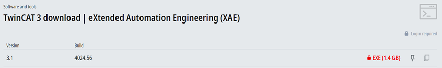

# Download and install the TwinCAT software 

To download and install the TwinCAT software:

1.  Access the link [https://www.beckhoff.com/en-en/support/download-finder/search-result/?c-1=26782567](https://www.beckhoff.com/en-en/support/download-finder/search-result/?c-1=26782567) and login using your BECKHOFF account. For a new user, register the account first.
2.  Click on **TwinCAT 3 download \| eXtended Automation Engineering \(XAE\)** and download it a local directory on your personal computer.

    

3.  Install the downloaded software.

    **Note:** Sometimes the laptop hardware does not support TwinCA. Therefore, it is best to use a desktop installation and install the e1000 network card. For a list of TwinCAT supported network cards, see [Beckhoff Information System - English](https://infosys.beckhoff.com/english.php?content=../content/1033/tc3_overview/9309844363.html&id=).

