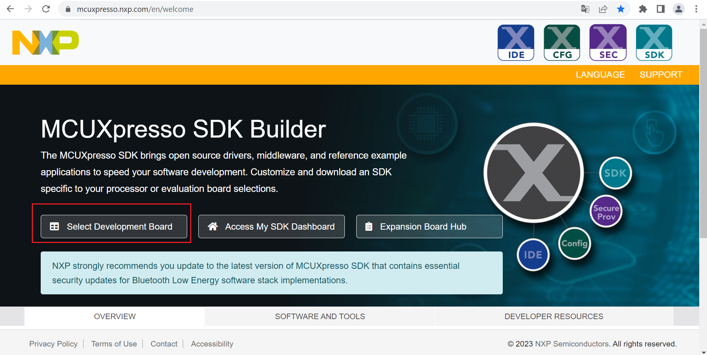
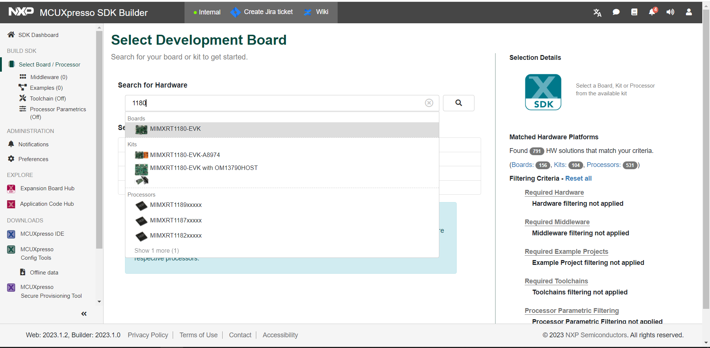
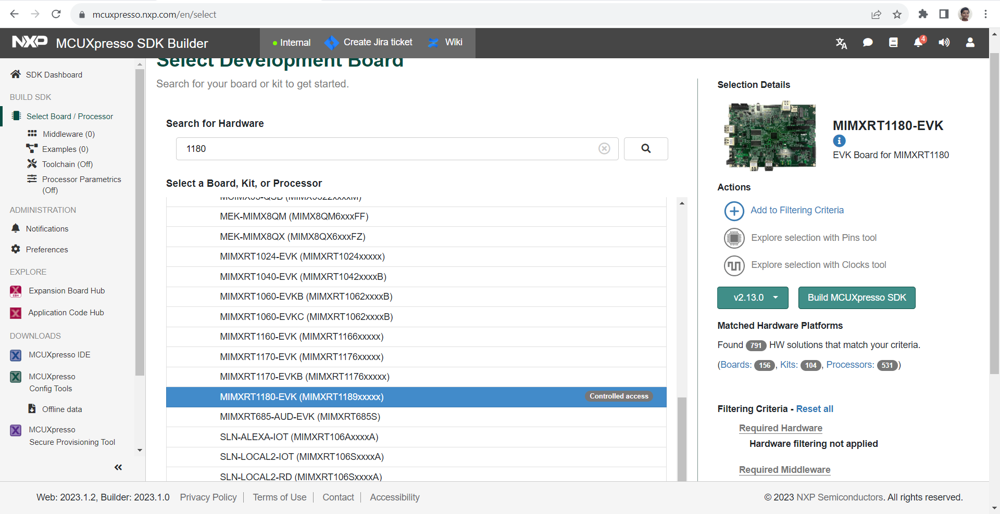
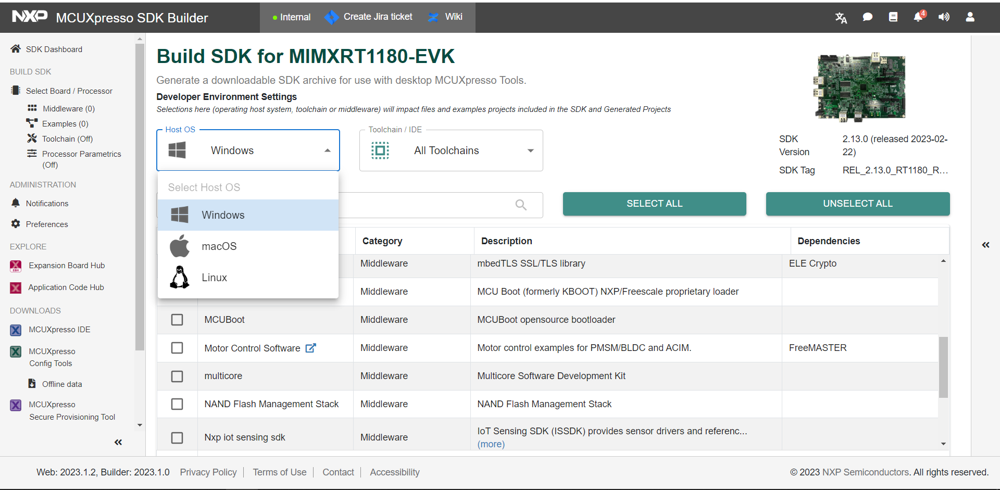
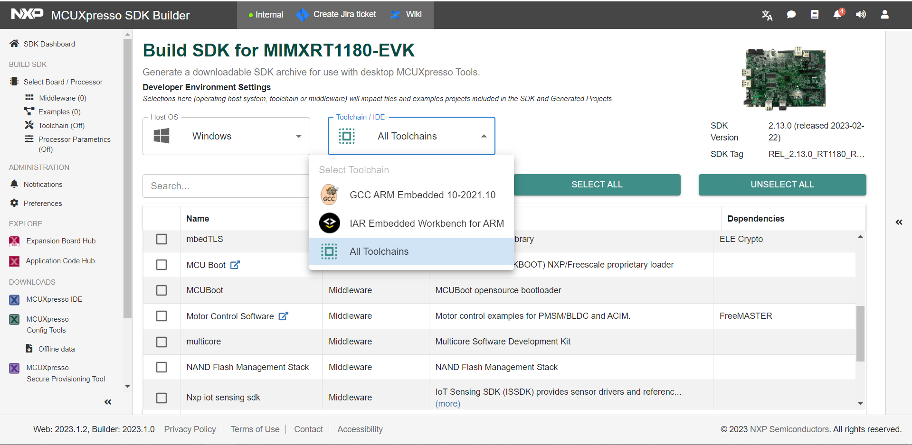
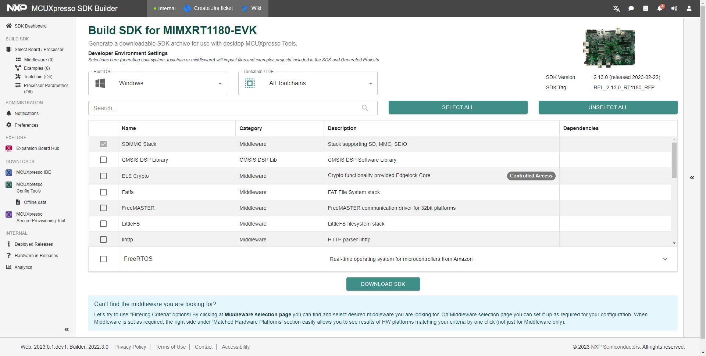
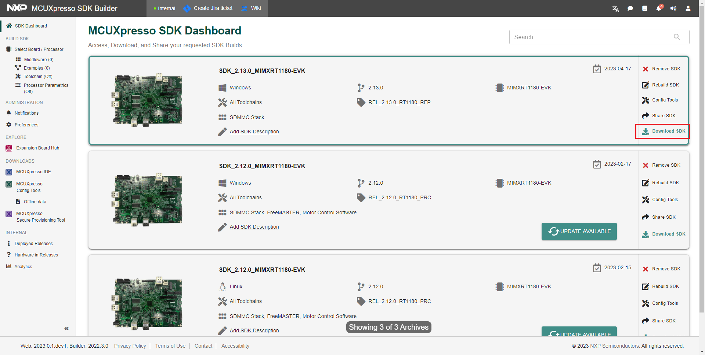
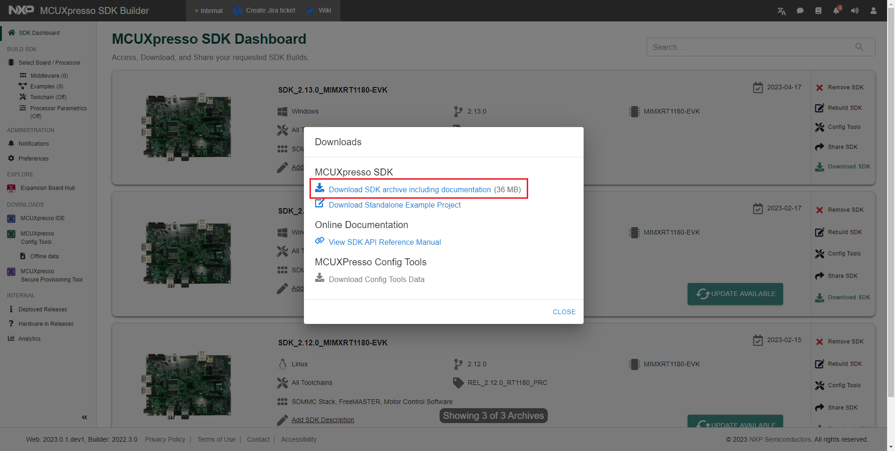
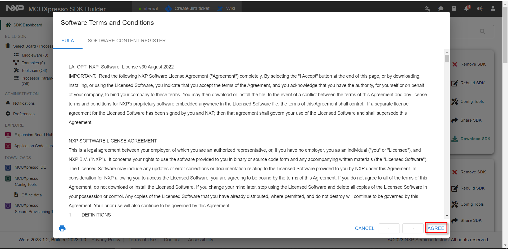

# MCUXpresso SDK download

To configure and download the MCUXpresso SDK for the digital IO example building:

1.  Click the link [https://mcuxpresso.nxp.com/en/welcome](https://mcuxpresso.nxp.com/en/welcome) and launch the MCUXpresso main page.
2.  Click the **Select Development Board** button. See, [Figure 1](#selectdev).

    

3.  Type 1180 in the **Search for Hardware** field.
4.  Select *MIMXRT1180-EVK* from the drop-down list. See, [Figure 2](#selecboard).

    

5.  Select the SDK version from which the SDK will be generated. See, [Figure 3](#sdkversion).

    **Note:** The SDK version in the image is for reference only. Ensure to download the latest SDK version.

    

6.  Click the **Build MCUXpresso SDK** button.

    

7.  Select the host operating system. See, [Figure 5](#selectohp).

    

8.  Select the Toolchain/IDE. See, [Figure 6](#seltoolchain).

    

9.  To select the components, click the **Select All** button.

    

10. To download the SDK, click the **Download SDK** button.

    

    You can now access, download, and share your requested SDK builds. See, [Figure 9](#fig_vp3_dp1_nyb).

11. Click the **Download SDK** button.

    

12. Click the **Download SDK archive including documentation** link.

    

13. Read the end user license agreement \(EULA\).
14. Click the **Agree** link.

    

    Wait until the build finishes and the download the SDK zip file.

