# Generate SSC for digital IO

Due to the license issue, the MCUXpresso SDK does not include the EtherCAT SSC. The SSC Tool must generate the subdevice stack code first. This section lists the steps to download the SSC tool and generate the subdevice stack code for the digital IO example via the SSC tool.

**Note:** You must have a Backoff account to download the EtherCAT SSC tool.

1.  Download and install the SSC tool.
    1.  Click the link [https://www.ethercat.org/en/downloads.html](https://www.ethercat.org/en/downloads.html).
    2.  Type *SSC* in the **Text Filter** field.
    3.  Select the *EtherCAT SSC* link under the **Description** column. See, [Figure 1](#selssc).

        **Note:** To proceed with the download, you must provide your account credentials, if you are not already logged in.

        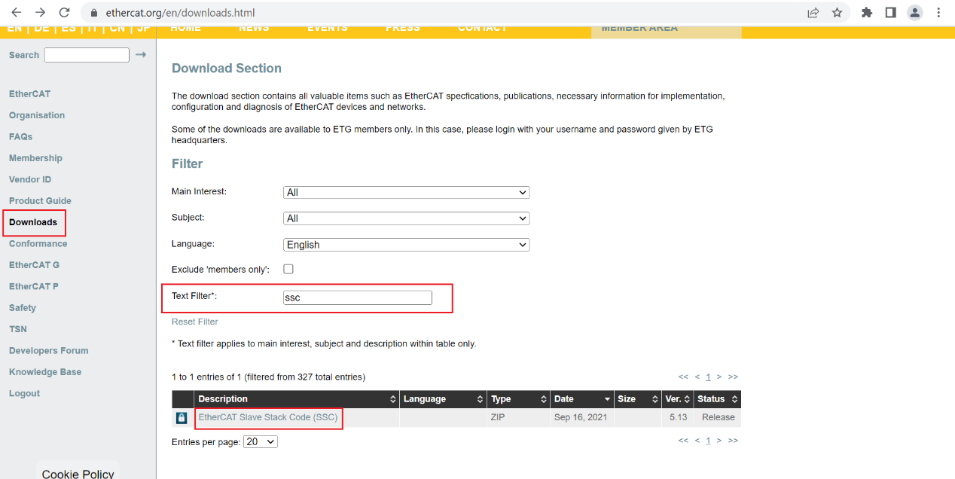

    4.  Install the downloaded SSC tool.
    5.  Launch the SSC tool.
2.  Import the configuration file for the digital IO example.
    1.  Select **Tool \> Options**.

        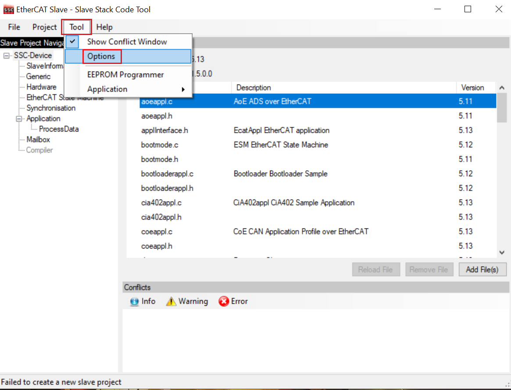

        The **Subdevice Stack Code Tool \| Options** window appears.

    2.  Click the **Configurations** tab.

    3.  To open the **Import Configuration file\(s\)** dialog box, click the **＋** icon.

    4.  Navigate to the \\*boards\\evkmimxrt1180\\ecat\_examples\\digital\_io\\<core\>\\SSC* folder.
    5.  Select the *digital\_io.xml* file.

    6.  Click the **Open** button. See, [Figure 3](#selectxml).

        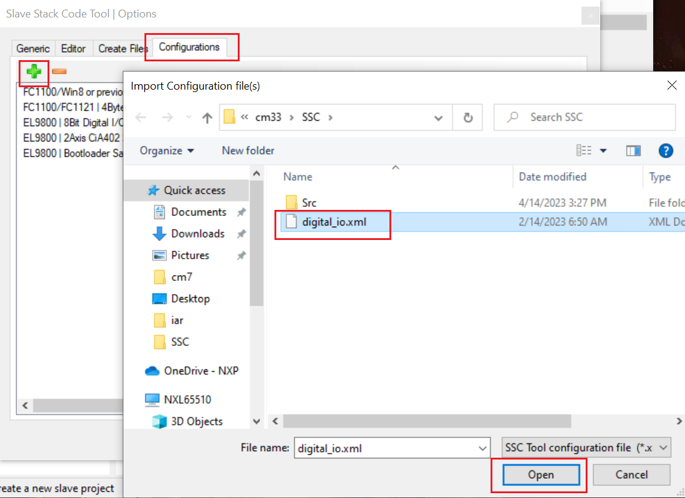

        The configuration is imported.

3.  Create a new project with the imported configuration.
    1.  Select **File \> New**.

        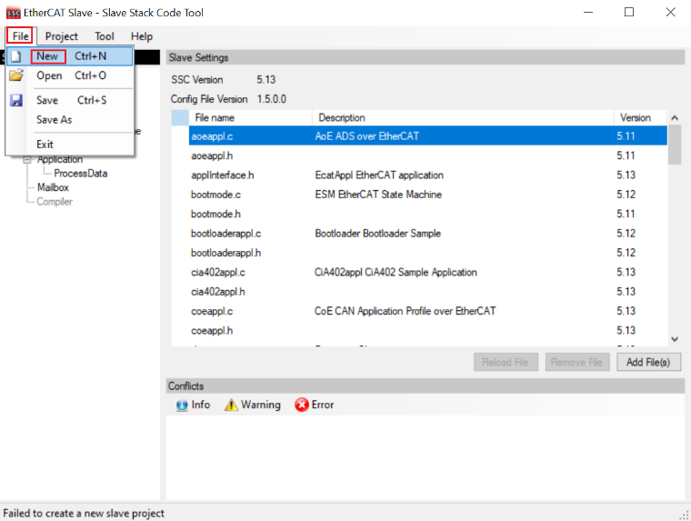

        The **New Project** dialog box appears.

    2.  Select the **Custom** option.
    3.  Select *NXP ECAT Digital IO modular <NXP\>* from the drop-down list.

        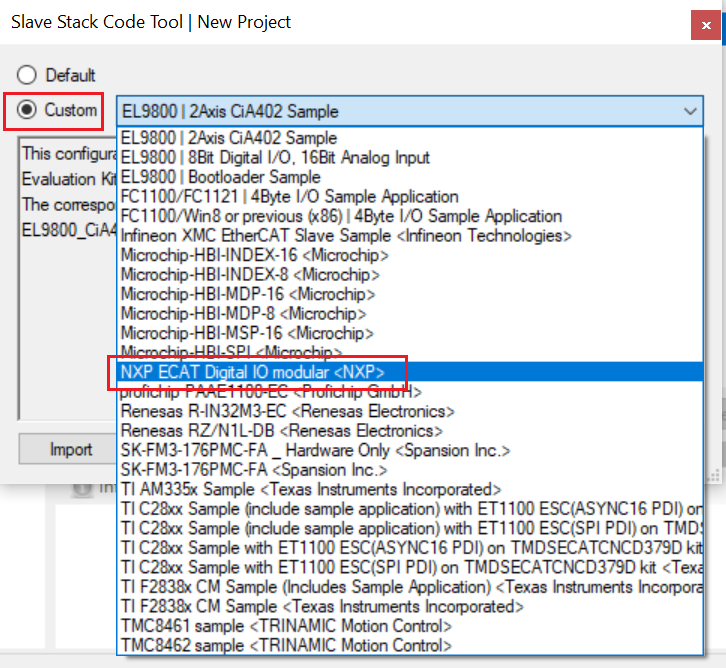

4.  Save this new project as ECAT-IO.esp to any folder.
    1.  Select **File \> Save**.

        

    2.  Save the file with an appropriate name. For example, ECAT-IO.esp.

        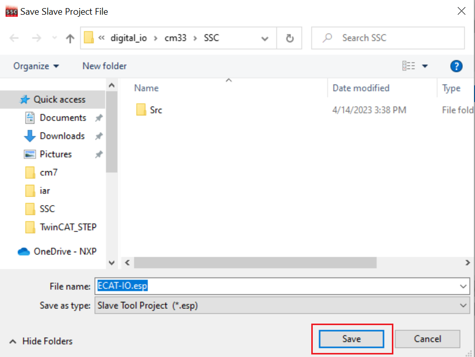

5.  Create the digital IO example application via importing the *digital\_io.xlsx* file.
    1.  Select **Tool \> Application \> Import**.

        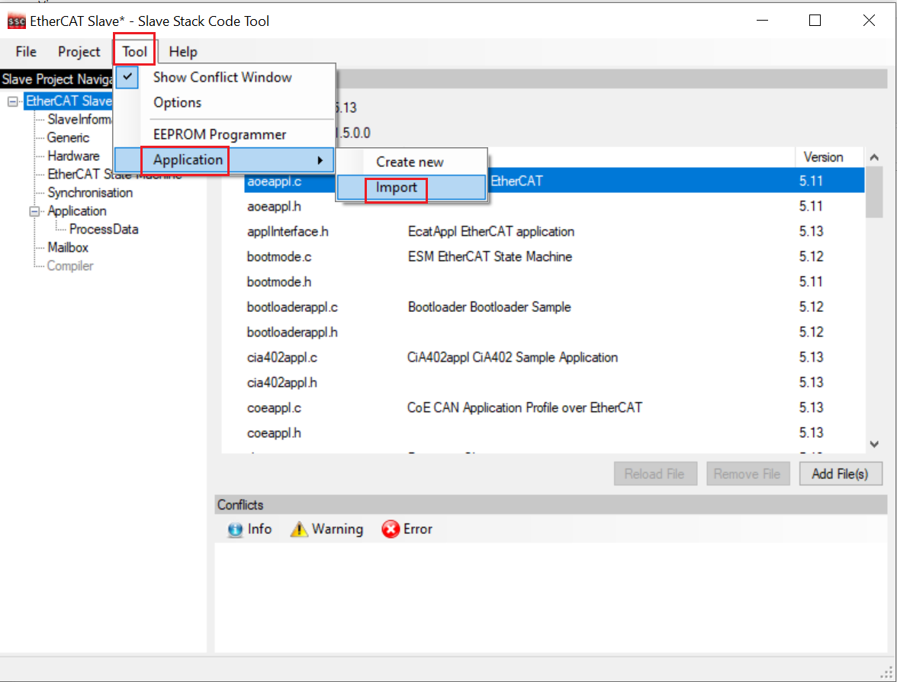

        The **File selection** dialog box appears.

    2.  Navigate to the *\\boards\\evkmimxrt1180\\ecat\_examples\\digital\_io\\<core\>\\SSC* folder.
    3.  Select the *digital\_io.xlsx* file.
    4.  Click the **Open** button.

        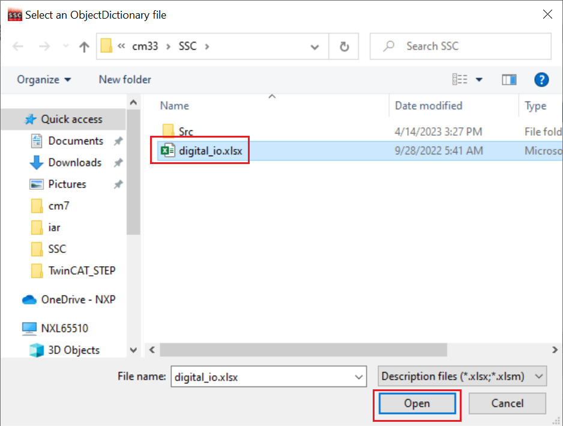

        The filename appears in the **Application name** field.

    5.  Click **OK**.

        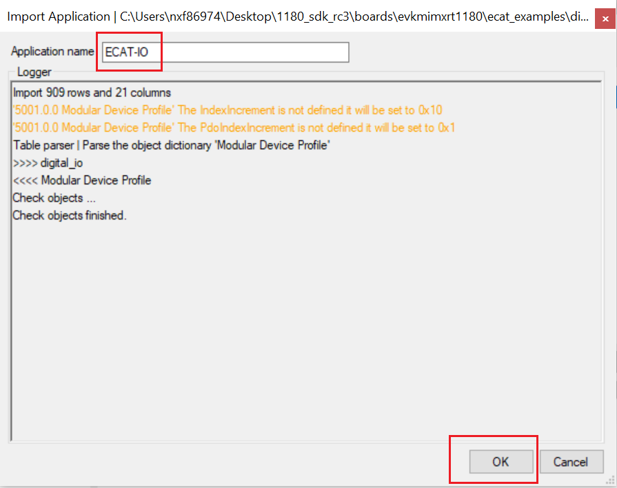

6.  Create the subdevice stack code for the digital IO example.
    1.  Click **Project \> Create new subdevice Files**.

        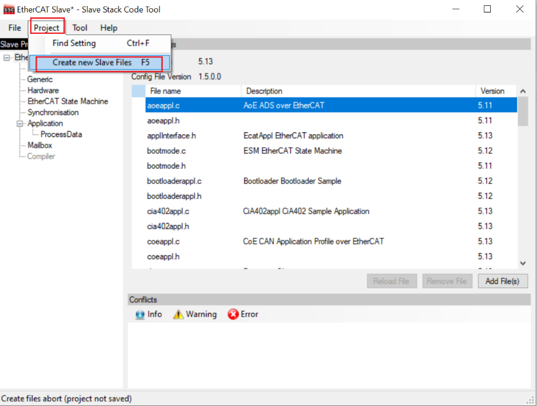

        The **Create new subdevice Files** dialog box appears.

    2.  To create the code, select **Start**.

        By default, the code is located in the *Src* subfolder under the folder where the project is saved.

        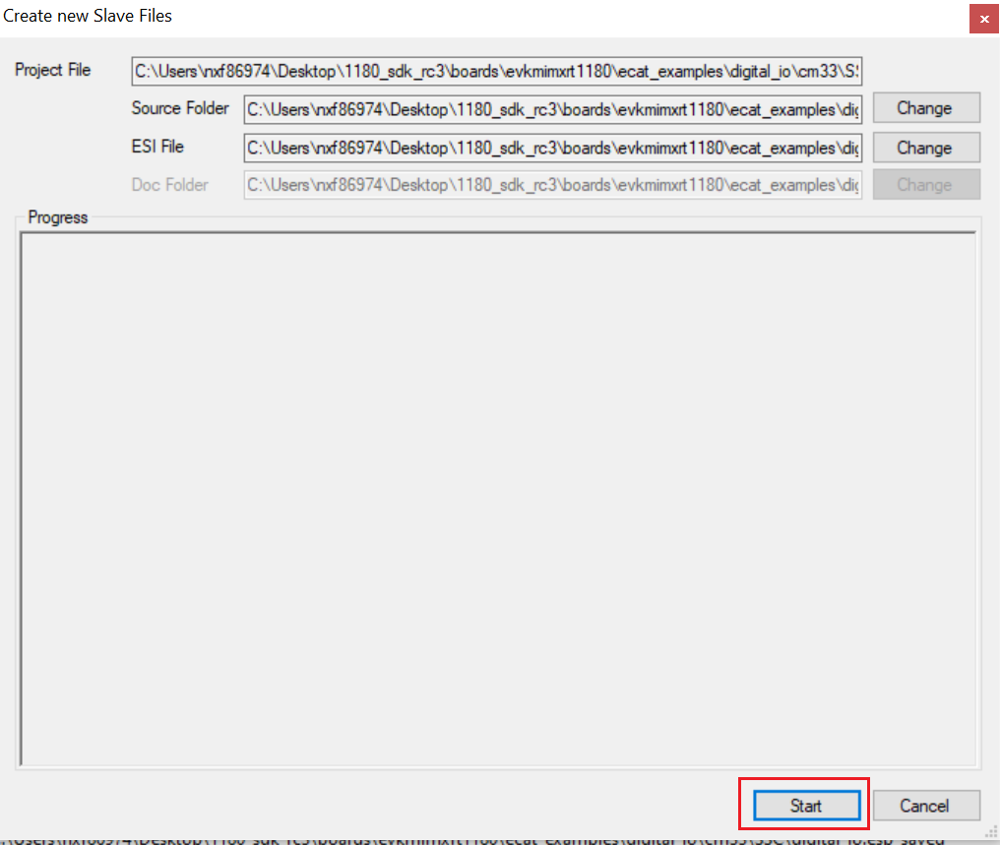

7.  Copy the *Src* subfolder to *boards\\evkmimxrt1180\\ecat\_examples\\digital\_io\\<core\>\\SSC\\Src* under the SDK source code.
8.  Delete the*digital\_io.c* file under *Src* folder because this file is provided by MCUXpresso SDK.

