# TwinCAT project setup

1.  Import the EtherCAT Subdevice Information \(ESI\) file of the digital IO example.
2.  Copy the ESI file named '*ECAT-IO.xml*' generated by SSC tool from the *SSC* project folder to the *<TwinCAT\_installation\_folder\>/<Version\>/Config/io/EtherCAT/* folder.
3.  Create a new project.
    1.  Select **File \> New \> Project**.

        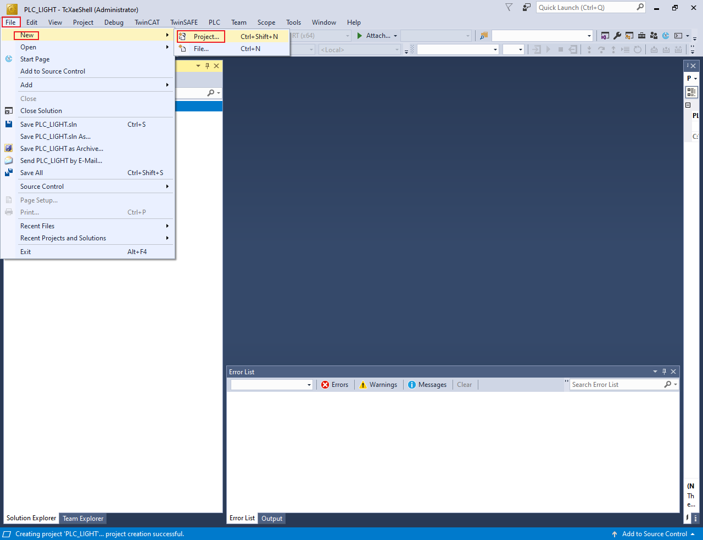

        The **New Project** dialog box appears.

    2.  Select **TwinCAT Projects**.
    3.  Click **OK**.

        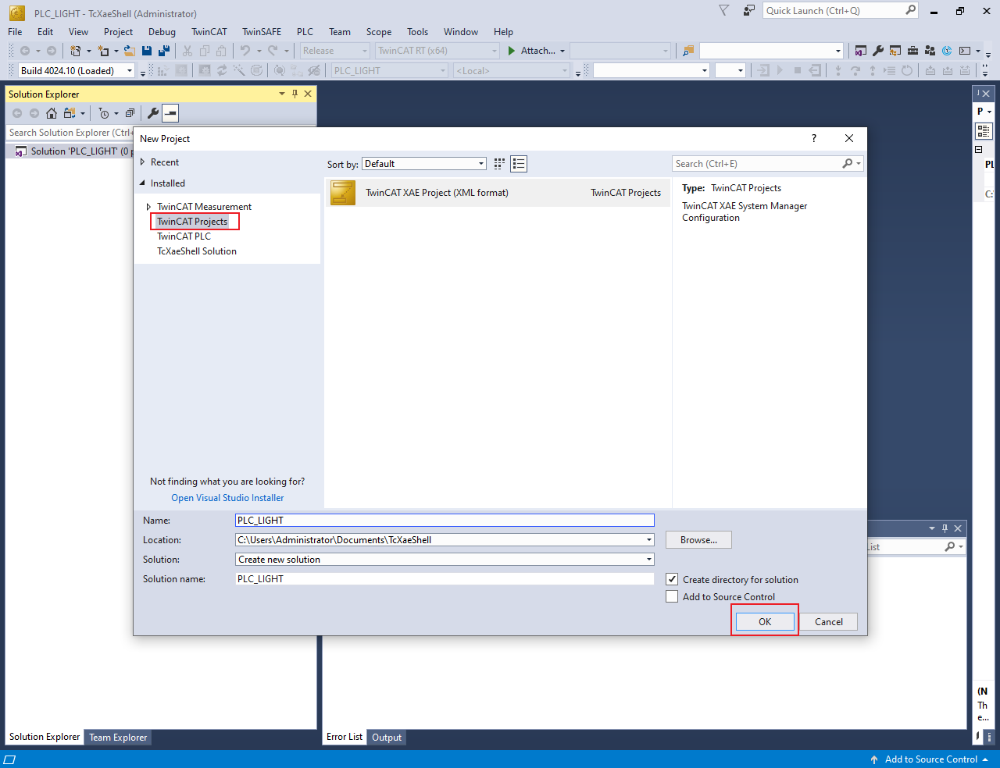

4.  Scan the for subdevices.
    1.  In the **Solution Explorer** view, expand **I/O**.
    2.  Right-click on **Device** and select **Scan**.

        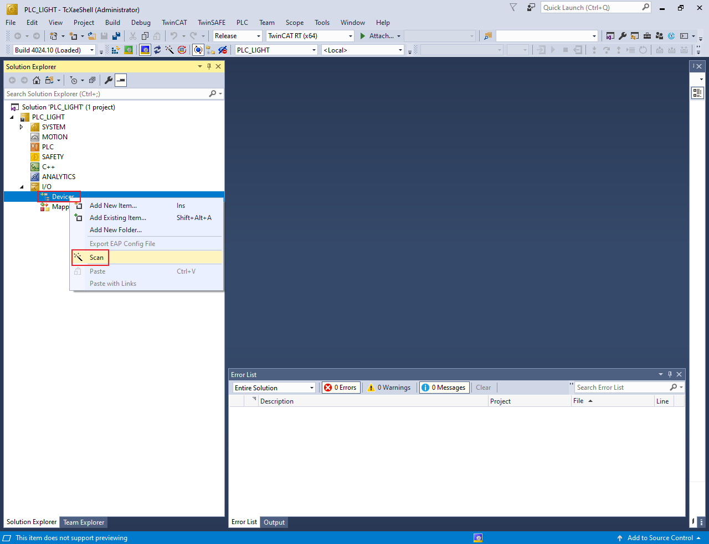

        The scanned devices appear in the **I/O devices found** dialog box.

    3.  Select the network interface connected with the MIMXRT1180-EVK board.
    4.  Click **OK**.

        

5.  Update the ESI file to E2PROM.

    **Note:** The E2PROM must be updated if the digital IO example is set up first time on the MIMXRT1180-EVK.

    1.  Under **Device**, double-click the EtherCAT device selected in step 4.The **TwinCAT Project** dialog box appears.
    2.  Click the **EtherCAT** tab.
    3.  Click the **Advanced Settings** button.

        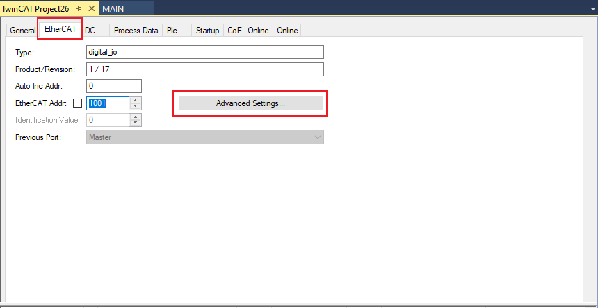

        The **Advanced Settings** dialog box appears.

    4.  From the left pane of the **Advanced Settings** dialog box, select **ESC Access \> Smart View**.
    5.  Click the **Write E2PROM** button.

        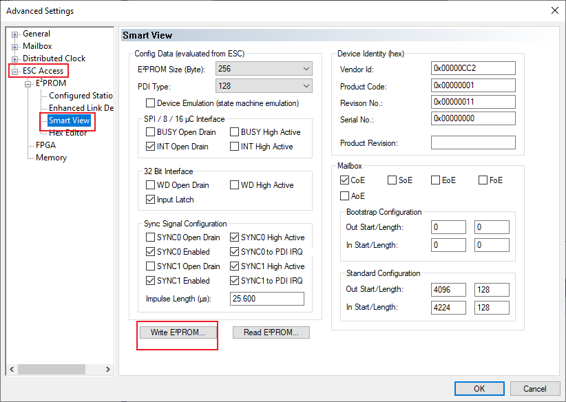

    6.  From the available EEPROM list, **select NXP \> ECAT \> digital\_io**.
    7.  Click **OK**, delete Device4, rescan, and add Device4 after the success of the write EEPROM operation.

        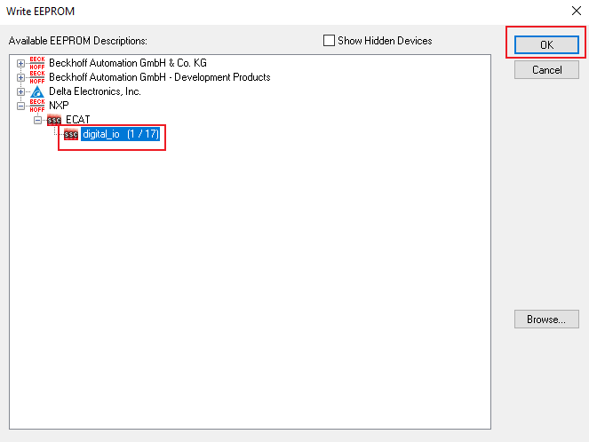

6.  Configure the subdevice.
    1.  Click the **DC** tab.
    2.  From the **Operation Mode** field, select the **SM-Synchron** option.

        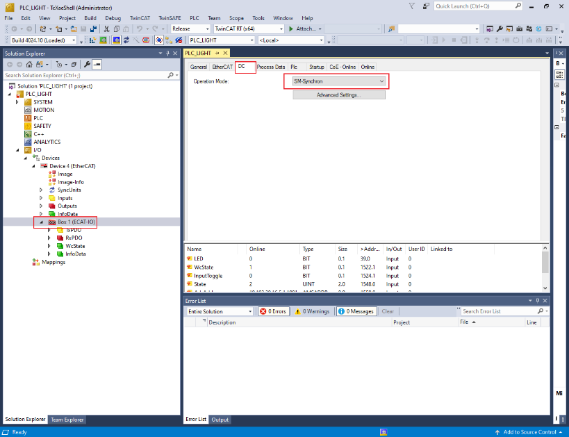

7.  Program the PLC code.
    1.  In the **Solution Explorer** view, right-click on **PLC** and select **Add New Item**.

        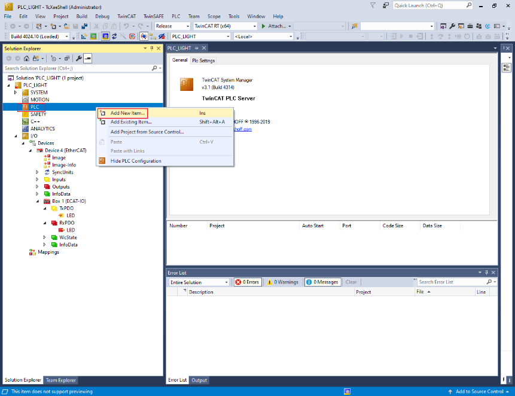

        The **Add New Item** dialog box appears.

    2.  From the **Installed** list in the left pane, select **Plc Templates**.
    3.  Select **Standard PLC Project**.
    4.  Click **OK**.

        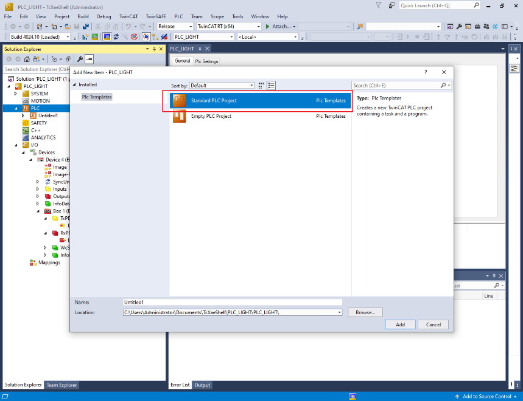

8.  To open the PLC edit page, select **MAIN \(PRG\)** under PLC. See, [Figure 11](#codeedit).
9.  Copy the code below and paste it in the **MAIN** view. See, [Figure 11](#codeedit).

    ```
    PROGRAM MAIN
    VAR 
    Delay : TON;
    LedIn AT %I* : BOOL; 
    LedOut AT %Q* : BOOL;
    END_VAR
    ```

    ```
    Delay(IN := TRUE, PT := T#1S);
    IF Delay.Q THEN
        LedOut := NOT LedIn;
        Delay(IN := FALSE);
    END_IF; 
    ```

    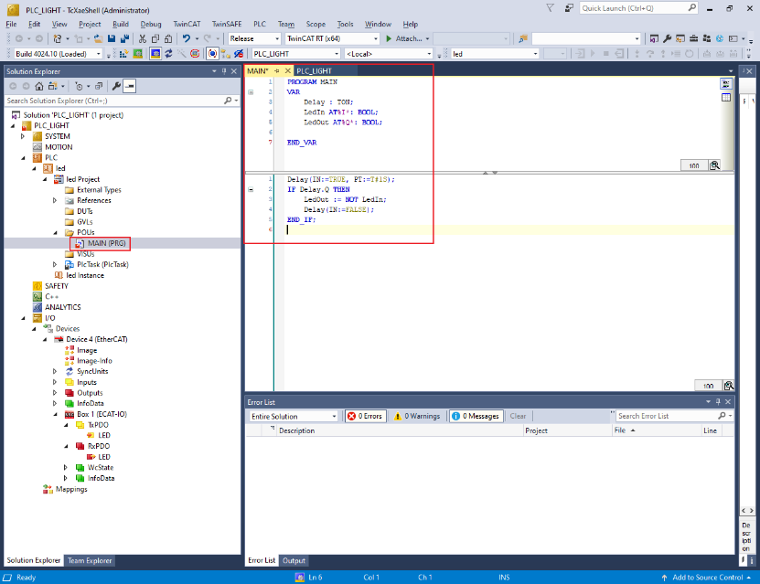

10. Build the PLC code.
    1.  Right-click on the PLC project and select **Build**.

        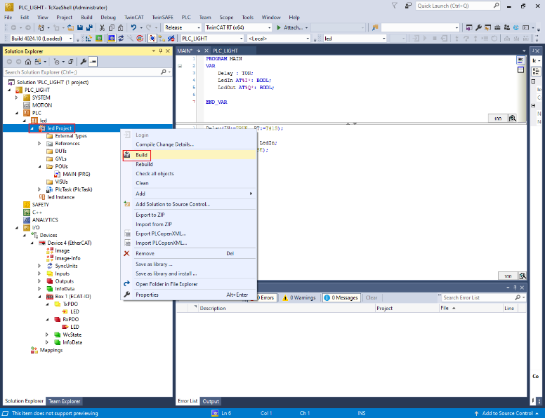

11. Map the PLC variables to the subdevice IO channel.
    1.  Right-click on **MAIN.LedIn**, select **Change Link**. See, [Figure 13](#mapvar).

        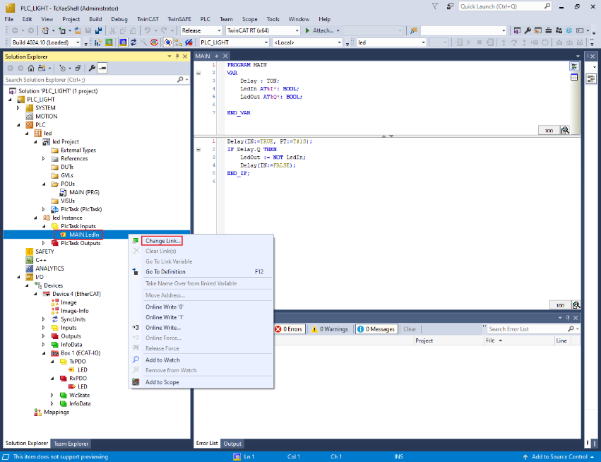

        The **Attach Variable MAIN.LedIn \(Input\)** dialog box appears.

    2.  Select **LED**. See, [Figure 14](#attachvari).
    3.  Click **OK**. See, [Figure 14](#attachvari).

        ")

    4.  In the **Solution Explorer**, under **PlcTask Outputs**, right-click on **MAIN.LedOut** and select **Change Link**.

        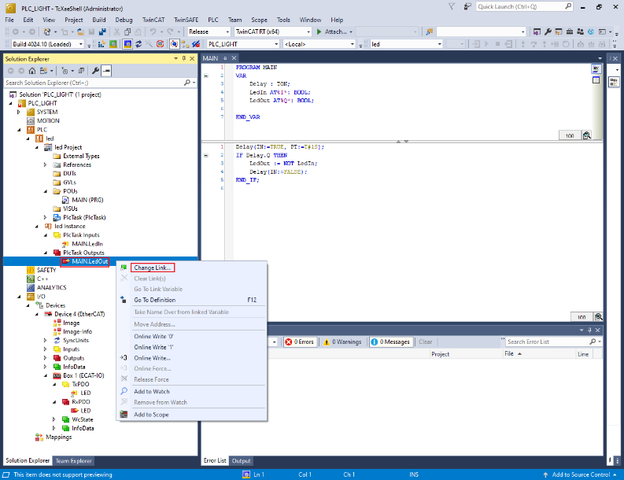

        The **Attach Variable MAIN.LedOut \(Output\)** dialog box appears.

    5.  Select **LED**. See, [Figure 16](#fig_g4x_3hj_nyb).
    6.  Click **OK**. See, [Figure 16](#fig_g4x_3hj_nyb).

        ")

12. Run the PLC code.
    1.  To activate the configuration, select **TwinCAT \> Activate Configuration**.

        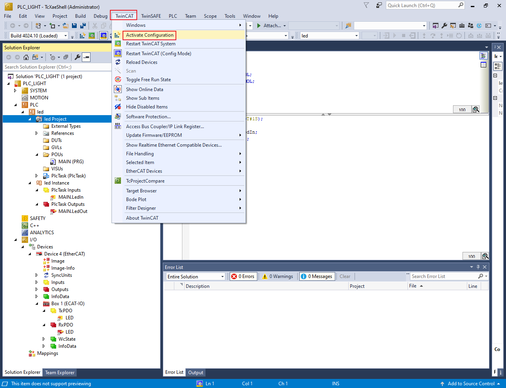

    2.  Select **PLC** \> **Login**.

        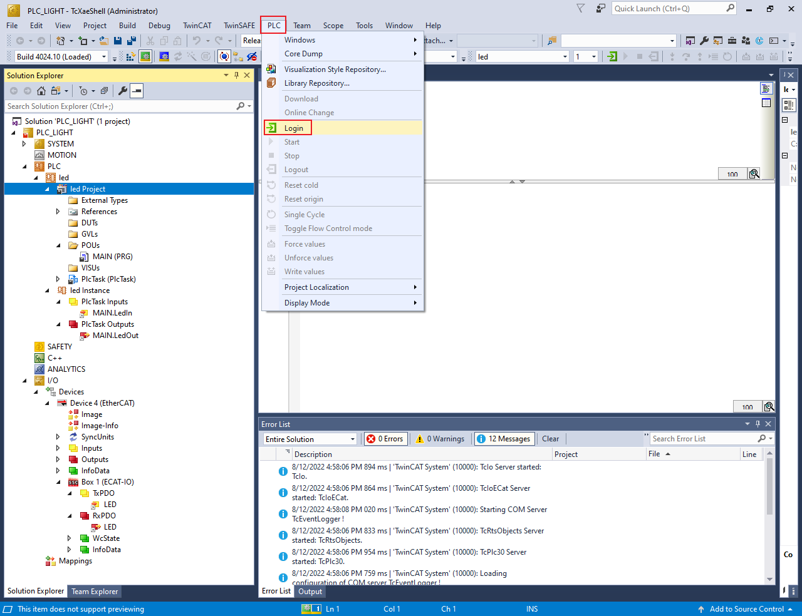

    3.  To initiate the PLC code, **PLC \> Start**.

        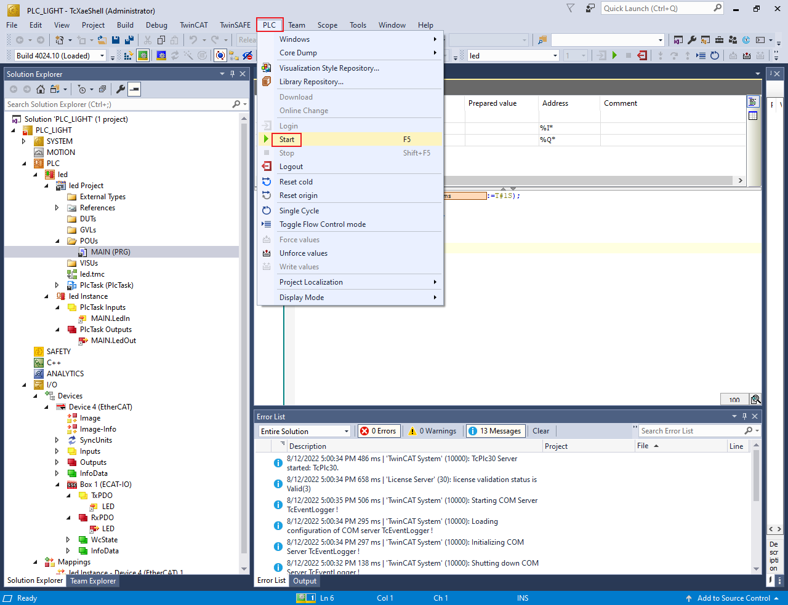

        When the PLC code initiates, the D7 LED on the MIMXRT1180-EVK board starts blinking with 0.5 Hz frequency.


