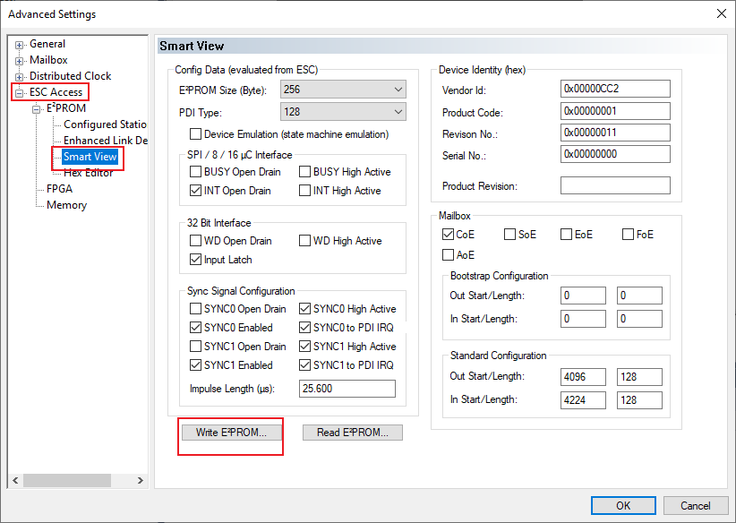
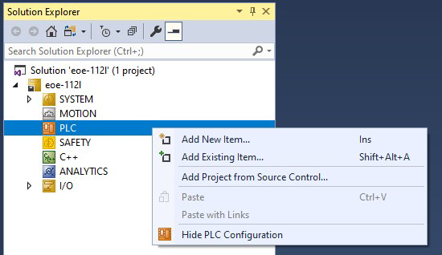

# TwinCAT project setup

1.  Import the EtherCAT Subdevice Information \(ESI\) file of the EoE example.
2.  Copy the ESI file named '*ECAT-EOE.xml*' generated by SSC tool from the *SSC* project folder to the *<TwinCAT\_installation\_folder\>/<Version\>/Config/io/EtherCAT/* folder.
3.  Create a new project.
    1.  Select **File \> New \> Project**.

        

        The **New Project** dialog box appears.

    2.  Select **TwinCAT Projects**.
    3.  Click **OK**.

        

4.  Scan the for subdevices.
    1.  In the **Solution Explorer** view, expand **I/O**.
    2.  Right-click on **Device** and select **Scan**.

        

        The scanned devices appear in the **I/O devices found** dialog box.

    3.  Select the network interface connected with the MIMXRT1180-EVK board.
    4.  Click **OK**.

        

5.  Update the ESI file to E2PROM.

    **Note:** The E2PROM must be updated if the EOE example is set up first time on the MIMXRT1180-EVK.

    1.  Under **Device**, double-click **Box1**.The **TwinCAT Project** dialog box appears.
    2.  Click the **EtherCAT** tab.
    3.  Click the **Advanced Settings** button.

        

        The **Advanced Settings** dialog box appears.

    4.  From the left pane of the **Advanced Settings** dialog box, select **ESC Access \> Smart View**.
    5.  Click the **Write E2PROM** button.

        

    6.  From the available EEPROM list, select **NXP \> ECAT \> eoe\_freertos**.
    7.  Click **OK**, delete Device4, rescan, and add Device4 after the write EEPROM operation is successful.

        

6.  Configure the subdevice.
    1.  Click the **DC** tab.
    2.  From the **Operation Mode** field, select the **SM-Synchron** or **DC** option.

        

7.  Program the PLC code.
    1.  In the **Solution Explorer** view, right-click on **PLC** and select **Add New Item**.

        

        The **Add New Item** dialog box appears.

    2.  From the **Installed** list in the left pane, select **PLC Templates**.
    3.  Select **Standard PLC Project**.
    4.  Click **OK**.

        

8.  To open the PLC edit page, select **MAIN \(PRG\)** under PLC.
9.  Copy the code below and paste it in the **MAIN** view.

    ```
    PROGRAM MAIN
                    VAR 
                    Delay : TON;
                    LedIn AT %I* : BOOL; 
                    LedOut AT %Q* : BOOL;
                    END_VAR
    ```

    ```
    Delay(IN := TRUE, PT := T#1S);
    IF Delay.Q THEN
        LedOut := NOT LedIn;
        Delay(IN := FALSE);
     END_IF; 
    ```

    

10. Build the PLC code.
    1.  Right-click on the PLC project and select **Build**.

        

11. Map the PLC variables to the subdevice IO channel.
    1.  Right-click on **MAIN.LedIn**, select **Change Link**.

        

        The **Attach Variable MAIN.LedIn \(Input\)** dialog box appears.

    2.  Select **LED**. .
    3.  Click **OK**.

        ")

    4.  In the **Solution Explorer**, under **PlcTask Outputs**, right-click on **MAIN.LedOut** and select **Change Link**.

        

        The **Attach Variable MAIN.LedOut \(Output\)** dialog box appears.

    5.  Select **LED**.
    6.  Click **OK**.

        ")

12. Configure the PC IP address.

    `ip address: 192.168.1.102`

    `subnet mask: 255.255.255.0`

    `gateway: 192.168.1.0`

    

13. Configure the board IP address.
    1.  Under **Device**, double-click **Box1.**The TwinCAT Project dialog box appears.
    2.  Click the **EtherCAT** tab.
    3.  Click the **Advanced Settings** button.

        

        The **Advanced Settings** dialog box appears.

    4.  Click **Mailbox \> EOE \> IP Port**.
    5.  Set the address of the board.

        `ip address: 192.168.1.66`

        `subnet mask: 255.255.255.0`

        `gateway: 192.168.1.102`

        

14. Activate the configuration.
    1.  To activate the configuration, select **TwinCAT \> Restart TwinCAT \(Config Mode\).**.

        ")

    2.  After activaing the configuration, the serial port prints the following.

        ```
        Start the SSC EoE example...
        Hardware init success...
        EoE interface init success...
        
        ***********************************************************
         HTTP Server example
        ***********************************************************
         IPv4 Address     : 192.168.1.66
         IPv4 Subnet mask : 255.255.255.0
         IPv4 Gateway     : 192.168.1.102
         mDNS hostname    : lwip-eoe
        ***********************************************************
        
        ```

15. Test ping and the http server.
    1.  Open cmd.exe and execute "ping 192.168.1.66".
    2.  Make sure to disable the browser proxy and open the browser to access [http://192.168.1.66](http://192.168.1.66).

        

        **Note:** To modify the html of http server, refer to**lwip\_examples/lwip\_httpsrv** example.


