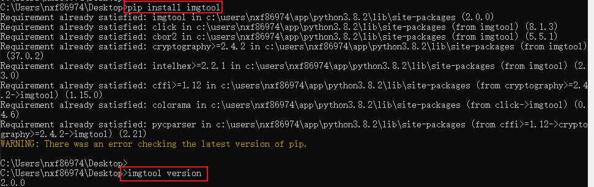
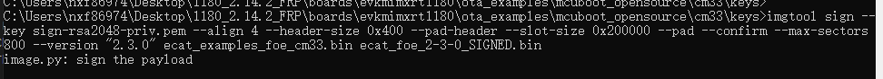
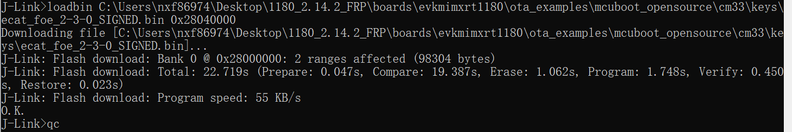
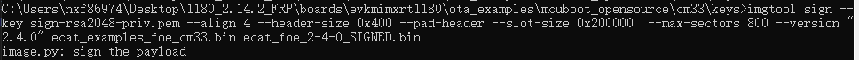

# Compile and download the image to RT1180

The GCC Arm Embedded 12.3.1 toolchain is supported.

1.  Download the `mcuboot_opensource` program to the target board.
    1.  Change **EVK SW5\[1..4\]** to **0000** and press the reset **SW3** key.
    2.  Enter `boards\evkmimxrt1180\ota_examples\mcuboot_opensource\cm33\armgcc`.
    3.  Compile and use the SPSDK tool to download the image to the board.

        **Note:** For details on the image download and program, see section from 4 to 7 of the Getting Started with MCUXpresso SDK for MIMXRT1180-EVK document in the SDK package.

        **Note:** For more information on mcuboot, refer to the **mcuboot\_opensource** example.

2.  Download the **signed FoE image** to the target board.
    1.  Enter `boards\evkmimxrt1180\ecat_examples\foe\cm33\armgcc` and compile the FoE image.
    2.  Open **cmd.exe** and type `pip install imgtool` to install the imgtool using the Python package manager.

        

    3.  Type `imgtool sign --key sign-rsa2048-priv.pem --align 4 --header-size 0x400 --pad-header --slot-size 0x200000 --pad --confirm --max-sectors 800 --version "2.3.0" ecat_examples_foe_cm33.bin ecat_foe_2-3-0_SIGNED.bin` to generate the FoE example signed image.

        

    4.  Open the **Jlink** command Line and download the image to the target board.

        ```
        JLink.exe -device MIMXRT1189xxx8_M33 -if SWD -speed 15000
        r 
        h
        loadbin ecat_foe_2-3-0_SIGNED.bin 0x28040000
        qc
        ```

        

3.  Run the FoE example.
    1.  Change **EVK SW5\[1..4\]** to **0100** and press the reset **SW3** key.
    2.  The serial terminal displays the following output.

        ```
        hello sbl.
        Bootloader Version 1.9.0
        Primary image: magic=good, swap_type=0x1, copy_done=0x3, image_ok=0x1
        Secondary image: magic=unset, swap_type=0x1, copy_done=0x3, image_ok=0x3
        Boot source: primary slot
        Swap type: none
        Bootloader chainload address offset: 0x40000
        Reset_Handler address offset: 0x40400
        Jumping to the image
        
        Start the SSC FoE example...
        Image version: 2.3.0
        ```

4.  Generate a new version of the FoE example signed image.

    1.  Type `imgtool sign --key sign-rsa2048-priv.pem --align 4 --header-size 0x400 --pad-header --slot-size 0x200000 --max-sectors 800 --version "2.4.0" ecat_examples_foe_cm33.bin ecat_foe_2-4-0_SIGNED.bin` to generate the new version image.

        

    **Note:** For subsequent upgrades, the new version number must be greater than the old version number. To generate the new version signed image, perform the step above.


