# TwinCAT project setup

1.  Import the EtherCAT Subdevice Information \(ESI\) file of the FoE example.
2.  Copy the ESI filename `ECAT-FOE.xml`, generated by the SSC tool, from the SSC project folder to the `<TwinCAT_installation_folder>/<Version>/Config/io/EtherCAT/` folder.
3.  Create a new project.
    1.  Select **File \> New \> Project**.

        

        The **New Project** dialog box appears.

    2.  Select **TwinCAT Projects**.
    3.  Click **OK**.

        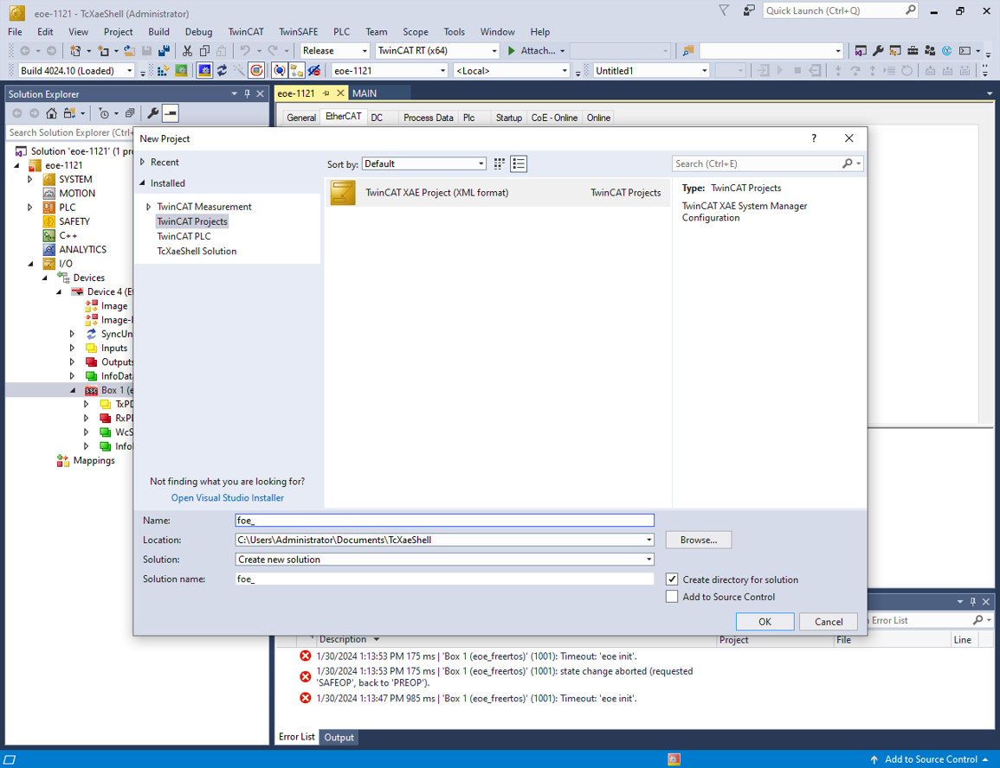

4.  Scan for the subdevices.
    1.  In the **Solution Explorer** view, expand **I/O**.
    2.  Right-click on **Device** and select **Scan**.

        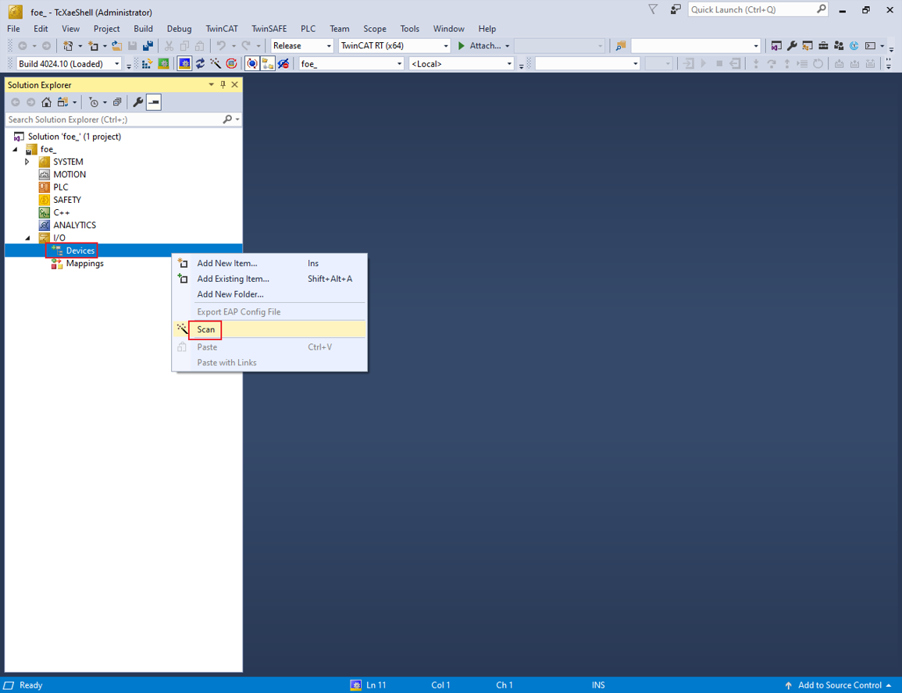

        The scanned devices appear in the**I/O devices found** dialog box.

    3.  Select the network interface connected with the MIMXRT1180-EVK board.
    4.  Click **OK**.

        

5.  Update the ESI file to E2PROM.

    **Note:** The E2PROM must be updated if the FoE example is set up first time on the MIMXRT1180- EVK.

    1.  Under **Device**, double-click **Box1**. The TwinCAT Project dialog box appears.
    2.  Click the **EtherCAT** tab.
    3.  Click the **Advanced Settings** button.

        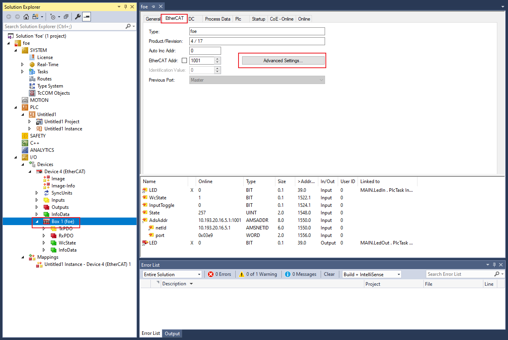

        The **Advanced Settings** dialog box appears.

    4.  From the left pane of the Advanced Settings dialog box, select **ESC Access** \> **Smart View**.

    5.  Click the **Write E2PROM** button.

        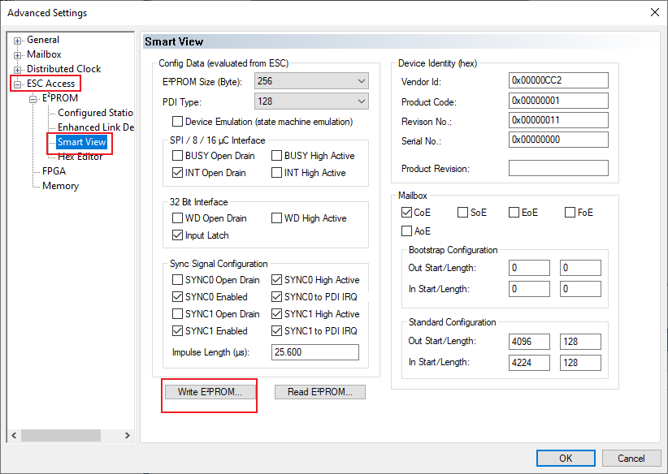

    6.  From the available EEPROM list, select **NXP \> ECAT \> foe**.
    7.  Click **OK**.

        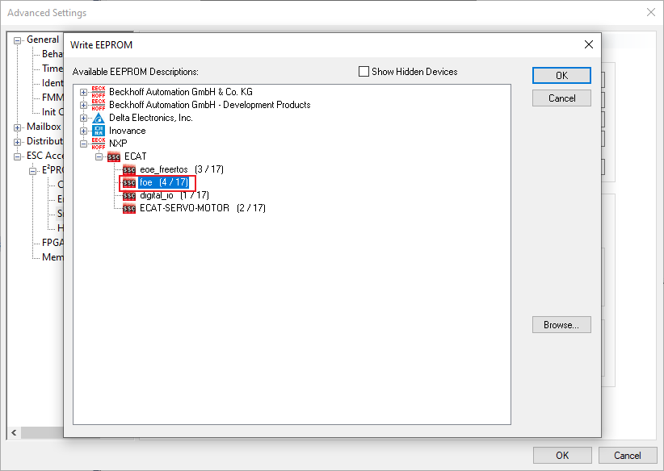

    8.  Remove the **device** and **rescan the** device.
6.  Configure the subdevice.

    1.  Click the **DC** tab.
    2.  From the **Operation Mode** field, select the **SM-Synchron** or **DC-Synchron** option.
    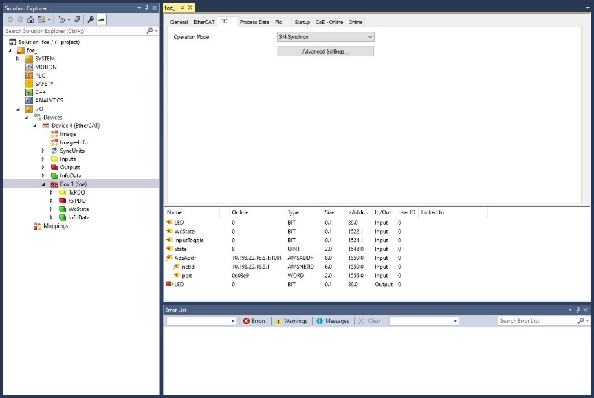

7.  Program the PLC code.
    1.  In the Solution Explorer view, right-click on **PLC**.
    2.  Select **Add New Item**.

        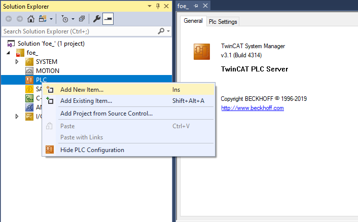

        The **Add New Item** dialog box appears.

    3.  From the **Installed list** in the left pane, select **PLC Templates**.
    4.  Select **Standard PLC Project**.
    5.  Click **OK**.

        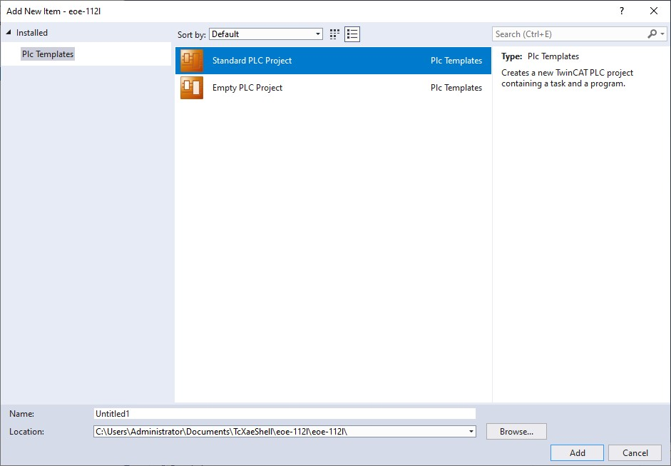

8.  To open the PLC edit page, select MAIN \(PRG\) under PLC.
9.  Copy the code below and paste it in the MAIN view.

    ```
    PROGRAM MAIN
    VAR 
    Delay : TON;
    LedIn AT %I* : BOOL; 
    LedOut AT %Q* : BOOL;
    END_VAR
    ```

    ```
    Delay(IN := TRUE, PT := T#1S);
    IF Delay.Q THEN
    LedOut := NOT LedIn;
    Delay(IN := FALSE);
    END_IF;
    ```

    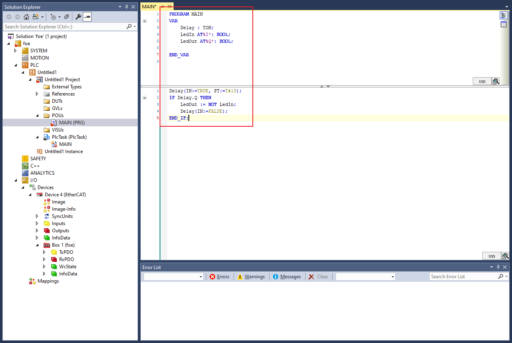

10. To build the PLC code, right-click on the PLC project and select **Build**.

    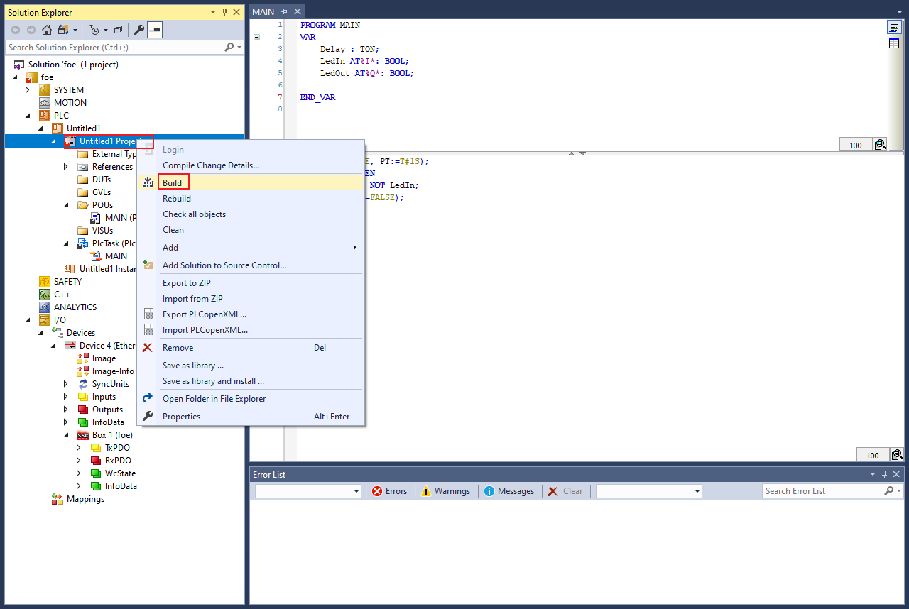

11. Map the PLC variables to the subdevice IO channel.
    1.  Right-click on **MAIN.LedIn**, select **Change Link**.

        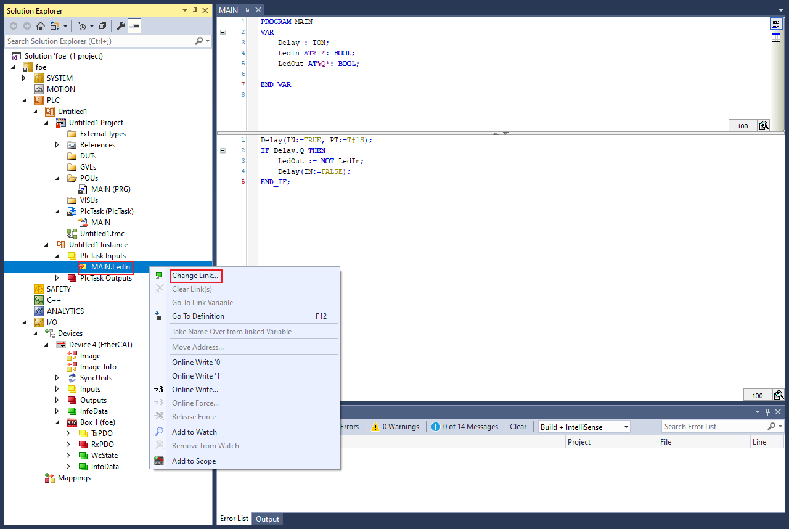

        The **Attach Variable MAIN.LedIn \(Input\)** dialog box appears.

    2.  Select **LED**.
    3.  Click **OK**.

        ")

    4.  In the **Solution Explorer**, under PlcTask Outputs, right-click on **MAIN.LedOut** and select **Change Link**.

        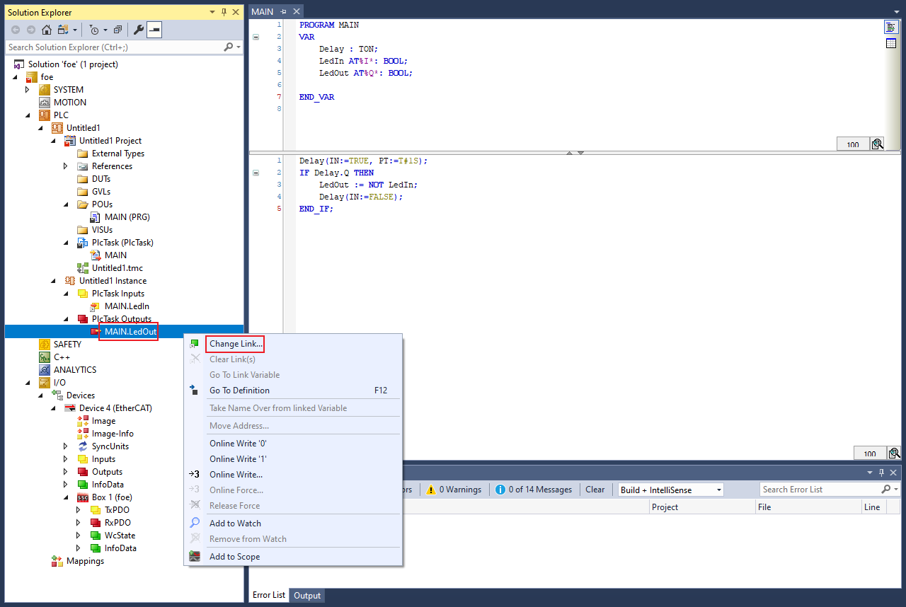

        The **Attach Variable MAIN.LedOut \(Output\)** dialog box appears.

    5.  Select **LED**.
    6.  Click **OK**.

        ")

12. Activate Configuration
    1.  To activate the configuration, select **TwinCAT** \> **Restart TwinCAT \(Config Mode\)**.

        ")

13. FoE image upgrade.
    1.  Click **Device \> Box1 \> Online \> Bootstrap**.

        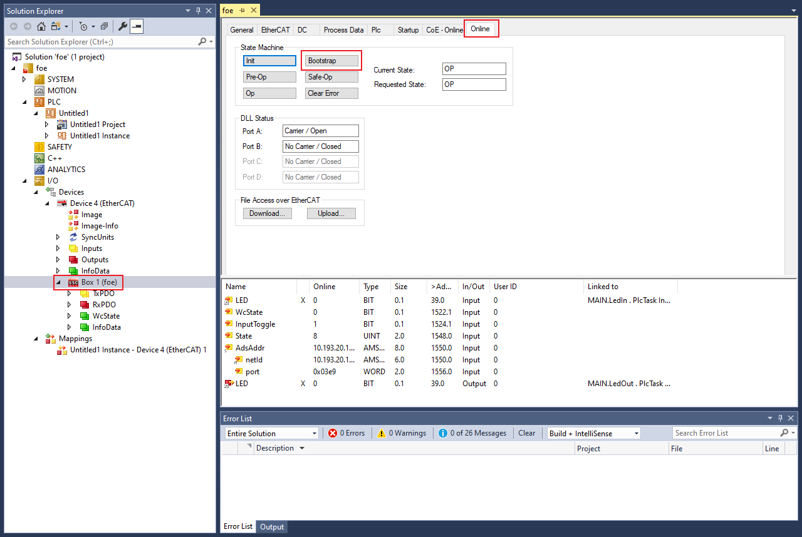

    2.  Click **Download \> ecat\_foe\_2-4-0\_SIGNED.bin \> Password' \> OK** to upgrade the image.

        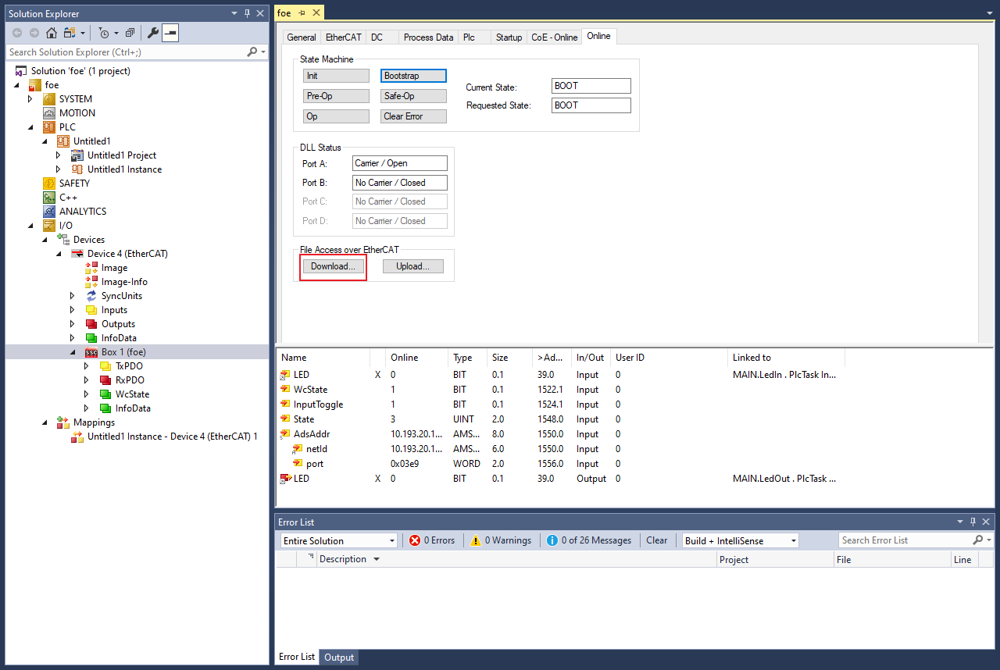

        **Note:** FoE download Password: ‘**12369874’**.

        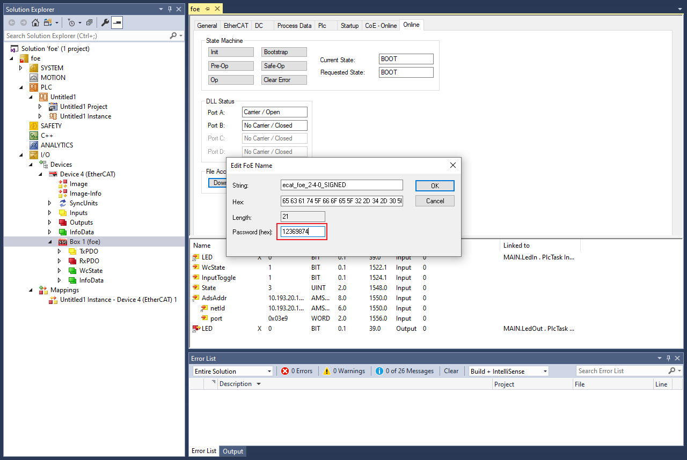

        The serial terminal prints the following output.

        ```
        storage addr: 0x28240000
        FoE_StoreImage: processed 256 bytes
        FoE_StoreImage: processed 512 bytes
        ...
        FoE_StoreImage: upload complete (42028 bytes)
        write magic number offset = 0x43ff00
        Update image success
        ```

    3.  After download, click **'Init'** to restart the board.

        The serial terminal prints the following output.

        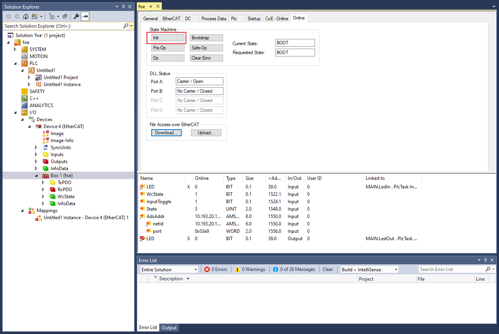

        ```
        System reset...
        hello sbl.
        Bootloader Version 1.9.0
        Primary image: magic=good, swap_type=0x1, copy_done=0x3, image_ok=0x1
        Secondary image: magic=good, swap_type=0x1, copy_done=0x3, image_ok=0x3
        Boot source: none
        Swap type: test
        Starting swap using move algorithm.
        Bootloader chainload address offset: 0x40000
        Reset_Handler address offset: 0x40400
        Jumping to the image
        
        Start the SSC FoE example...
        Image version: 2.4.0
        Image state: testing
        Set image as confirmed: success
        ```

14. FoE image download.
    1.  Click **Upload** to choose the file to download.

        

15. To download the upgraded image, click **OK.**

    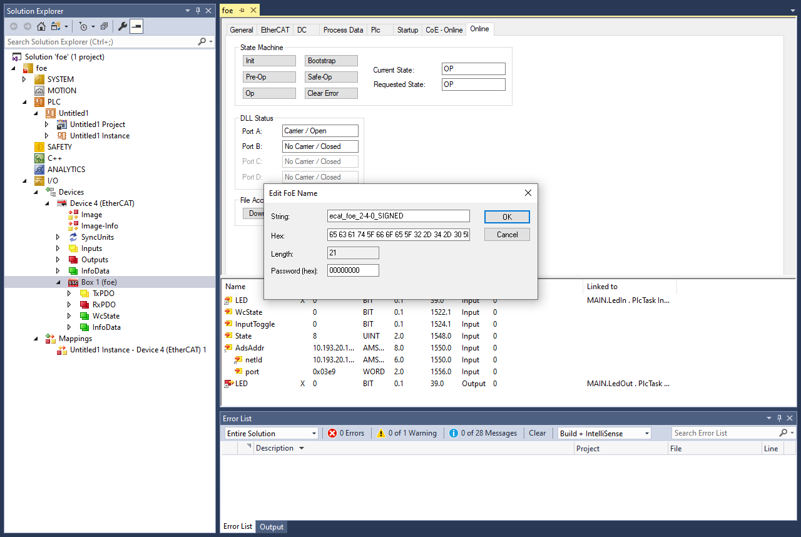

    **Note:** The download image name must be the same as the upgraded image name.


