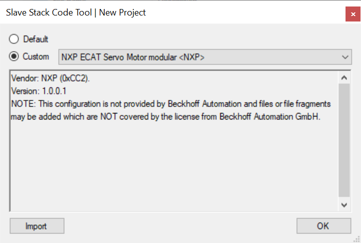

# Generate SSC code for servo motor

Due to the license issue, the MCUXpresso SDK does not include the EtherCAT Subdevice Stack Code \(SSC\). The SSC Tool must generate the subdevice stack code first. This section lists the steps to download the SSC tool and generate the subdevice stack code for the servo motor example via the SSC tool.

**Note:** You must have a Backoff account to download the EtherCAT SSC tool.

1.  Download and install the SSC tool.
    1.  Click the link [https://www.ethercat.org/en/downloads.html](https://www.ethercat.org/en/downloads.html).
    2.  Type *SSC* in the **Text Filter** field.
    3.  Select the *EtherCAT Subdevice Stack Code \(SSC\)* link under the **Description** column.

        **Note:** To proceed with the download, you must provide your account credentials, if you are not already logged in.

        

    4.  Install the downloaded SSC tool.
    5.  Launch the SSC tool.
2.  Import the configuration file for the servo motor example.
    1.  Select **Tool \> Options**.

        The **Subdevice Stack Code Tool \| Options** window appears.

    2.  Click the **Configurations** tab.

    3.  To open the **Import Configuration file\(s\)** dialog box, click the **＋** icon.

    4.  Navigate to the \\*boards\\evkmimxrt1180\\ecat\_examples\\servo\_motor\\cm7\\SSC* folder.
    5.  Select the *servo\_motor.xml* file.

        

    6.  Click the **Open** button.

        The configuration is imported.

3.  Create a new project with the imported configuration.
    1.  Select **File \> New**.

        

        The **New Project** dialog box appears.

    2.  Select the **Custom** option.
    3.  Select *NXP ECAT Servo Motor modular <NXP\>* from the drop-down list.

        

4.  Save this new project as *ECAT-SERVO-MOTOR.esp* to any folder.
    1.  Select **File \> Save**.

        

    2.  Save the file with an appropriate name. For example, *ECAT-SERVO-MOTOR.esp*.

        

5.  Create the subdevice stack code for the servo motor example.
    1.  Click **Project \> Create new Subdevice Files**.

        

        The **Create new Subdevice Files** dialog box appears.

    2.  To create the code, select **Start**.

        By default, the code is located in the *Src* subfolder under the folder where the project is saved.

        

6.  Copy the *Src* subfolder to *boards\\evkmimxrt1180\\ecat\_examples\\ servo\_motor\\cm7\\SSC\\Src* under the SDK source code.
7.  **Apply patch**.

    Change to *.\\boards\\evkmimxrt1180\\ecat\_examples\\servo\_motor\\cm7\\SSC* path. Install patch tool.

    -   To apply the patch on **Linux**:
        1.  Download dos2unix command `apt-get install dos2unix`.
        2.  Transfer SSC source code format `dos2unix Src/*`.
        3.  Apply patch by using the command `patch -d Src < CiA402-combine-the-SSC-subdevice-with-ec_pmsm-support.patch`.
    -   To apply the patch on **Windows**:

        1.  Download the `patch.exe` and `Unix2Dos.exe` tools.
            -   Download Windows patch utility from [http://gnuwin32.sourceforge.net/downlinks/patch-bin-zip.php](http://gnuwin32.sourceforge.net/downlinks/patch-bin-zip.php).
            -   Download `Dos2Unix/Unix2Dos-Text` file format converters from [https://sourceforge.net/projects/dos2unix/](https://sourceforge.net/projects/dos2unix/).
        2.  Transfer the patch format. `$(Dos2Unix/Unix2Dos-DIR)/bin/unix2dos.exe …\boards\evkmimxrt1180\ecat_examples\servo_motor\cm7\SSC\CiA402-combine-the-SSC-subdevice-with-ec_pmsm-support.patch`.

        3.  Apply patch by using the command `./patch.exe -i …\boards\evkmimxrt1180\ecat_examples\servo_motor\cm7\SSC\CiA402-combine-the-SSC-subdevice-with-ec_pmsm-support.patch -d …\boards\evkmimxrt1180\ecat_examples\servo_motor\cm7\SSC\Src\`.

        **Note:** Patch and Unix2Dos are command line tools. To check their functions through command like use `patch --help/unix2cos -help`.

