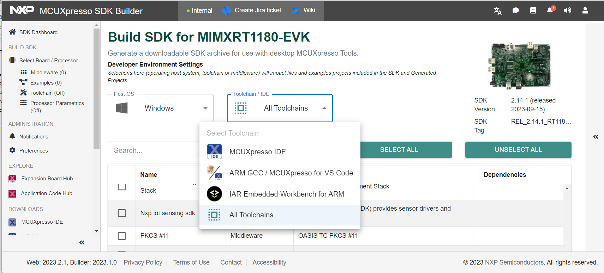

# MCUXpresso SDK download

To configure and download the MCUXpresso SDK for the servo motor example building, perform the following steps.

1.  Click the link [https://mcuxpresso.nxp.com/en/welcome](https://mcuxpresso.nxp.com/en/welcome) to go to the MCUXpresso main page.
2.  Click the **Select Development Board** button.

    

3.  Type 1180 in the **Search for Hardware** field.
4.  Select *MIMXRT1180-EVK* from the drop-down list. See, [Figure 3](#fig_asn_3fc_fzb).

    **Note:** The SDK version in the image is for reference only. Ensure to download the latest SDK version.

    

5.  Select the SDK version from which the SDK will be generated.
6.  Click the **Build MCUXpresso SDK** button.

    

7.  Select the host operating system.

    

8.  Select the Toolchain/IDE.

    

9.  Select the **Motor Control Software** checkbox.

    

10. To download the SDK, click the **Download SDK** button.

    

    You can now access, download, and share your requested SDK builds from the **MCUXpresso Dashboard**.

    

11. Click the **Download SDK** button.

    

12. Click the **Download SDK archive including documentation** link.

    

13. Read the end user license agreement \(EULA\).
14. Click the **Agree** link.

    

    Wait until the build finishes and the download the SDK zip file.

