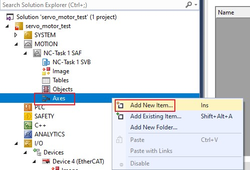
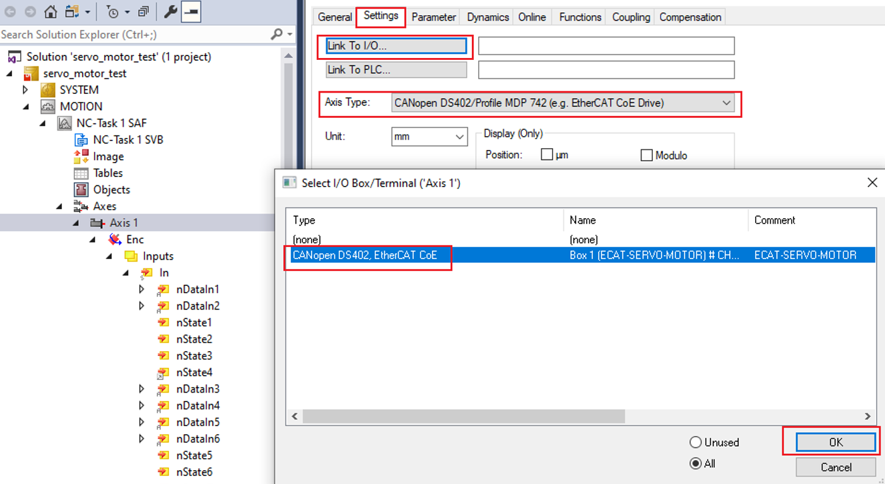

# TwinCAT project setup

This section lists the steps to set up the TwinCAT project.

## Create a new project 

1.  Import the ESI file of the servo motor example before TwinCAT starts.

    Copy the ESI file '`ECAT-SERVO-MOTOR.xml`' generated by SSC tool under the SSC project saving directory to `<TwinCAT_installation_folder>/<Version>/Config/io/EtherCAT/`.

2.  Select **File \> New \> Project**.

    

    The **New Project** dialog box appears.

3.  Select **TwinCAT Projects**.
4.  Click **OK**.

    

## Scan the for subdevices 

1.  In the **Solution Explorer** view, expand **I/O**.
2.  Right-click on **Device** and select **Scan**.

    

    The scanned devices appear in the **I/O devices found** dialog box.

3.  Select the network interface connected with the MIMXRT1180-EVK board.
4.  Click **OK**.

    

## Update the ESI file to E2PROM 

**Note:** The E2PROM must be updated if the servo motor example is set up first time on the MIMXRT1180-EVK.

1.  Under **Device4**, double-click Box 1 \(ECAT-SERVO-MOTOR\).The **TwinCAT Project** dialog box appears.
2.  Click the **EtherCAT** tab.
3.  Click the **Advanced Settings** button.

    The **Advanced Settings** dialog box appears.

4.  From the left pane of the **Advanced Settings** dialog box, select **ESC Access \> Smart View**.
5.  Click the **Write E2PROM** button.
6.  From the available EEPROM list, **select NXP \> ECAT \> ECAT-SERVO-MOTOR**.

    

7.  Click **OK**.

    **Note:** Delete *Device4*, rescan, and add *Device4* after Write E2PROM success.

    

## Configure the subdevice 

1.  Click **Box 1\(ECAT-SERVO-MOTOR\)**.
2.  Click the **DC** tab.
3.  From the **Operation Mode** field, select the **DC-Synchron** option.

    

## Select the csp mode 

1.  Click **Box 1\(ECAT-SERVO-MOTOR\)**.
2.  Click the **Slots** tab.
3.  Select *Axis 0’ \> ‘x’*.
4.  Click *Axis 0’ \> ‘csp - axis’ \> ‘<*’ to select the csp mode.

    

    The results are shown in [Figure 9](#fig_mcz_13z_gzb).

    

## Add new Axes

1.  Right-click **MOTION** and click **Add New Item**.

    

    The **Insert Motion Configuration** dialog box appears.

2.  Select **NC/PTP NCI Configuration**.
3.  Click **OK**.

    

4.  Right-click **Axes** and click **Add New Item \> OK**.

    

    The **Insert NC Axis** dialog box appears.

5.  Provide the name in the **Insert NC Axis** text box.
6.  Click **OK**.

    

## Link I/O 

1.  Select **Axes \> Axis1** from the **Solution Explorer**,
2.  Click the **Settings** tab.
3.  Select **Link To I/O \> CANopen DS402, EtherCAT CoE**.
4.  Click **OK**.

    

## Configure Enc. 

1.  Select **Axes \> Axis1 \> Enc \> Inputs \> In \> nDataIn1** from the **Solution Explorer**.

    The **TwinCAT Project** dialog box appears.

2.  Click the **\> Linked to** button.

    The **Attached Variable nDataIn1 \(Input\)** dialog box appears.

3.  Select **Box1\(ECAT-SERVO-MOTOR\) \> ActualPosition**.
4.  Select **All Types** checkbox on the right to display all variables.
5.  Click **OK**.

    

6.  Select **Axis1 \> Enc \>Inputs \> In \> nState4 \> Linked to** from the **Solution Explorer** to link **InputToggle**.

    

7.  Select **Axes \> Axis1 \> Enc \> Inputs \> In \> nDcInputTime \> Linked to** to link **DcInputShift**.

    

## Configure scaling factor 

The encoder density of Tecknic2311P motor is 8,000 counts/rev. Tp configure Scaling Factor 1/8000; convert pulse counters to mm using below formula：

`Target position(mm) = Motor revolutions(counts) * Scaling Factor`

1.  Select **Axes \> Axis1 \> Enc** from the **Solution Explorer**.

    The **TwinCAT Project** dialog box appears.

2.  Click the **Parameter** tab.
3.  Set **Scaling Factor Numerator** to `1`.
4.  Set **Scaling Factor Denominator** to `8000`.

    

## Configure drive 

1.  Select **Axes \> Axis1 \> Drive \> Inputs \> In \> nState1** from the **Solution Explorer**.

    The **TwinCAT Project** dialog box appears.

2.  Click the **Linked to** button.

    The **Attached Variable nState1 \(Input\)** dialog box appears.

3.  Select **Box1\(ECAT-SERVO-MOTOR\) \> Status Word Linked** to link **StatusWord**.
4.  Click **OK**.

    

5.  Click **OK** to link `StatusWord`.

    

6.  Click **Axes \> Axis1 \> Drive \> Inputs \> In \> nState2 \> Linked to** to link `StatusWord`.

    

    

7.  Click **Axes \> Axis1 \> Drive \> Inputs \> In \> nState4 \> Linked to** to link **WcState**.

    

8.  Click **OK**.

    

9.  Click **Axes \> Axis1 \> Drive \> Outputs \> Out \> nDataOut1 \> Linked to** to link **TargetPosition**.

    

10. Click **Axes \> Axis1 \> Drive \> Outputs \> Out \> nCtrl1 \> Linked to** to link **ControlWord**.

    

11. Click **Axes \> Axis1 \> Drive \> Outputs \> Out \> nCtrl2 \> Linked to** to link **ControlWord**.

    ")

## Stop position lag monitoring 

1.  Click **Axes \> Axis1 \> Parameter \> Monitoring \> Position Lag Monitoring** to choose `FALSE`.

    

## Start to run motor 

1.  Activate the configuration by clicking **TwinCAT \> Activate Configuration**.

    

2.  Click **Axes \> Axis1.**
3.  Click the **Online** tab.
4.  Click **Set**.
5.  Set enabling and click **All**.

    

6.  Set **Target Position** and click the **F5** button. The motor will run to the target position.

    

    **Note:** If the motor does not run and the position bar is gray, follow the following steps.

    1.  Click **Device 4 \> Box 1 \> WcState \> WcState \> Clear Link\(s\)**.
    2.  Click **Device 4 \> Box 1 \> WcState \> InputToggle \> Clear Link\(s\)**.

        

7.  Repeat step [Start to run motor](#startto)..

