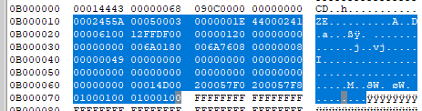

# coredump_fault

## Overview
The coredump_fault example demonstrates the basic usage of debug/coredump component.

In this example, a Usagefault is intentionally triggered using a division-by-zero operation. 
The fault is then captured in the UsageFault_Handler, where the cause of the fault, the current 
Exception Stack Frame (ESF), and partial RAM contents are saved to flash memory using the coredump component.
 
Afterward, a software reset is triggered. Upon reboot, the fault’s cause is analyzed using the API provided by the coredump component.

Please note that only flash targets are supported!

## Use GDB server to examine core dump data.
1. Save the data with an offset of 0x10 from the coredump flash partition into a binary file (e.g., log.bin).
    > Note: The offset should be 0x10. Otherwise ***[ERROR][parser] Log header ID not found...*** will reported.  

    
2. Start the custom GDB server using the script [coredump_gdbserver.py](../../../components/debug/coredump/scripts/coredump_gdbserver.py) with the core dump binary log file(saved in step 1) and example elf file as pararmeters:   
    `python ../components/debug/coredump/scripts/coredump_gdbserver.py coredump_fault.elf log.bin --port=2331`
3. Start GDB:  
    `arm-none-eabi-gdb.exe .\coredump_fault.elf`
4. Inside GDB, connect to the GDB server via port 2331:  
    `(gdb) target remote localhost:2331`  
    Output from GDB:
    ```
    Remote debugging using localhost:2331
    0x08006a76 in DEMO_TriggetUseFault ()
        at mcuxsdk/examples/component_examples/coredump_fault/coredump_fault.c:142
    142         x = x / y;
    ```
5. Examine the Core registers:  
    `(gdb) info registers`
    Output from GDB:
    ```
    r0             0x61                97
    r1             0x2012ffdf          538116063
    r2             0x1                 1
    r3             0x0                 0
    r4             0x0                 0
    r5             0x0                 0
    r6             0x0                 0
    r7             0x0                 0
    r8             0x0                 0
    r9             0x0                 0
    r10            0x0                 0
    r11            0x0                 0
    r12            0x80000000          -2147483648
    sp             0x0                 0x0
    lr             0x8006a01           134244865
    pc             0x8006a76           0x8006a76 <DEMO_TriggetUseFault+54>
    xpsr           0x49000000          1224736768
    ```
6. Examine the backtrace:  
    `(gdb) bt`
    Output from GDB:
    ```
    #0  0x08006a76 in DEMO_TriggetUseFault ()
    at mcuxsdk/examples/component_examples/coredump_fault/coredump_fault.c:142
    ```

## Supported Boards
- [FRDM-RW612](../../_boards/frdmrw612/component_examples/coredump_fault/example_board_readme.md)
