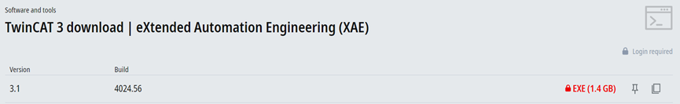
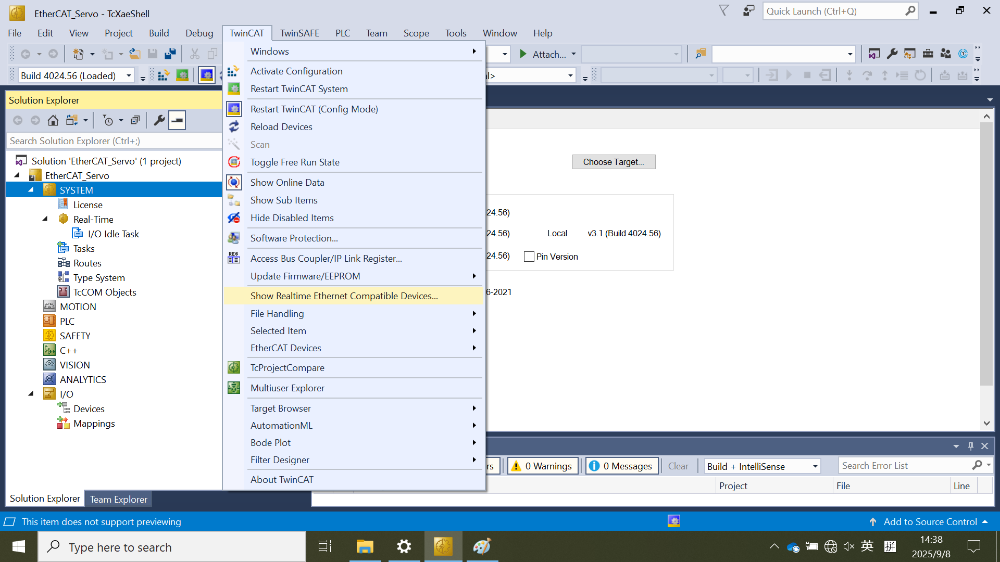
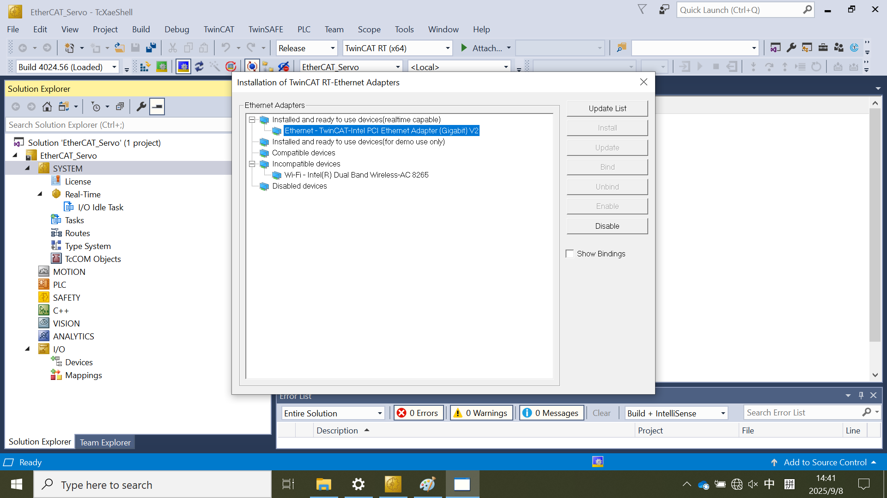

# Download and install the TwinCAT software {#download_and_install_the_twincat_software}

Download and install the TwinCAT3:

1.  Access the link [https://www.beckhoff.com/en-en/support/download-finder/search-result/?c-1=26782567](https://www.beckhoff.com/en-en/support/download-finder/search-result/?c-1=26782567).   
   A Beckhoff account is required. Please register for free first.
2.  Click on **TwinCAT 3 download \| eXtended Automation Engineering \(XAE\)** and download it a local directory on your personal computer.

    

3.  Install the software.

    **Note:** Some models of laptops are incompatible with TwinCAT. Therefore, it is advised to use a desktop computer with the e1000 series network card or other network card recommended by Beckhoff. For a list of TwinCAT supported network cards, see [Beckhoff Information System - English](https://infosys.beckhoff.com/english.php?content=../content/1033/tc3_overview/9309844363.html&id=).

4. Install Realtime Ethernet Driver  
  TwinCAT requires the realtime ethernet support. The steps is as below:
    1. Click **TwinCAT** \> **Show Realtime Ethernet Compatible Devices**. 
    

    2. Select the network card connected with subdevices.
    3. Click **Install**.  
    
