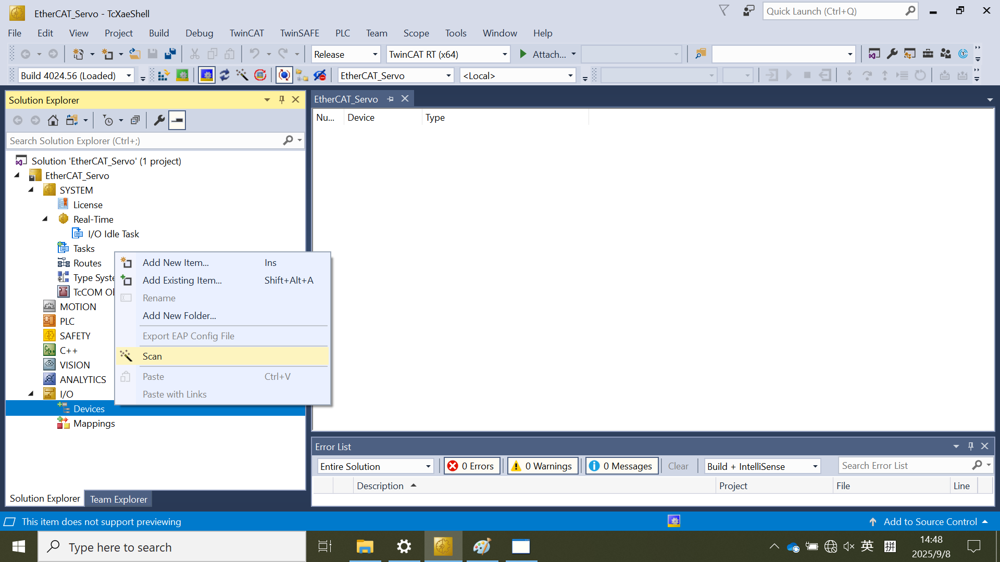
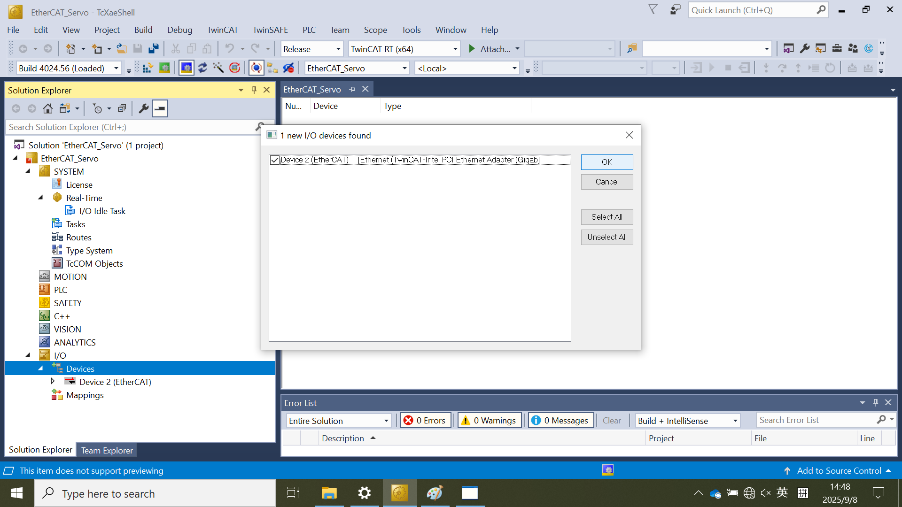
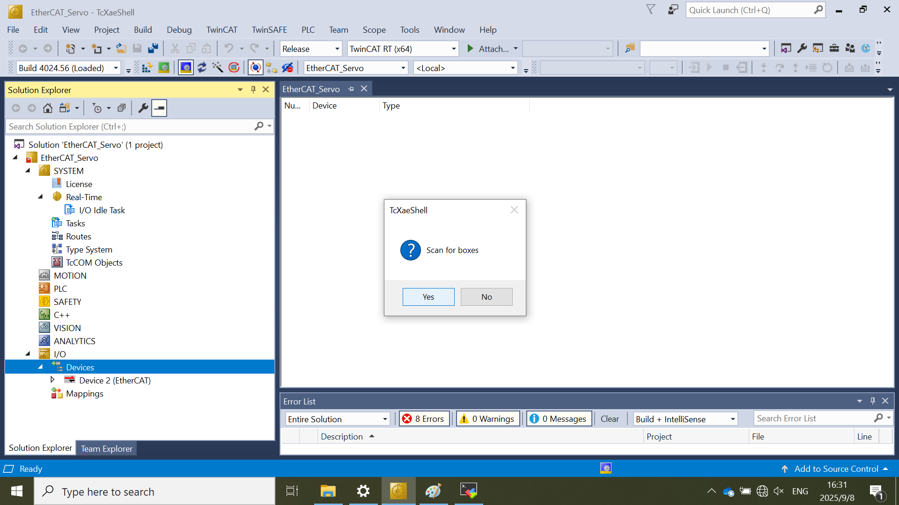
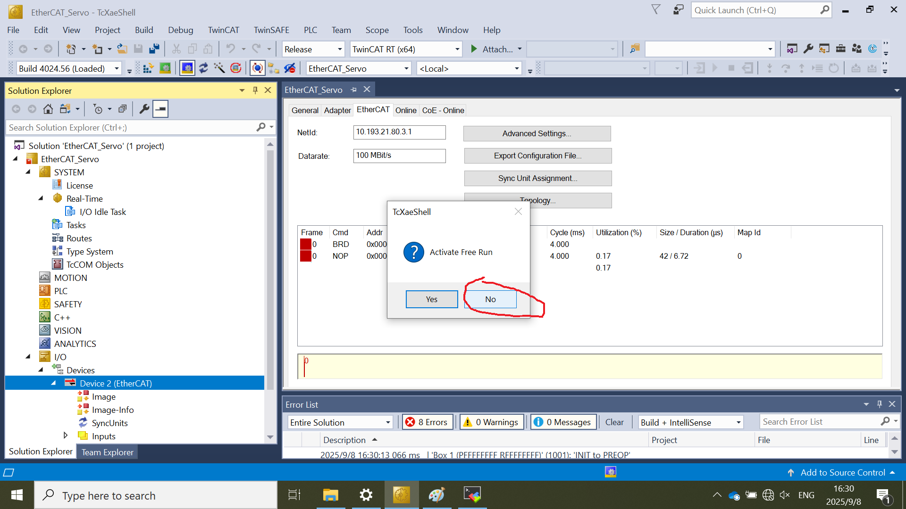
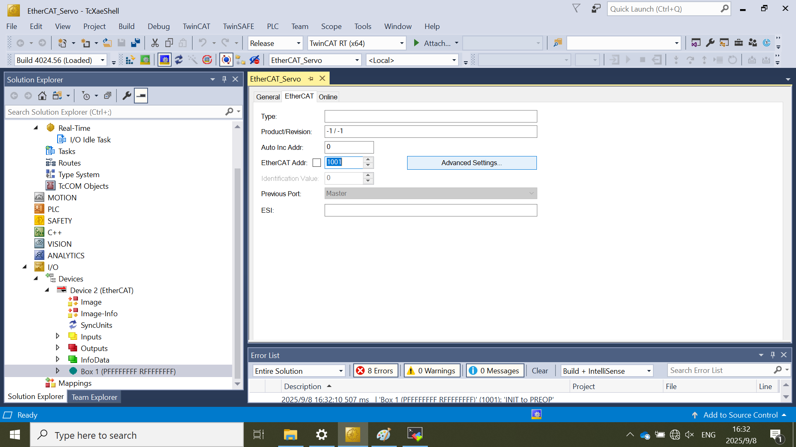
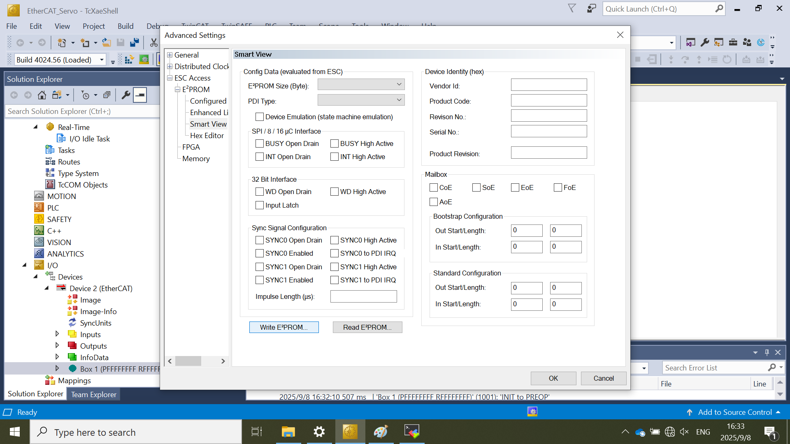
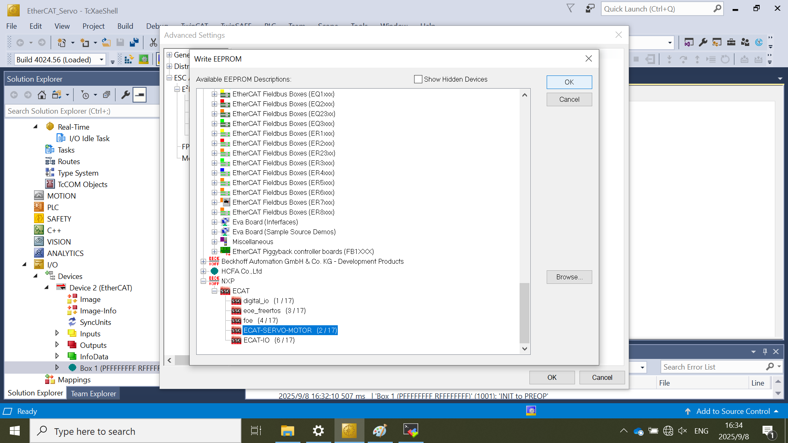
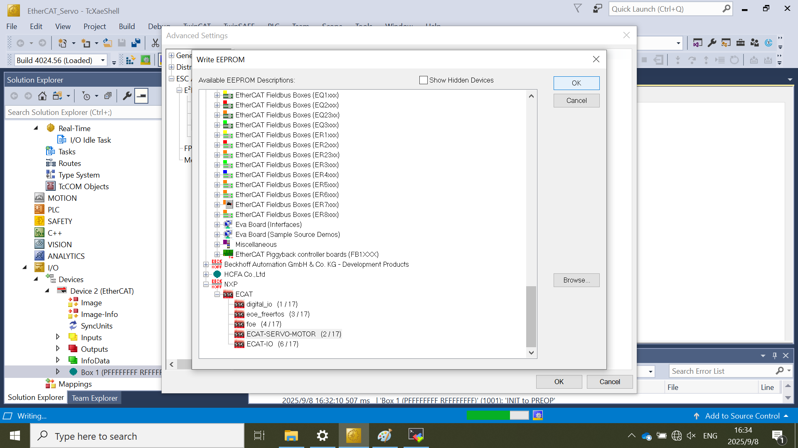
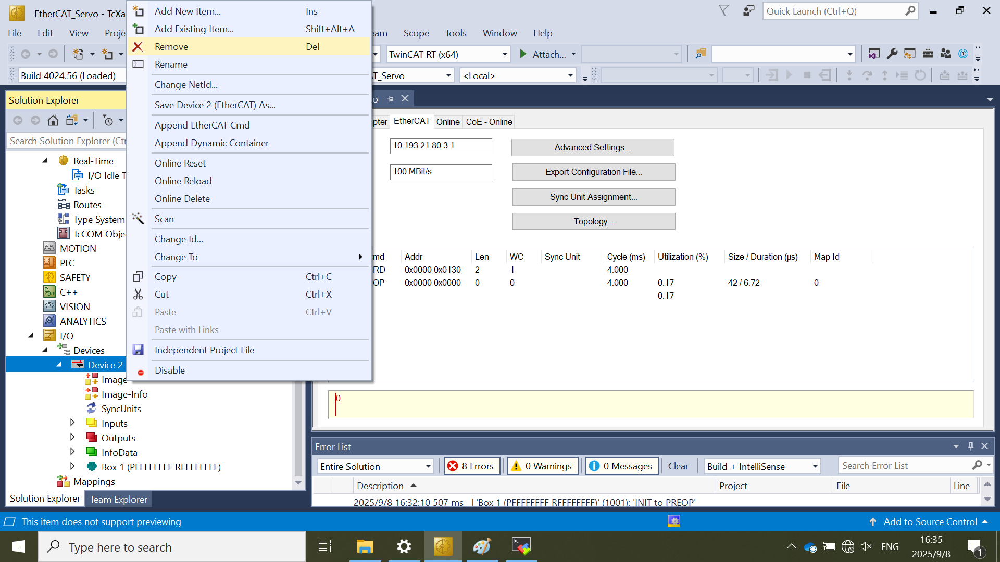

# TwinCAT EEPROM Update

## Import the SubDevice ESI file
Copy the ESI file '`ECAT-IO.xml`' generated by SSC tool to TwinCAT install directory: `C:\Program Files/3.1/Config/io/EtherCAT/` in general.    
## Create a new project 

1.  Select **File \> New \> Project**.

    

2.  Select **TwinCAT Projects** and name this project **EtherCAT_IO**.
3.  Click **OK**.

    

## Update the ESI file to EEPROM 

**Note:** The EEPROM update is required if the digital_io example is set up at first time on the board.
### Scan the subdevices 

1.  Right-click on **Device** \> **Scan** in the **Solution Explorer** pane.

    

2.  Select the realtime network interface connected with the SubDevice.
3.  Click **OK**.
    
4.  Click **Yes** to scan for boxes.  
    
5.  Click **No** to refuse to activate Free Run mode
    

### EEPROM Update
1.  Select the subdevice under EtherCAT devices node: **Device X (EtherCAT)**
2.  Double-click the Subdevice: **Box 1 \(PFFFFFFFF RFFFFFFFF\)**.
3.  Click the **EtherCAT** tab.
4.  Click the **Advanced Settings** button.
     
5.  Select **ESC Access \> Smart View** and click the **Write EEPROM** button.
     

6.  Select **NXP \> ECAT \> digital_io**.
    
7.  Click **OK**.  
8.  After EEPROM update completion, click **Ok** to exit. The status of EEPROM writing is shown on the bottom of TwinCAT IDE.
    
9.  Right-click on **Device X (EtherCAT)** node and remove the **Device X (EtherCAT)** node.  
    