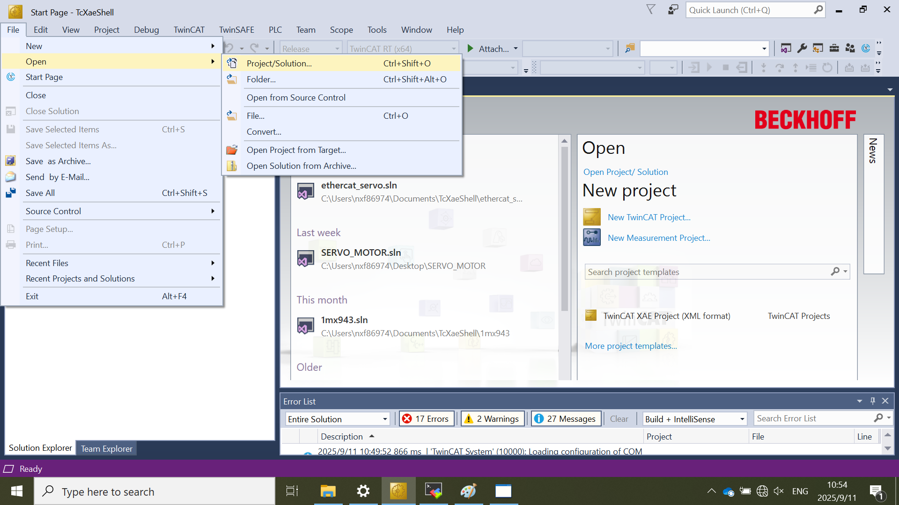
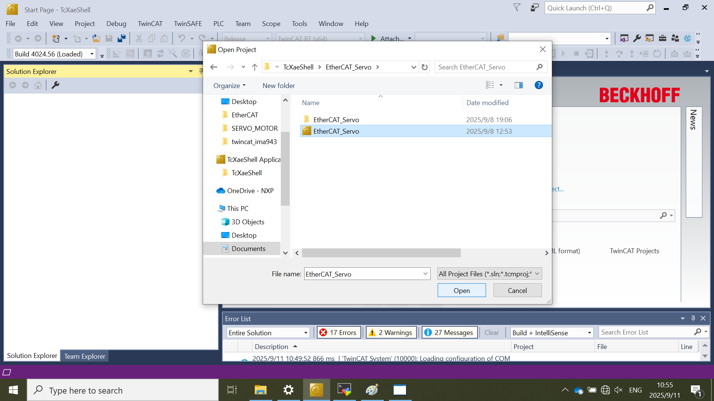
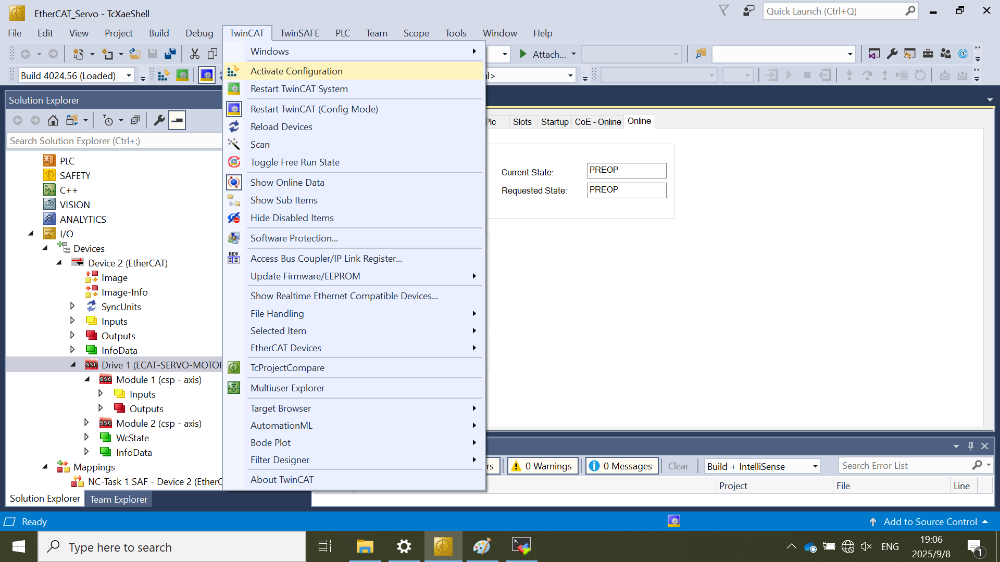
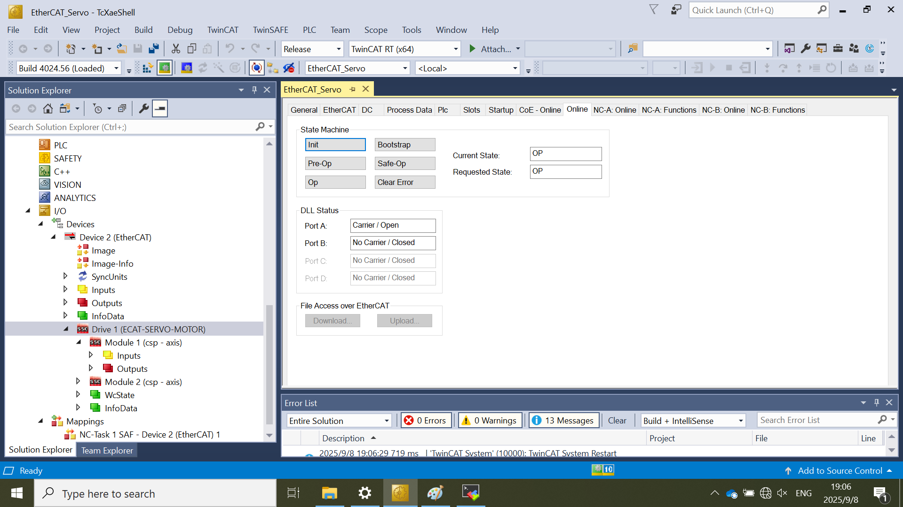
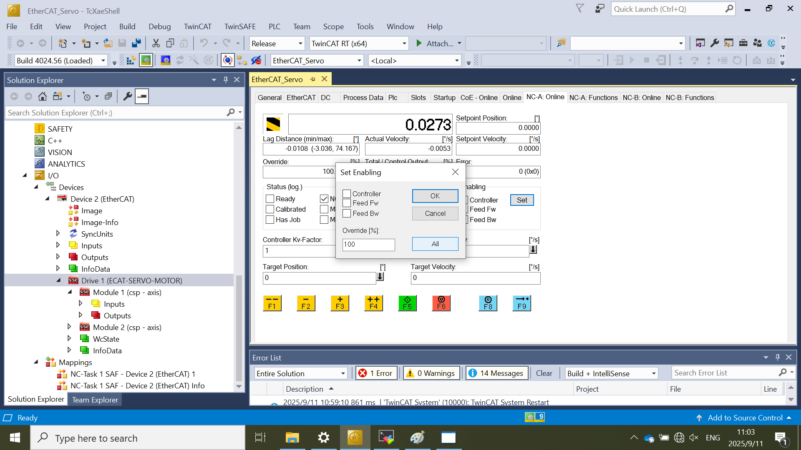
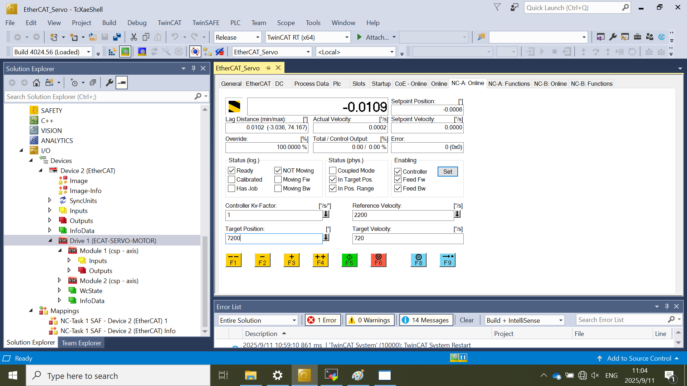
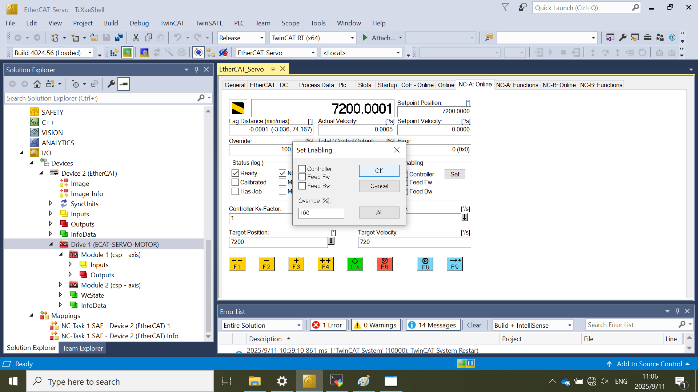

# TwinCAT Project Running

This document describes how to run the Servo_motor demo.

### Open the project
If the project does not exist, please follow the [TwinCAT Project Setup](../topics/twincat_project_setup.md) to setup the project. If the project is closed, open it as steps below:  
  - Click **File** \> **Open** \> **Project/Solution**.
      
  - Select the **EtherCAT_sevor** project.
       

### Activate the Configuration
  Please make sure that the hardware setup is ready to start first.
  - Select **Activate Configuration** in the **TwinCAT** tab.
        
### Check the state of EtherCAT state machine
  - Make sure that the current state of EtherCAT state machine has been switched to **OP** mode.  
   
### Enabling the motors 
  1. Select **NC-A: Online** for **Motor1** and Select **NC-B: Online** for **Motor2** if the **Motor2** is connected. 
  2. Click **Set** in the **Enabling** pane.
  3. Click **All** to enable **Controller**, **Feed Fw** and **Feed Bw** options.
     
  4. After enabling, the associated motor is locked.
### Start the motors
  1. Select **NC-A: Online** for **Motor1** and Select **NC-B: Online** for **Motor2** if the **Motor2** is connected.
  2. Set **Target Velocity** to **720** degree per second, namely: 2 revolution per second. 
  3. Set **Target Position** to **7200** degree. It means that the motor will move to the tenth revolution from current position. 
  4. Click **F5** button to start the motor.
    
### Disabling the motors 
  1. Select **NC-A: Online** for **Motor1** and Select **NC-B: Online** for **Motor2** if the **Motor2** is connected. 
  2. Click **Set** in the **Enabling** pane.
  3. Cancel the **Controller**, **Feed Fw** and **Feed Bw** options, and click **OK**.
     
  4. After disabling, the associated motor is unlocked.   