# TwinCAT project setup

This document describes how to configurate the TwinCAT project for Servo_motor demo.
## Create a new project 

1.  Select **File \> New \> Project**.
    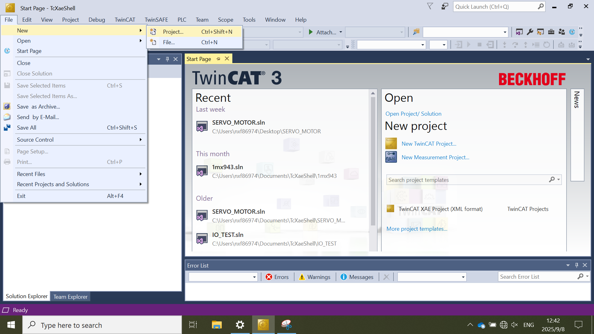
2.  Select **TwinCAT Projects** and name this project **EtherCAT_Servo**.
3.  Click **OK**.
    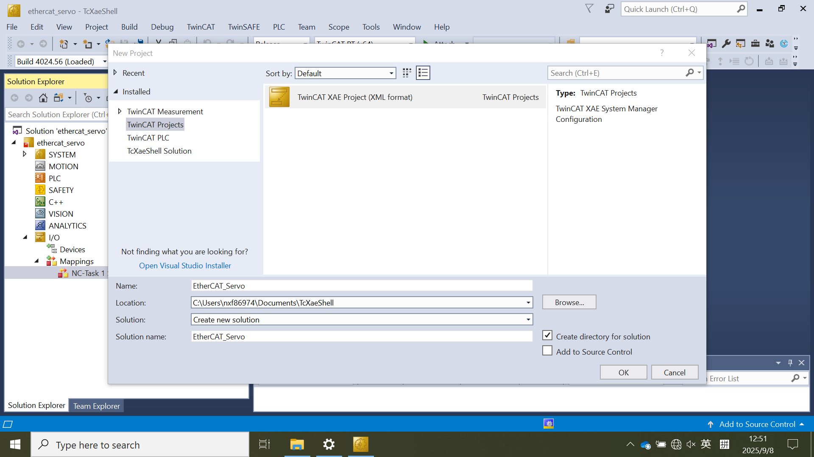

## Scan the subdevices
  1.  Right-click on **Device** \> **Scan** in the **Solution Explorer** pane.
        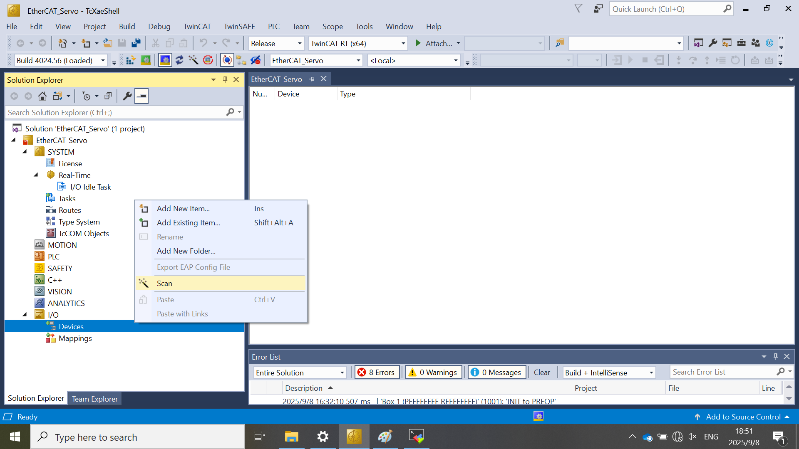
  2.  Select the realtime network interface connected with the SubDevice.
  3.  Click **OK**.
        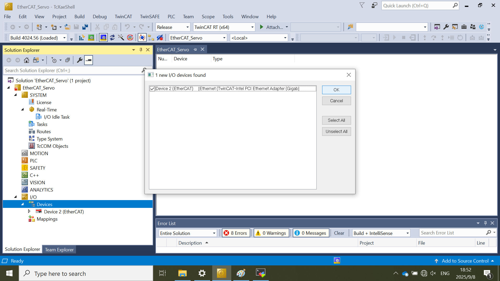
  4.  Click **Yes** to scan for boxes.  
        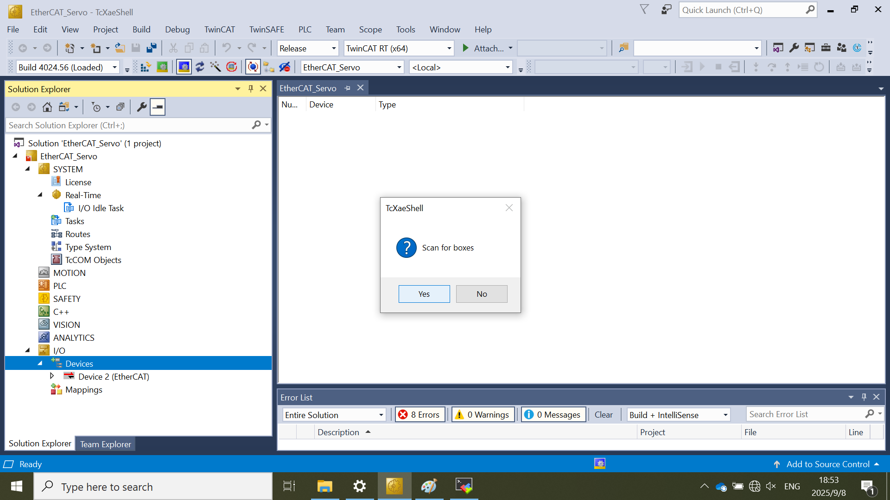
  5.  Click **OK** to append linked axis to **NC**.  
        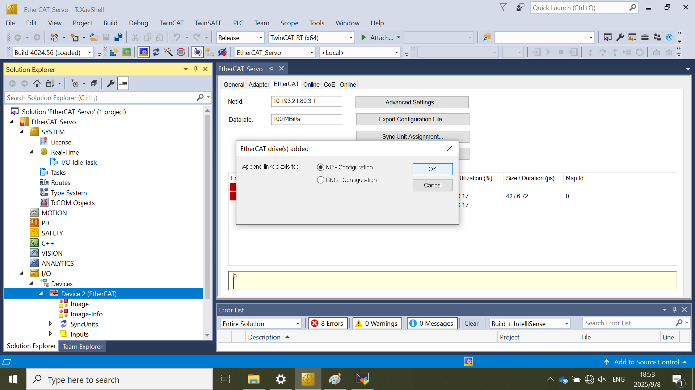
  6.  Click **NO** to refuse to activate Free Run mode.
        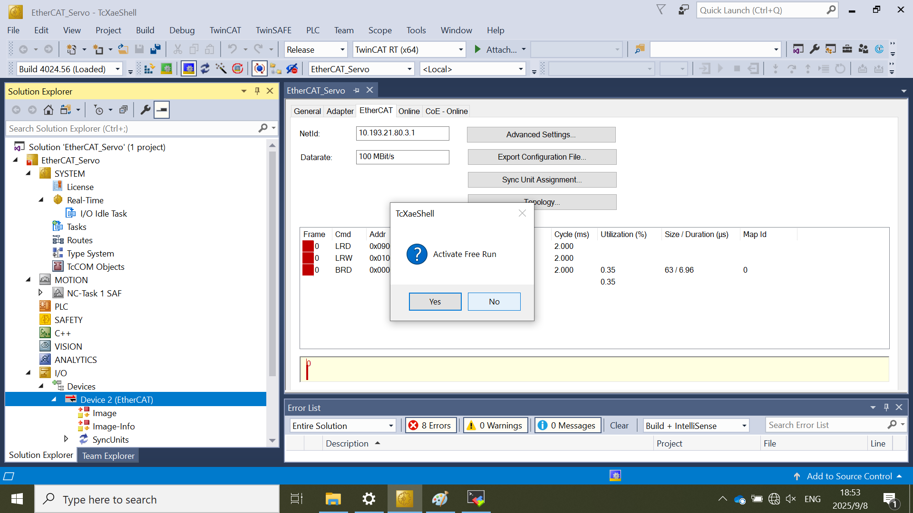

## Configure the cycle of NC task  
The cycle time of NC task depends on the cycle of slow task on subdevice.  
- The cycle time of Dual_cores_servo_motor example is 250us.
- The cycle time of servo_motor example is 1ms.

1. Configure the base time of TwinCAT to 250us
     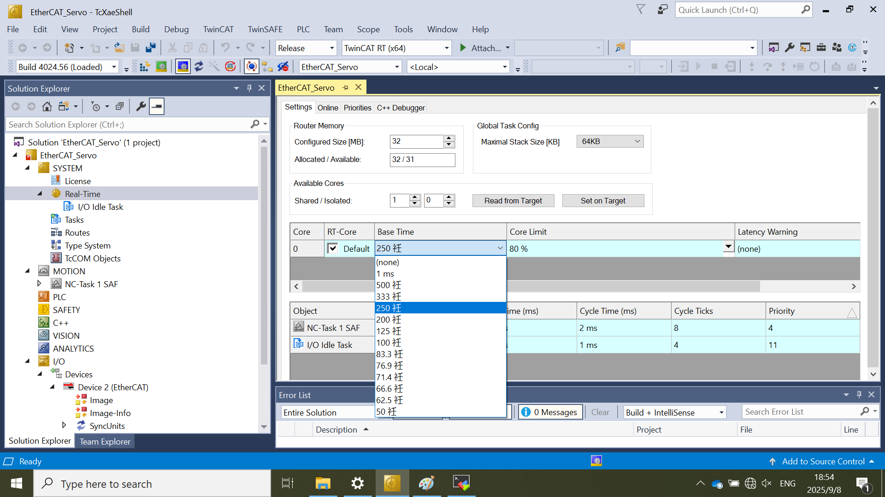
2. Configure the NC task cycle
   - Configure the NC task cycle to 250us by setting **Cycle ticks** to **1** for Dual_cores_servo_motor example.  
   - Configure the NC task cycle to 1ms by setting **Cycle ticks** to **4** for servo_motor example.  
     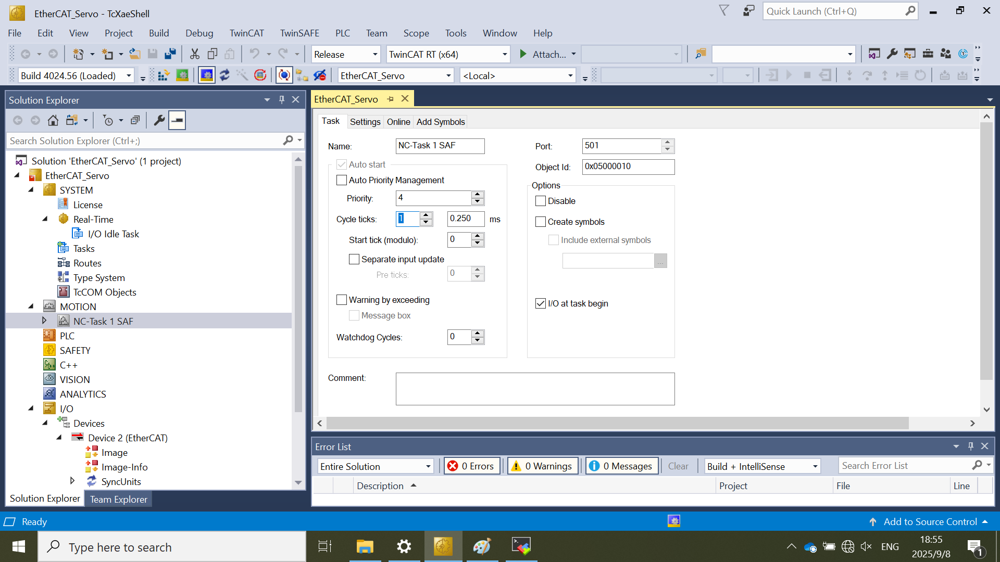

## Configure the subdevice

1.  Select **Box 1\(ECAT-SERVO-MOTOR\)** in the **Solution Explorer** pane.
2.  Select **DC** operation mode to **DC-Synchron** mode in the **DC** tab. 
    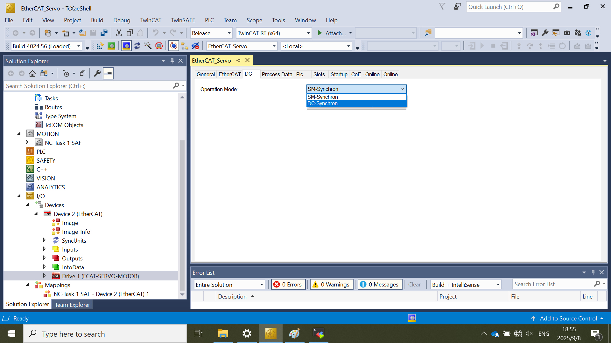
3.  Activate the **Axis 0** in the **Slots** tab for **Motor1**.
    1. Select the **Axis 0** in the left pane and select the **csp - axis** in the right pane.
    2. Click **\<** button to activate **Axis 0**.
    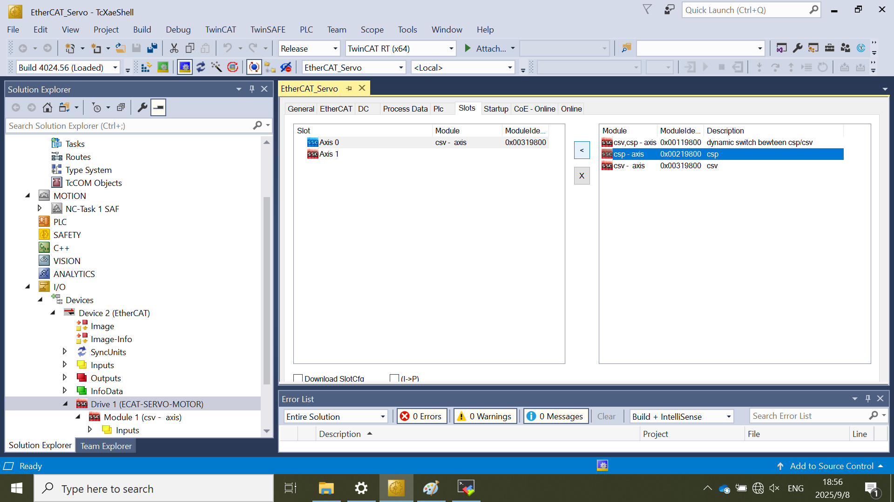
 4. Activate the **Axis 1** for **Motor2** in the **Slots** tab if the **Motor2** is connected.
    1. Select the **Axis 1** in the left pane and select the **csp - axis** in the right pane.
    2. Click **\<** button to activate **Axis 1**.
    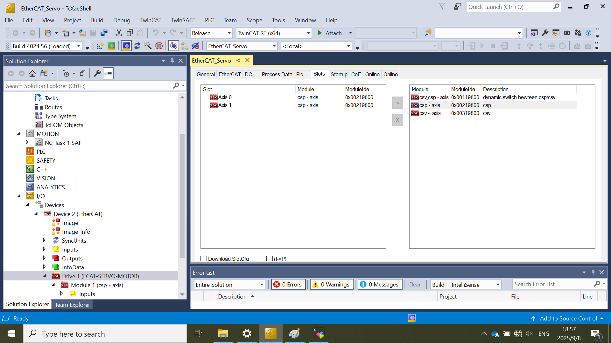

## TwinCAT NC **Axes** configuration
1. Mapping **Axis 1** to **Motor1**.
   1. Select **Axis 1** under **MOTION** \> **NC-Task 1 SAF** \> **Axes**  
   2. Click **Link TO I/O** in the **Settings** tab.
   3. Select **Drive 1 #CHN1** and click **OK**.
    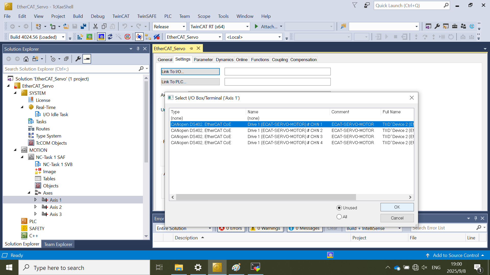  
   4. Select the **Unit** to degree.
    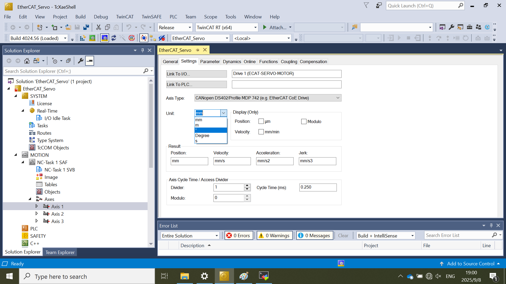 
   5. Disable **Position Log Monitoring** in the **Parameter** tab.
    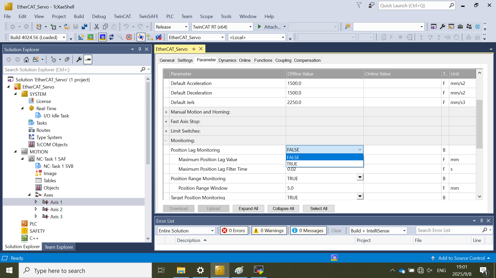  
   6. Set the **Scaling Factor** for **Enc**
      1. Select **Enc** node under **Axis 1** and then select **Parameter** tab.  
      2. Set **Scaling Factor Numerator** to **1**.
      3. Set **Scaling Factor Denominator**:
          - Set **Scaling Factor Denominator** to **93206.75555** for Dual_cores_servo_motor demo on i.MX943EVK or frdmimxrt1186. 
          - Set **Scaling Factor Denominator** to **8000** for Dual_cores_servo_motor demo on evkmimxrt1180.
          - Set **Scaling Factor Denominator** to **8000** for servo_motor demo on evkmimxrt1180 or frdmimxrt1186.  
  
        **Note:** For T5PUXS4-H09/T5PUXS4-H18 motor, the **Scaling Factor Denominator** is calculated as **the resolution of the encoder / 360**.  
        -  The resolution of the Encoder on Dual_cores_servo_motor example is 25Bits，namely 33554432(2^25).   

        **Note:** For Teknic 2311P motor, the **Scaling Factor Denominator** is calculated as **the resolution of the encoder**. 
        -  The resolution of the Encoder on servo_motor example is 8000.
  
      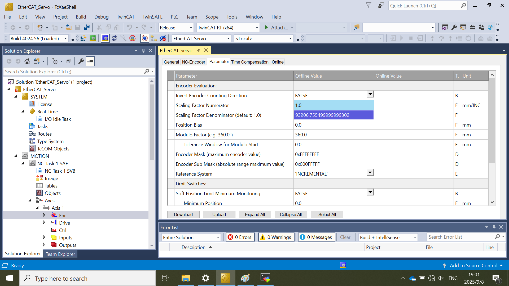  
2. Mapping **Axis 2** to **Motor2** if the **Motor2** is connected
   1. Select **Axis 2** under **MOTION** \> **NC-Task 1 SAF** \> **Axes**  
   2. Click **Link TO I/O** in the **Settings** tab.
   3. Select **Drive 1 #CHN2** and click **OK**.
    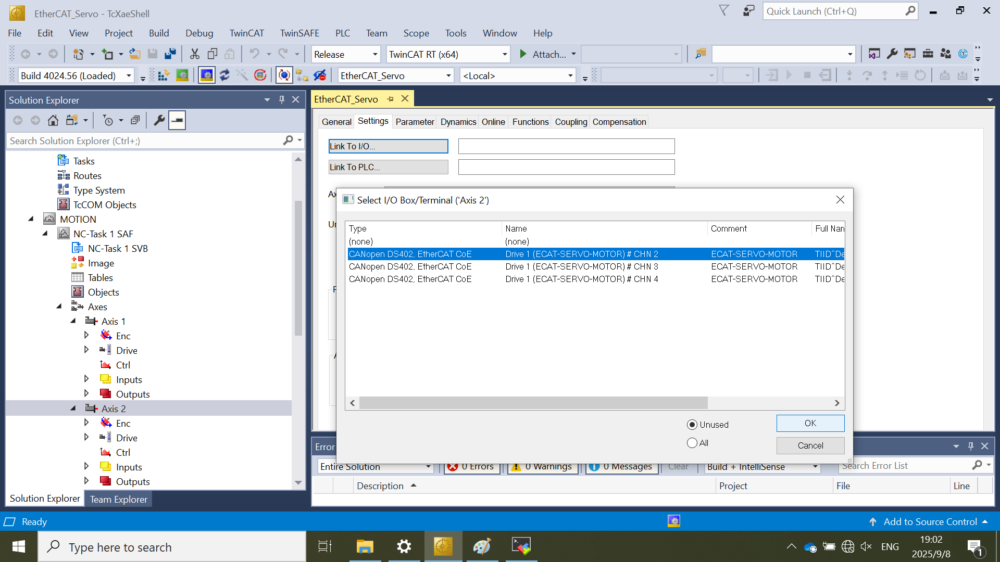  
   4. Select the **Unit** to degree.
    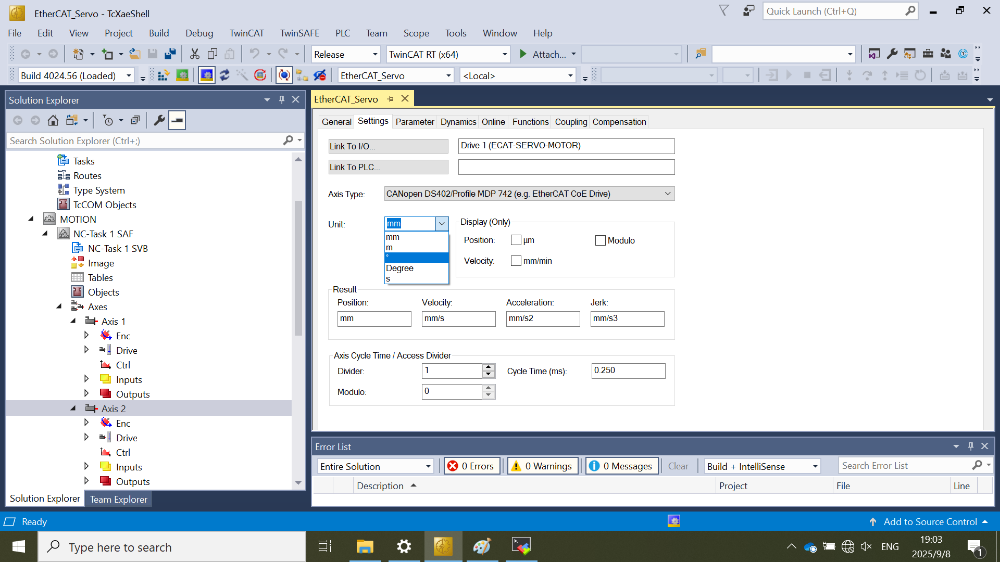 
   5. Disable **Position Log Monitoring** in the **Parameter** tab.
    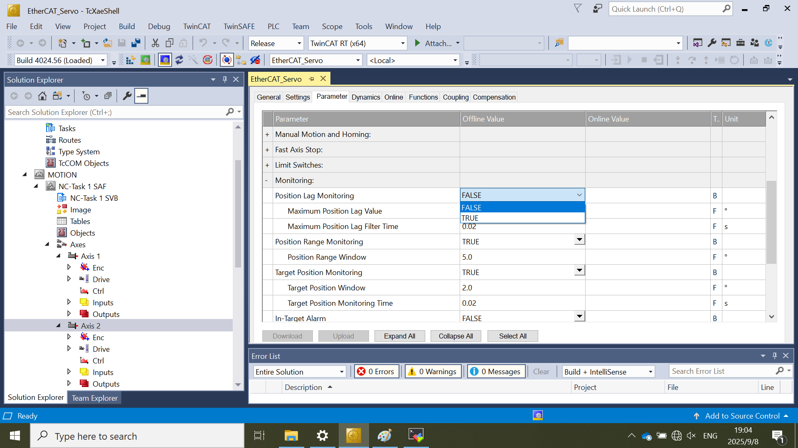  
   6. Set the **Scaling Factor** for **Enc**
      1. Select **Enc** node under **Axis 1** and then select **Parameter** tab.  
      2. Set **Scaling Factor Numerator** to **1**.
      3. Set **Scaling Factor Denominator**:
          - Set **Scaling Factor Denominator** to **93206.75555** for Dual_cores_servo_motor demo on i.MX943EVK or frdmimxrt1186.
  
        **Note:** the **Scaling Factor Denominator** is calculated as **the resolution of the encoder / 360**.  
        -  The resolution of the Encoder on Dual_cores_servo_motor example is 25Bits，namely 33554432(2^25).   
   
      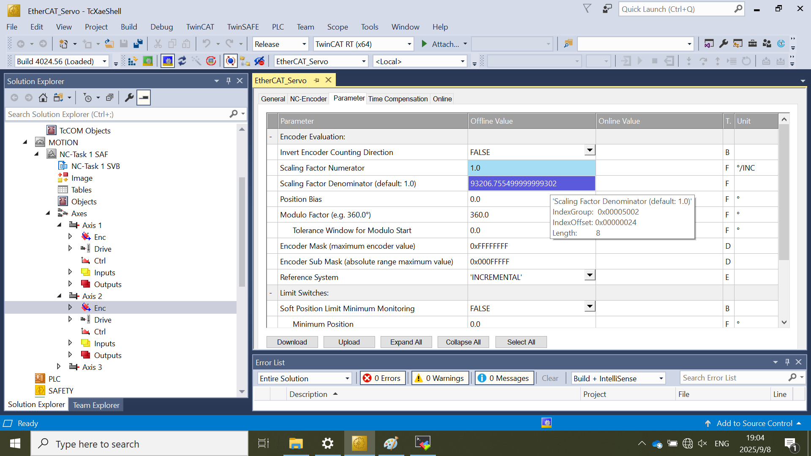  
## Save the project  
  - Click **File** \> **Save All** 
  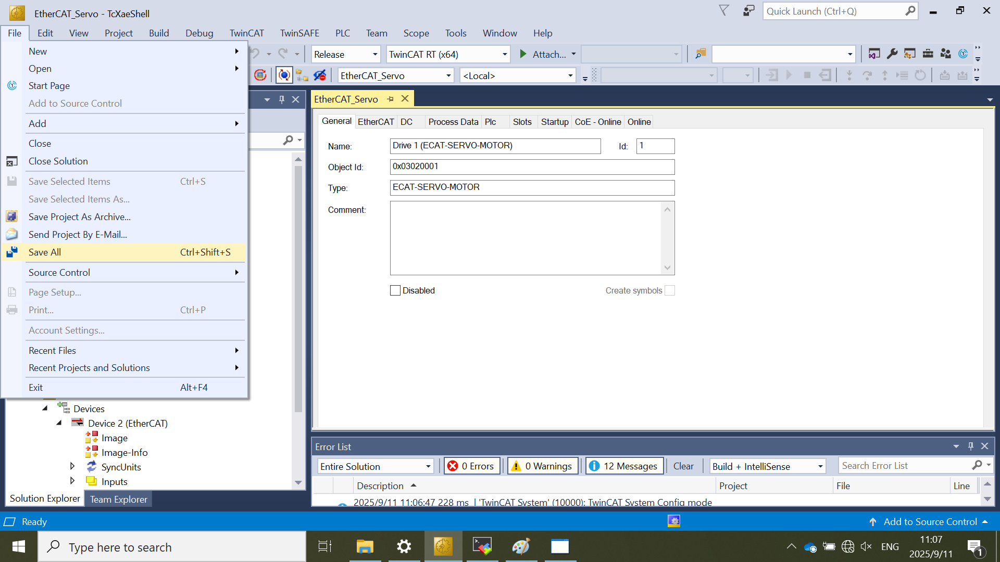 

