# Run NCP device example using MCUXpresso for VS Code

## Build ot-cli libraries

> Please refer to [ot-nxp/src/rw/rw612/README.md at release/v1.4.0.2 · NXP/ot-nxp · GitHub](https://github.com/NXP/ot-nxp/blob/release/v1.4.0.2/src/rw/rw612/README.md)

### Download ot-nxp reporisty
Download the ot-nxp repo from a release branch or a release tag.

For example, download from **release/v1.4.0.2** branch.

```bash
$ git clone https://github.com/NXP/ot-nxp.git -b release/v1.4.0.2
$ cd <path-to-ot-nxp>
$ git submodule update --init
```

### Toolchain
OpenThread environment is suited to be run on a Linux-based OS (Ubuntu OS for example), WSL (Ubuntu 20.04 on Windows) or Windows (command line). There are three tools that need to be installed:

- CMake
- ninja
- the arm-non-eabi gcc cross-compiler

Depending on system used installing each tool done differently.

**Linux-based**

In a Bash terminal (for example, in Ubuntu OS), follow these instructions to install the GNU toolchain and other dependencies.

```bash
$ ./script/bootstrap
```

**WSL (Ubuntu 20.05 on Windows)**

Open the WSL console and type the following.

```bash
$ sudo apt install ninja-build cmake gcc-arm-none-eabi
```

**Windows**

On this platform you have to install all the tools by downloading the installers:

- For the CMake get the downloader from the [official site](https://cmake.org) and install it
- For the ninja build system download the binary from the [official site](https://ninja-build.org). Place it in a path accessible from the windows command window.
- For the gcc-arm-non-eabi cross-compiler, download the installer from the [official site](https://developer.arm.com/downloads/-/gnu-rm) and install it

Make sure that the paths of all these tools are set into the **Path** system variable.

### Downloading the NXP MCUXpresso SDK (only used for ot-cli library build)
Note: Before downloading the SDK, it is assumed that ot-nxp has been downloaded and submodules have been updated, because the script of nxp_matter_support submodule is required. Download the NXP MCUXpresso git SDK and associated middleware from GitHub using script:

```bash
$ cd <path-to-ot-nxp>
$ ./third_party/nxp_matter_support/scripts/update_nxp_sdk.py --platform common
```

### Building the NCP ot libraries
Setup compilation parameters and build NCP ot libs,

```bash
$ cd <path-to-ot-nxp>
$ export ARMGCC_DIR='your-own-armgcc-dir-path'
$ source ./third_party/nxp_matter_support/github_sdk/sdk_next/repo/mcuxsdk/mcux-env.sh
$ west mcuxsdk-export

For ncp coex (embedded supplicant), ot libs build:
$ ./script/build_rw612 ot_cli -DOT_NXP_BUILD_APP_AS_LIB=ON -DOT_APP_CLI_FREERTOS_LOWPOWER=OFF -DOT_NCP_RADIO=ON -DOT_NXP_ENABLE_WPA_SUPP_MBEDTLS=OFF -DOT_NXP_NCP_UART_INTERFACE=ON

For ncp coex (wpa supplicant), ot libs build:
$ ./script/build_rw612 ot_cli -DOT_NXP_BUILD_APP_AS_LIB=ON -DOT_APP_CLI_FREERTOS_LOWPOWER=OFF -DOT_NCP_RADIO=ON -DOT_NXP_ENABLE_WPA_SUPP_MBEDTLS=ON -DOT_NXP_NCP_UART_INTERFACE=ON

Note:This ncp coex (wpa supplicant) ot libs only used to compile with CONFIG_NCP_WIFI=1 and CONFIG_WPA_SUPPLICANT=1 in ncp_examples/ncp_device/app_config.cmake, otherwise should use ncp coex (embedded supplicant) ot libs to compile.
```

## Confirm the SDK version used to compile the NCP device

Determine which SDK version to use by:

For example, you compiled the ot-cli library using the [release/v1.4.0.2](https://github.com/NXP/ot-nxp/tree/release/v1.4.0.2) branch. 

Go to ot-nxp/third_party/,

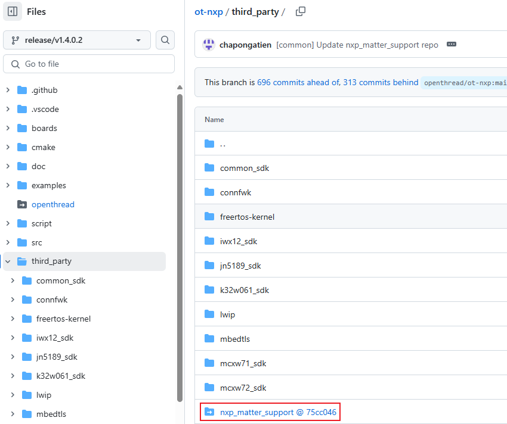

click nxp_matter_support, it will switch to nxp_matter_support repo.

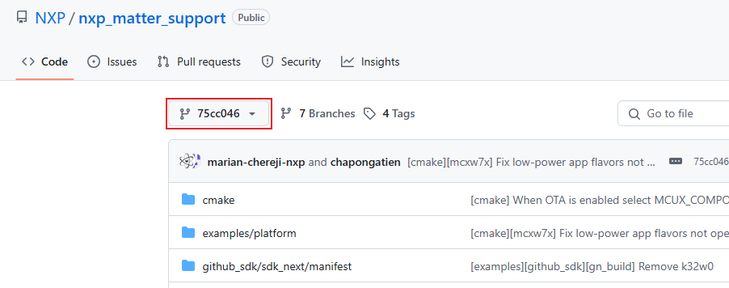

Go to nxp_matter_support/github_sdk/sdk_next/manifest, it includes a **west.yml**

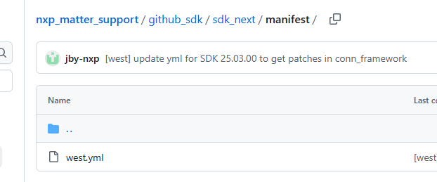

Then you can get the revision from west.yml, revision is **v25.03.00**.

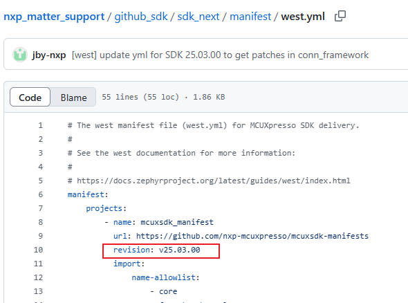

Now, **you should download SDK v25.03.00 to compile the NCP device**.

## Build NCP device example

### MCUXpresso for VS Code extension Installation

Installation process using VS Code

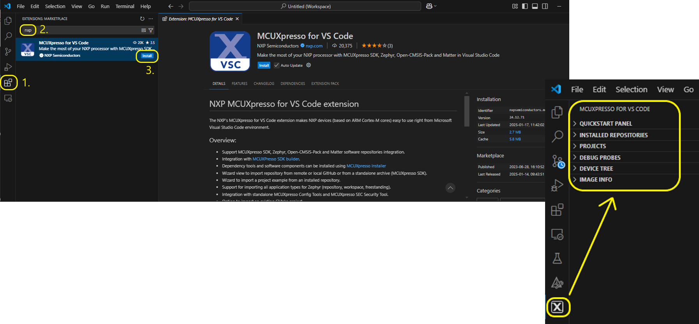


### Dependency Installation
In addition to the extension itself, some extra tools and software components are required for the full development flow within VS Code.

Please refer to [Dependency Installation · nxp-mcuxpresso/vscode-for-mcux Wiki · GitHub](https://github.com/nxp-mcuxpresso/vscode-for-mcux/wiki/Dependency-Installation).

### Building ncp_device example using VS Code
Please refer to [Working with MCUXpresso SDK](https://github.com/nxp-mcuxpresso/vscode-for-mcux/wiki/Working-with-MCUXpresso-SDK)

To build ncp_device example:

1. Import the SDK into your workspace. Click **Import Repository** from the **QUICKSTART PANEL**.
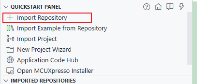

    Note: You can import the SDK in several ways. Refer to [MCUXpresso for VS Code Wiki](https://github.com/nxp-mcuxpresso/vscode-for-mcux/wiki/Working-with-MCUXpresso-SDK) for details

    **a. Import remote Git repository**

    A special tab option on the IMPORT REPOSITORY view will allow the user to specify the details about the remote repository.

    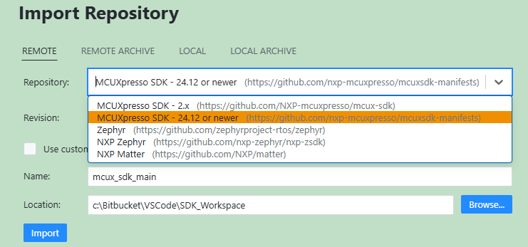

    By default, "main" revision is set. If other revision is needed, check the expanded list.

    For example, refer to **[Confirm the SDK version used to compile the NCP device](#confirm-the-sdk-version-used-to-compile-the-ncp-device)**, we should select revision **v25.03.00**.

    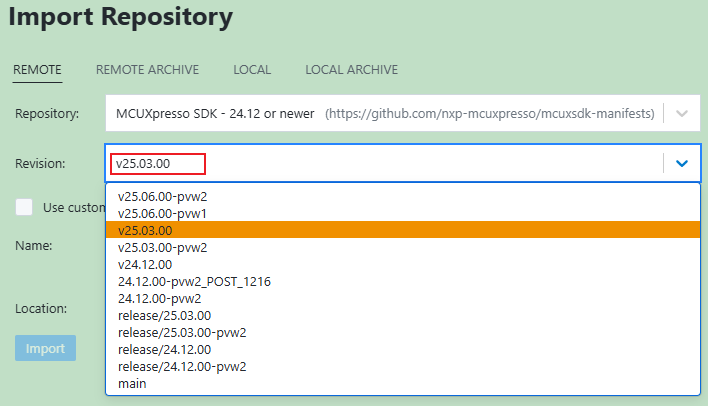

    **b. Import MCUXpresso SDK using SDK Builder**

    It is possible to import an MCUXpresso SDK archive directly from the extension, using the SDK Builder.

    After selecting a package (which can be either a board or a device) and a version, information regarding the SDK package will be displayed.

    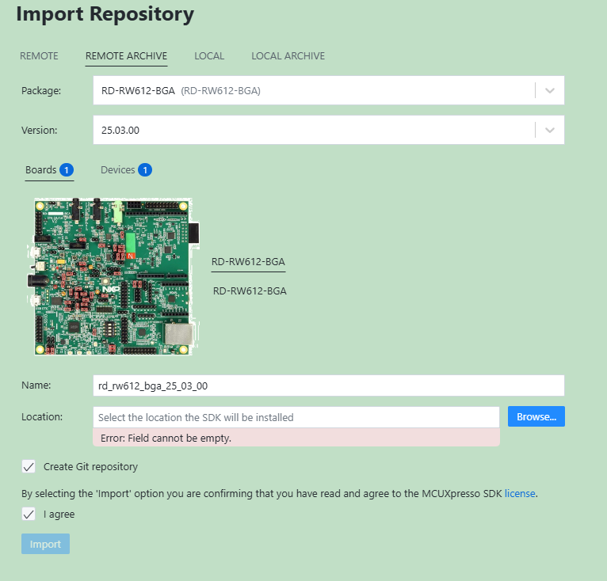

    **c. Import local Git repository**

    Select Local if you've already obtained the SDK as seen in Get MCUXpresso SDK Repo. Select your location and click Import.
    Select the folder where the local repository is located.

    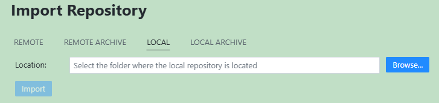

    **d. Import standalone MCUXpresso SDK zip archive**

    Another possibility is to install an MCUXpresso SDK from a zip archive (Downloaded from [MCUXpresso.NXP.com](https://mcuxpresso.nxp.com/en)).

    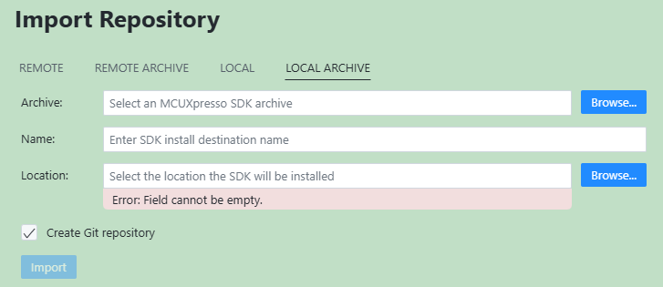

2. Click **Import Example from Repository** from the **QUICKSTART PANEL**.

    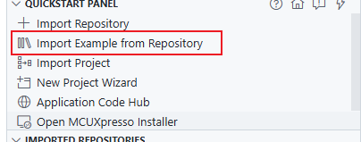

    In the dropdown menu, select the MCUXpresso SDK, the Arm GNU Toolchain, your board (RD-RW612-BGA), template (ncp_examples//ncp_device), and application type. Click **Import.**

    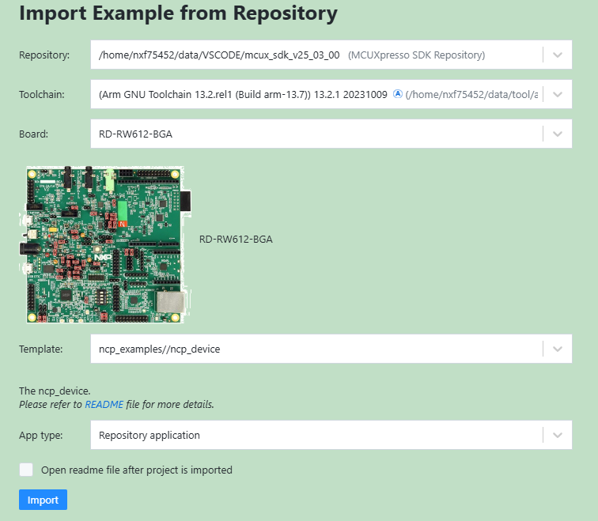

    **Note**: The MCUXpresso SDK projects can be imported as **Repository applications** or **Freestanding applications**. The difference between the two is the import location. Projects imported as Repository examples will be located inside the MCUXpresso SDK, whereas Freestanding examples can be imported to a user-defined location. Select between these by designating your selection in the App type dropdown menu.

3. VS Code will prompt you to confirm if the imported files are trusted. Click Yes.
4. Navigate to the **PROJECTS** view. Find your project - ncp_device

    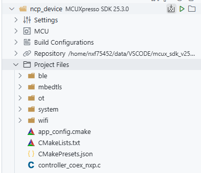

    Create a soft link to the ot-nxp repo in the ncp_device example. (path: mcux_sdk_v25_03_00/mcuxsdk/examples/ncp_examples/ncp_device/ot/third_party).

    ```bash
    Go to path: mcux_sdk_v25_03_00/mcuxsdk/examples/ncp_examples/ncp_device/ot/third_party
    
    #On windows, create a soft link
    $ mklink /D ot-nxp <path-to-ot-nxp>
    
    #On Linux, create a soft link
    $ ln -s <path-to-ot-nxp> ot-nxp
    ```

    **NOTE: For MCU SDK version 25.03.00, you need to add the following fix:**

    **Fix 1:**
    ```C
    diff --git a/ncp_examples/ncp_device/ot/third_party/ot_config.cmake b/ncp_examples/ncp_device/ot/third_party/ot_config.cmake
    index afc90dd3b3..3e2f5f2874 100644
    --- a/ncp_examples/ncp_device/ot/third_party/ot_config.cmake
    +++ b/ncp_examples/ncp_device/ot/third_party/ot_config.cmake
    @@ -52,10 +52,23 @@ if (EXISTS ${NXP_OT_ROOT_PATH})
            ${NXP_OT_ROOT_PATH}/third_party/mbedtls/configs
        )
    else()
    -    message(WARNING "Please download ot-nxp in ${CMAKE_CURRENT_LIST_DIR}")
    +    message(FATAL_ERROR "Please download ot-nxp in ${CMAKE_CURRENT_LIST_DIR}")
    endif()

    if (EXISTS ${NXP_OT_LIBS_PATH})
    +
    +    if(${CONFIG_NCP_UART})
    +        set(ot-ncp-app-lib "libot-cli-rw612-ncp-uart.a")
    +    elseif(${CONFIG_NCP_SPI})
    +        set(ot-ncp-app-lib "libot-cli-rw612-ncp-spi.a")
    +    elseif(${CONFIG_NCP_SDIO})
    +        set(ot-ncp-app-lib "libot-cli-rw612-ncp-sdio.a")
    +    elseif(${CONFIG_NCP_USB})
    +        set(ot-ncp-app-lib "libot-cli-rw612-ncp-usb.a")
    +    else()
    +        message(FATAL_ERROR "Unknown ncp interface")
    +    endif()
    +
        TARGET_LINK_LIBRARIES(${MCUX_SDK_PROJECT_NAME} PRIVATE -Wl,--start-group)
        # ot ncp libs
        target_link_libraries(${MCUX_SDK_PROJECT_NAME} PRIVATE
    @@ -67,13 +80,13 @@ if (EXISTS ${NXP_OT_LIBS_PATH})
            ${NXP_OT_LIBS_PATH}/libopenthread-rw612.a
            ${NXP_OT_LIBS_PATH}/libopenthread-spinel-ncp.a
            ${NXP_OT_LIBS_PATH}/libot-cli-addons.a
    -        ${NXP_OT_LIBS_PATH}/libot-cli-rw612.a
    +        ${NXP_OT_LIBS_PATH}/${ot-ncp-app-lib}
            ${NXP_OT_LIBS_PATH}/libopenthread-url.a
            ${NXP_OT_LIBS_PATH}/libopenthread-radio-spinel.a
            ${NXP_OT_LIBS_PATH}/libtcplp-ftd.a
        )
        TARGET_LINK_LIBRARIES(${MCUX_SDK_PROJECT_NAME} PRIVATE -Wl,--end-group)
    else()
    -    message(WARNING "Please compile ot ncp libs in ${CMAKE_CURRENT_LIST_DIR}")
    +    message(FATAL_ERROR "Please compile ot ncp libs in ${CMAKE_CURRENT_LIST_DIR}")
    endif()
    endif()
    ```

    **Fix 2:**
    ``` C
    diff --git a/ncp_examples/common/mbedtls/mbedtls_common.c b/ncp_examples/common/mbedtls/mbedtls_common.c
    index 0b63d2db71..432434981b 100644
    --- a/ncp_examples/common/mbedtls/mbedtls_common.c
    +++ b/ncp_examples/common/mbedtls/mbedtls_common.c
    @@ -37,15 +37,15 @@ static const int _ciphersuite_list[] = {
    mbedtls_ctx_t *_mbedtls;
    uint32_t _verify_num;

    -static int port_mbedtls_rng(void *p_rng, uint8_t *buf, uint32_t len)
    +static int port_mbedtls_rng(void *p_rng, unsigned char *buf, size_t len)
    {
        if (!buf)
        {
            return -1;
        }
    -    for (uint32_t i = 0; i < len; ++i)
    +    for (uint32_t i = 0; i < (uint32_t)len; ++i)
        {
    -        buf[i] = (uint8_t)rand();
    +        buf[i] = (unsigned char)rand();
        }
        return 0;
    }
    @@ -186,7 +186,7 @@ static int ncp_encrypt_init_mbedtls(void)
        (void) TRNG_Init(TRNG, &trngConfig);
        (void) TRNG_GetRandomData(TRNG, &seed, sizeof(seed));
        (void) srand(seed);
    -    (void) port_mbedtls_rng(NULL, _mbedtls->entropy_buf, sizeof(_mbedtls->entropy_buf));
    +    (void) port_mbedtls_rng(NULL, (unsigned char *)(_mbedtls->entropy_buf), sizeof(_mbedtls->entropy_buf));
        mbedtls_ssl_config_init(&_mbedtls->conf);
        // mbedtls_platform_set_printf(&DbgConsole_Printf);
    #ifdef MBEDTLS_DEBUG_C
    ```

5. Enable WIFI, BLE and OT
    Go to path: mcux_sdk_v25_03_00/mcuxsdk/examples/ncp_examples/ncp_device/app_config.cmake, enable WIFI, BLE and OT.

    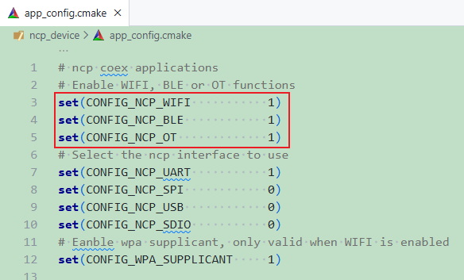

6. Click the Build Project icon

    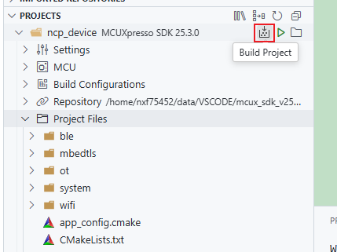

    The integrated terminal will open at the bottom and will display the build output.
    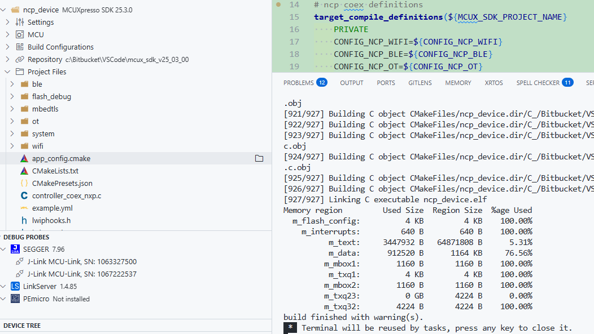
