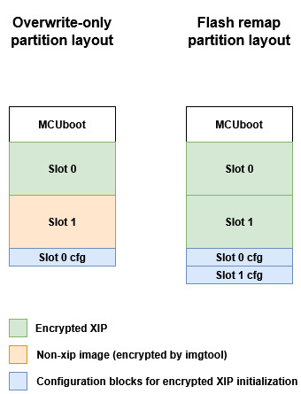
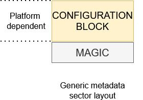
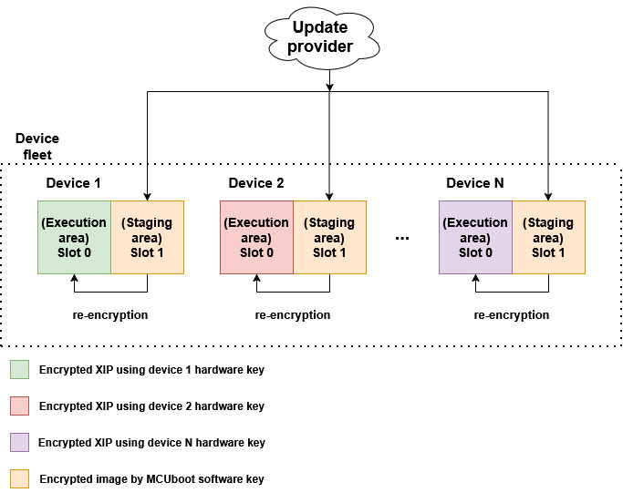
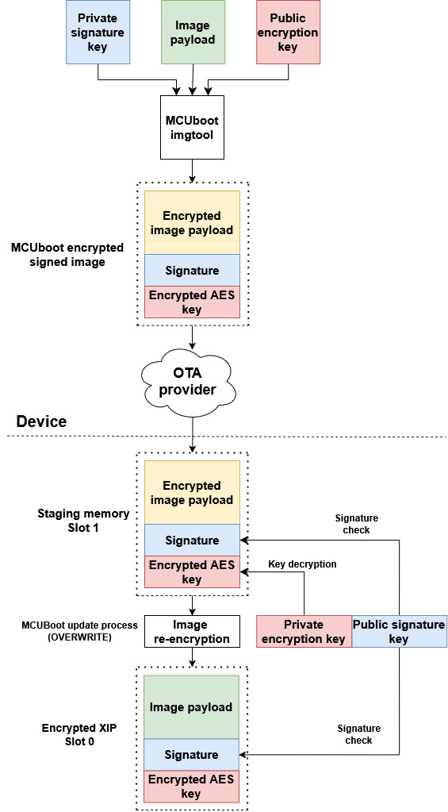
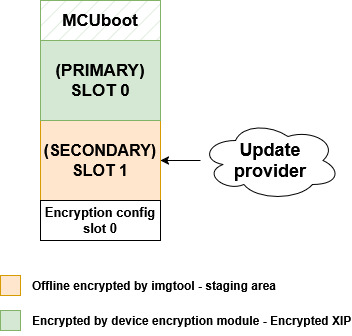
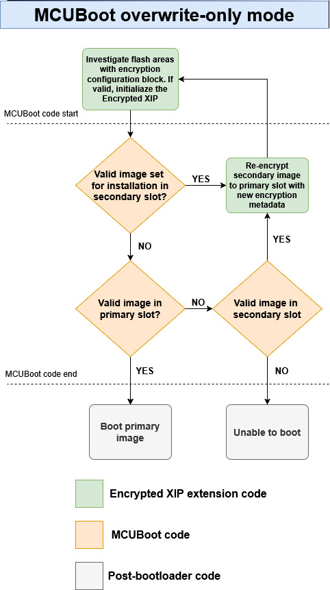
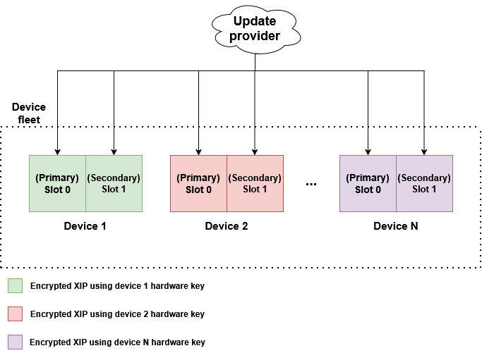
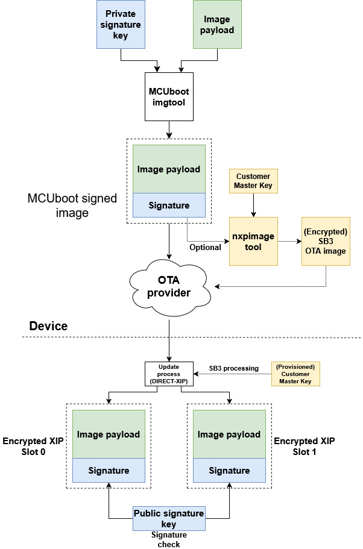
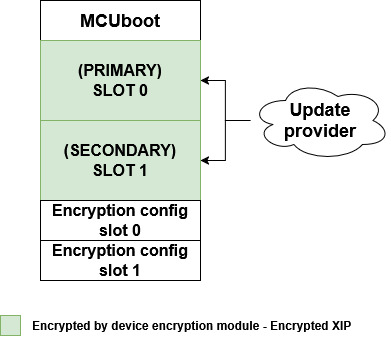
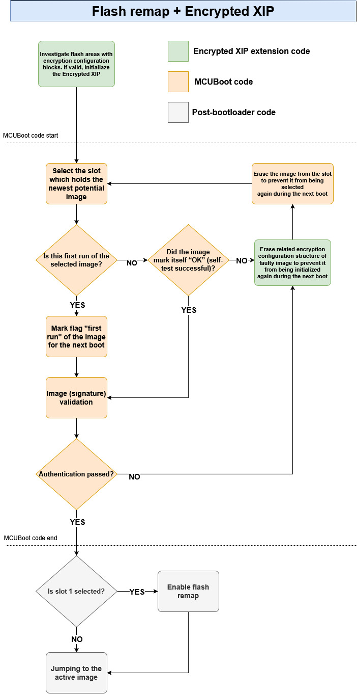

# Encrypted XIP and MCUboot

- [1. Introduction](#1-introduction)
- [2 Encrypted XIP configuration structures](#2-encrypted-xip-configuration-structures)
- [3. Encrypted XIP upgrade modes](#3-encrypted-xip-upgrade-modes)
   * [3.1 OVERWRITE_ONLY](#31-overwrite_only)
      + [3.1.1 OVERWRITE_ONLY partition layout](#311-overwrite_only-partition-layout)
      + [3.1.2 OTA flow of modified overwrite only mode](#312-ota-flow-of-modified-overwrite-only-mode)
   * [3.2 FLASH_REMAP](#32-flash_remap)
      + [3.2.1 FLASH_REMAP partition layout](#321-flash_remap-partition-layout)
      + [3.2.2 OTA flow of modified FLASH_REMAP mode](#322-ota-flow-of-modified-flash_remap-mode)
      + [3.2.3 Limitations of FLASH_REMAP mode](#323-limitations-of-flash_remap-mode)
   * [3.3 Summary of Encrypted XIP upgrade modes](#33-summary-of-encrypted-xip-upgrade-modes)
- [4. Supported encryption modules](#4-supported-encryption-modules)
   * [4.1 Supported boards](#41-supported-boards)
- [5. OTA examples instructions](#5-ota-examples-instructions)
   * [5.1 Generate ECIES-P256 key pairs for encrypted image containers (optional)](#51-generate-ecies-p256-key-pairs-for-encrypted-image-containers-optional)
   * [5.2 Enable encrypted XIP support and build projects](#52-enable-encrypted-xip-support-and-build-projects)
   * [5.3 Sign and encrypt image](#53-sign-and-encrypt-image)
   * [5.4 Initial image](#54-initial-image)
      + [5.4.1 Load an initial image to flash memory (production)](#541-load-an-initial-image-to-flash-memory-production)
      + [5.4.2 Run unsigned unencrypted OTA application (development)](#542-run-unsigned-unencrypted-ota-application-development)
   * [5.5 Running the example](#55-running-the-example)

<!-- TOC end -->

<!-- TOC -->
## 1. Introduction

To provide confidentiality of image data while in transport to the device or while residing on an non-secure storage such as external flash memory, MCUboot has support for encrypting/decrypting images on-the-fly while upgrading. MCUboot architecture expects that XIP is done from a secure memory so encrypted image is decrypted to a secure location such as internal Flash or RAM, however, size of an internal RAM is limited and there are devices with interfaces to only external flash memory.

Some NXP devices support encrypted XIP on an internal or external Flash device utilizing on-the-fly decryption modules (BEE, OTFAD, IPED, NPX...). It is possible use these decryption engines with a second stage bootloader as the MCUboot.

This document describes an extension of MCUboot functionality to support encrypted XIP on NXP devices and its enablement in OTA examples in MCUXpresso SDK.

<!-- TOC -->
## 2 Encrypted XIP configuration structures

In summary, every NXP encryption module utilizing the encrypted XIP feature uses a scheme where on-the-fly decryption is configured by ROM. After device reset, the ROM investigates specific configuration structures typically expected at a particular flash offset in the header of the bootable image, which is MCUboot in our case. If configuration structures are valid, then the ROM configures the encryption module for encrypted XIP.

In the case of an OTA update, it is expected that for security reasons the key (or IV/nonce) of the encrypted execution region is also updated, so configuration blocks also have to be re-generated for each OTA update. Unfortunately, this creates a risk during the update of these configuration blocks, as there is a period of time where a power loss could corrupt the update and result in a bricked device.

Note: The risk is related only to use cases using a custom second-stage bootloader. OTA solutions using only a ROM bootloader typically utilize a dual image feature which safely handles this issue, as the ROM can safely revert to the last functional configuration.

The risk is resolved by moving configuration blocks out of the header of the second stage bootloader to a particular flash area and letting the bootloader configure the encryption module manually by inspecting these configuration blocks.

There is always one static configuration for the MCUboot region, investigated by ROM during startup and used for encrypted XIP initialization of the MCUboot region, and one or two dynamic configurations (depending on mode) for application slots, which are regenerated during an OTA update. The application configuration structure is manually handled by MCUboot to provide more flexibility and robustness to the update process.

The encrypted XIP extension uses a reserved area called encryption metadata, which is used for storage of configuration blocks. The following image shows a generic structure of the encryption metadata.

The metadata sector consists of platform-specific configuration block and a magic id. The magic acts as a confirmation of the integrity of the configuration block as it is written as last in a separate flash page.

It's recommended to have both blocks (config and magic) in a common flash sector so they are separated by flash page granularity and deleted simultaneously during sector erase. Typically, in the example code, the configuration block is placed at the beginning of the sector and the magic is placed at the end of the sector.

During an OTA update, the extension generates a new configuration block, holds it as context in RAM, and reconfigures the encryption unit for the updated area. If the update and verification of the execution area are successful, the configuration block is then written to Flash. This approach is necessary for some encryption modules (such as IPED and NPX), as reading invalid cipher causes a device reset and a possible endless reset loop.

<!-- TOC -->
## 3. Encrypted XIP upgrade modes

The extension supports __OVERWRITE_ONLY__ and __FLASH_REMAP__ upgrade modes. Each strategy has its advantages and disadvantages, so the selection depends on the user and their requirements.

__Note: Encrypted XIP with FLASH_REMAP support is currently in an experimental state and enabled only for RW61x devices using IPED encryption. The mode can be evaluated only with `ota_mcuboot_basic_iped_remap` example__

<!-- TOC -->
### 3.1 OVERWRITE_ONLY

This update strategy combines usage of platform specific encrypted XIP feature and funcionality of MCUboot encrypted images created by imgtool. 

Following image shows simplified OTA update flow of device fleet using encrypted XIP extension.

The device fleet shares a common MCUboot private key used for decryption of encrypted OTA images residing in staging areas. The MCUboot AES key and hardware encryption module are then used for image re-encryption to the execution area. The hardware key is provisioned by NXP or the user and is typically unique per device instance to prevent image cloning.

For __OVERWRITE_ONLY__ mode an image encrypted by MCUboot is used as a secure capsule for transport and staging in the non-XIP area of a device. This is a feature of MCUboot - for more information please see [MCUboot Encrypted images documentation](https://docs.mcuboot.com/encrypted_images.html).

In summary, an image payload is encrypted using AES-CTR cipher by image tool (see [imgtool](https://docs.mcuboot.com/imgtool.html)). The AES key is randomized per OTA image and padded to image as an encrypted TLV section. The encrypted AES key can be decrypted using private key in selected key encryption scheme (RSA-OAEP, AES-KW, ECIES-P256 or ECIES-X25519).

Following image shows keys management for __OVERWRITE_ONLY__ mode:

As shown in the image, a user must securely embed the encryption private key into the device. For simplicity, the OTA examples in SDK use private keys embedded as a C array in MCUboot code (see `middleware\mcuboot_opensource\boot\nxp_mcux_sdk\keys.c`). Users are advised to implement secure provisioning and loading of the private key in the device, for example by encrypting the MCUboot application (including the array) using the encrypted XIP feature of the device, or by staging the private key in trusted sources like OTP or TPM (supported since MCUboot 2.2.0).

<!-- TOC -->
#### 3.1.1 OVERWRITE_ONLY partition layout

The extension customize OVERWRITE_ONLY upgrade mode and utilizes a partition layout with one execution slot for encrypted XIP, one slot for staging an OTA image and one sector for encryption metadata. The revert funcionality is not possible here.

Following image shows flash memory layout:

Secondary slot act as a staging area for encrypted OTA image by MCUboot. The execution slot is used as an execution area of the encrypted image using platform on-the-fly decryption.

Note: the placement of encryption configuration blocks in the flash memory is up to user.

<!-- TOC -->
#### 3.1.2 OTA flow of modified overwrite only mode

Following image shows simplified flow of MCUboot overwrite-only mode extended with encrypted XIP extension.

Before jumping to the booting process, the on-the-fly decryption is initialized so MCUboot is able to read and validate content in the primary slot. The re-encryption process is implemented in customized MCUboot code and in MCUboot hooks (see `flash_api.c` and `bootutil_hooks.c`).

<!-- TOC -->
### 3.2 FLASH_REMAP

This update strategy combines usage of platform specific encrypted XIP feature and [flash remapping](flash_remap_readme.md). 

Following image shows simplified OTA update flow of device fleet using encrypted XIP extension.

An OTA image is always downloaded to the inactive slot and marked for testing on the next boot. If the new image doesn't mark itself as OK (confirmed), it will be deleted and the previous version will boot again. This feature is called revert.

The hardware key is provisioned by NXP or the user and is typically unique per device instance to prevent image cloning.

Compared to OVERWRITE_ONLY mode, this update strategy doesn't use MCUboot encrypted images, so there is no need to secure the MCUboot private key. However, the OTA image is then just a signed plaintext, which is exposed during transport. If the transport isn't secure, the user must implement their own secure container or utilize [SB3 as a secure capsule](sb3_common_readme.md) for the MCUboot image.

Following image shows keys management for __FLASH_REMAP__ mode:

<!-- TOC -->
#### 3.2.1 FLASH_REMAP partition layout

The extension customize FLASH_REMAP upgrade mode. Following image shows flash memory layout:

Note: the placement of encryption configuration blocks in the flash memory is up to user. 

<!-- TOC -->
#### 3.2.2 OTA flow of modified FLASH_REMAP mode

Following image shows simplified flow of MCUboot flash remap mode extended with encrypted XIP extension.

Before jumping to the booting process, the on-the-fly decryption is initialized so MCUboot is able to read and validate content in both slots. Compared to OVERWRITE_ONLY, the encryption is processed in the application during OTA - not from the MCUboot context. MCUboot only initializes encrypted XIP after boot (see `flash_api.c` and `bootutil_hooks.c`).

<!-- TOC -->
#### 3.2.3 Limitations of FLASH_REMAP mode

[The flash remap feature](flash_remap_readme.md) combined with encrypted XIP adds another layer of complexity. Encrypted data can be decrypted on-the-fly only by logical access (code read, code fetch), as physical access (using the flash driver) passes encrypted data. Due to this, from the application context with active flash remap, the decrypted content such as the image header and image payload in the inactive (overlayed) slot are not accessible. For example, from the application context it is not possible to calculate a hash of written data - which is required by some certifications (https://arm-software.github.io/psa-api/fwu/).

<!-- TOC -->
### 3.3 Summary of Encrypted XIP upgrade modes

| **Encrypted XIP mode**                          | **OVERWRITE_ONLY**          | **FLASH_REMAP**                  |
|-------------------------------------------------|-----------------------------|----------------------------------|
| Revert (Fall to previous version)               | No                          | Yes                              |
| Analyzing slots from application context        | Yes                         | Only image state                 |
| Security of OTA image                           | MCUBoot encrypted image     | Up to user or utilize SB3        |
| Encryption process                              | By MCUBoot during overwrite | By application during OTA update |

<!-- TOC -->
## 4. Supported encryption modules

| **Encryption module** | State of support                 | Upgrade modes                | Additional documentation                      |
|-----------------------|----------------------------------|------------------------------|-----------------------------------------------|
| **BEE**               | Supported                        | OVERWRITE_ONLY               | [BEE documentation](encrypted_xip_bee.md)     |
| **OTFAD**             | Planned                          |       X                      | [OTFAD documentation](encrypted_xip_otfad.md) |
| **NPX**               | Partially supported              | OVERWRITE_ONLY               | [NPX documentation](encrypted_xip_npx.md)     |
| **IPED**              | Supported only for RW61x devices | OVERWRITE_ONLY / FLASH_REMAP | [IPED documentation](encrypted_xip_iped.md)   |

<!-- TOC -->
### 4.1 Supported boards

BEE:

- [EVK-MIMXRT1020](../../_boards/evkmimxrt1020/ota_examples/mcuboot_opensource/example_board_readme.md)
- [MIMXRT1040-EVK](../../_boards/evkmimxrt1040/ota_examples/mcuboot_opensource/example_board_readme.md)
- [EVKB-IMXRT1050](../../_boards/evkbimxrt1050/ota_examples/mcuboot_opensource/example_board_readme.md)
- [MIMXRT1060-EVKB](../../_boards/evkbmimxrt1060/ota_examples/mcuboot_opensource/example_board_readme.md)
- [MIMXRT1060-EVKC](../../_boards/evkcmimxrt1060/ota_examples/mcuboot_opensource/example_board_readme.md)
- [EVK-MIMXRT1064](../../_boards/evkmimxrt1064/ota_examples/mcuboot_opensource/example_board_readme.md)

IPED:

- [RD-RW612-BGA](../../_boards/rdrw612bga/ota_examples/mcuboot_opensource/example_board_readme.md)
- [FRDM-RW612](../../_boards/frdmrw612/ota_examples/mcuboot_opensource/example_board_readme.md)

NPX:

- [FRDM-MCXN947](../../_boards/frdmmcxn947/ota_examples/mcuboot_opensource/example_board_readme.md)
- [MCX-N5XX-EVK](../../_boards/mcxn5xxevk/ota_examples/mcuboot_opensource/example_board_readme.md)
- [MCX-N9XX-EVK](../../_boards/mcxn9xxevk/ota_examples/mcuboot_opensource/example_board_readme.md)

<!-- TOC -->
## 5. OTA examples instructions

Start preferentially with an empty board, erasing original content if needed.

<!-- TOC -->
### 5.1 Generate ECIES-P256 key pairs for encrypted image containers (optional)

Note: For evaluation purpose this part can be skipped as OTA examples in SDK uses pre-generated key pairs.

1. Generate private key using imgtool: `imgtool keygen -k enc-ec256-priv.pem -t ecdsa-p256`
    * Adjust the content of the `middleware\mcuboot_opensource\boot\nxp_mcux_sdk\keys\enc-ec256-priv.pem` accordingly.

3. Extract private key to a C array: `imgtool getpriv --minimal -k enc-ec256-priv.pem`
    * Adjust the content of the `middleware\mcuboot_opensource\boot\nxp_mcux_sdk\keys\enc-ec256-priv-minimal.c` accordingly.

5. Derive public key key: `imgtool getpub -k enc-ec256-pub.pem -e pem`
Adjust the content of the `middleware\mcuboot_opensource\boot\nxp_mcux_sdk\keys\enc-ec256-pub.pem` accordingly.

<!-- TOC -->
### 5.2 Enable encrypted XIP support and build projects

There are several ways how to enable Encrypted XIP mode.

__OVERWRITE_ONLY:__

1. Manually modify content of `sblconfig.h`
    * Disable default upragde mode (e.g. `CONFIG_BOOT_MODE_FLASH_REMAP`) and `CONFIG_BOOT_CUSTOM_DEVICE_SETUP`
    * Enable `CONFIG_BOOT_MODE_ENCRYPTED_XIP_OVERWRITE`
2. Manually customize Kconfig configuration and generate the project - see [Kconfig and customization of OTA examples](kconfig_customization.md)
3. Use pre-defined customized builds - see particular chapter in your board readme (see Supported boards)

__FLASH_REMAP:__

Manually modify content of `sblconfig.h`
   * Disable default upragde mode (e.g. `CONFIG_BOOT_MODE_FLASH_REMAP`) and `CONFIG_BOOT_CUSTOM_DEVICE_SETUP`
   * Enable `CONFIG_BOOT_MODE_ENCRYPTED_XIP_REMAP`

Then build and load the `mcuboot_opensource` application.

<!-- TOC -->
### 5.3 Sign and encrypt image

To sign and encrypt an application binary, imgtool must be provided with the respective key pairs and a set of parameters as in the following examples.

__OVERWRITE_ONLY:__

This mode requires offline encryption by mcuboot for security.

~~~
 imgtool sign --key sign-ecdsa-p256-priv.pem
         --align 4
         --header-size 0x400
         --pad-header
         --slot-size 0x200000
         --max-sectors 800
         --version "1.1"
         -E enc-ec256-pub.pem
         ota_app.bin
         signed_ota_app_encrypted.bin
~~~

__FLASH_REMAP:__

~~~
 imgtool sign --key sign-ecdsa-p256-priv.pem
         --align 4
         --header-size 0x400
         --pad-header
         --slot-size 0x200000
         --max-sectors 800
         --version "1.1"
         ota_app.bin
         signed_ota_app.bin
~~~

The values of parameters can be obtained from a readme file of target board. E.g. `boards\BOARD\ota_examples\mcuboot_opensource\example_board_readme.md`

<!-- TOC -->
### 5.4 Initial image

There are several methods how to run device for first time (initial image) when an application utilizes encrypted XIP.

<!-- TOC -->
#### 5.4.1 Load an initial image to flash memory (production)

See `flash_partitioning.h` for your board. For example:

~~~
#define BOOT_FLASH_ACT_APP                0x60040000  -- active (execution) slot 0 address
#define BOOT_FLASH_CAND_APP               0x60240000  -- candidate slot 1 address
#define BOOT_FLASH_SLOT0_ENC_CFG_ADDRESS  0x60440000  -- encryption metada address - slot 0
#define BOOT_FLASH_SLOT1_ENC_CFG_ADDRESS  0x60441000  -- encryption metada address - slot 1 //FLASH_REMAP only
~~~

__OVERWRITE_ONLY:__

An encrypted OTA image has to be loaded always to __candidate__ slot address defined as `BOOT_FLASH_CAND_APP`. The MCUboot code recognizes empty primary slot and re-encrypt the encrypted OTA image from the secondary slot to primary slot.

__FLASH_REMAP:__

An OTA image can be loaded to slot 0 or slot 1 using an initial SB3. Please see [IPED documentation](encrypted_xip_iped.md).

<!-- TOC -->
#### 5.4.2 Run unsigned unencrypted OTA application (development)

An unsigned unencrypted application can be loaded and run from execution area using a debug session and then process the OTA update as usual.

<!-- TOC -->
### 5.5 Running the example

__OVERWRITE_ONLY:__

Expected output for the initial image:

~~~
hello sbl.
Bootloader Version 2.3.0
Built Apr 22 2026 13:19:23
Toolchain IAR ANSI C/C++ Compiler V9.70.4.588/W64 for ARM
Upgrade mode: ENCRYPTED XIP: OVERWRITE ONLY
context_boot_go
Image index: 0, Swap type: none
Image 0 upgrade secondary slot -> primary slot
Erasing the primary slot
Encrypted XIP: Erasing configuration block slot 0
Image 0 copying the secondary slot to the primary slot: 0xa64e bytes
boot_write_magic: fa_id=0 off=0x1ffff0 (0x23fff0)
erasing secondary header
erasing secondary trailer
Bootloader chainload address offset: 0x40000
Reset_Handler address offset: 0x40400
Jumping to the image

*************************************
* Basic MCUBoot application example *
*************************************

Built Apr 22 2026 13:20:05
Toolchain IAR ANSI C/C++ Compiler V9.70.4.588/W64 for ARM

$
~~~

An example of OTA update:

~~~
*************************************
* Basic MCUBoot application example *
*************************************

Built Apr 22 2026 13:20:05
Toolchain IAR ANSI C/C++ Compiler V9.70.4.588/W64 for ARM

$ image
Image 0; name APP; state None:

  Slot 0 APP_PRIMARY; offset 0x40000; size 0x200000 (2097152):
    <IMAGE: size 41280; version 1.0.0+1000>
    SHA256 of image payload: 2EF7A87FCF1A7C9B6FB4...
    log_addr 0x8040000
    *ACTIVE*

  Slot 1 APP_SECONDARY; offset 0x240000; size 0x200000 (2097152):
    <No Image Found>

$ image erase
Erasing inactive slot...done
$ xmodem
Started xmodem download into flash at 0x240000
Initiated XMODEM-CRC transfer. Receiving... (Press 'x' to cancel)
CCCCC
Received 43008 bytes
SHA256 of received data: 8A7CB03313D4FB85D952...
SHA256 of flashed data:  8A7CB03313D4FB85D952...
$
$ image test
write magic number offset = 0x43ff00
$ image
Image 0; name APP; state ReadyForTest:

  Slot 0 APP_PRIMARY; offset 0x40000; size 0x200000 (2097152):
    <IMAGE: size 41280; version 1.0.0+1000>
    SHA256 of image payload: 2EF7A87FCF1A7C9B6FB4...
    log_addr 0x8040000
    *ACTIVE*

  Slot 1 APP_SECONDARY; offset 0x240000; size 0x200000 (2097152):
    <IMAGE: size 41280; version 1.0.1+1000>
    SHA256 of image payload: 62E17385C88450873F4D...
    log_addr 0x8240000

$ reboot
System reset!
hello sbl.
Bootloader Version 2.3.0
Built Apr 22 2026 13:19:23
Toolchain IAR ANSI C/C++ Compiler V9.70.4.588/W64 for ARM
Upgrade mode: ENCRYPTED XIP: OVERWRITE ONLY
Encrypted XIP: Successfuly initialiazed for slot 0
context_boot_go
Image index: 0, Swap type: test
Image 0 upgrade secondary slot -> primary slot
Erasing the primary slot
Encrypted XIP: Erasing configuration block slot 0
Image 0 copying the secondary slot to the primary slot: 0xa64d bytes
boot_write_magic: fa_id=0 off=0x1ffff0 (0x23fff0)
erasing secondary header
erasing secondary trailer
Bootloader chainload address offset: 0x40000
Reset_Handler address offset: 0x40400
Jumping to the image

*************************************
* Basic MCUBoot application example *
*************************************

Built Apr 22 2026 13:20:05
Toolchain IAR ANSI C/C++ Compiler V9.70.4.588/W64 for ARM

$ image
Image 0; name APP; state None:

  Slot 0 APP_PRIMARY; offset 0x40000; size 0x200000 (2097152):
    <IMAGE: size 41280; version 1.0.1+1000>
    SHA256 of image payload: FD9FBFD76F9708A6D761...
    log_addr 0x8040000
    *ACTIVE*

  Slot 1 APP_SECONDARY; offset 0x240000; size 0x200000 (2097152):
    <No Image Found>

$

~~~

__FLASH_REMAP:__

Expected output for the initial image:

~~~
hello sbl.
Disabling flash remapping function
Bootloader Version 2.3.0
Built Apr 22 2026 13:36:46
Toolchain IAR ANSI C/C++ Compiler V9.70.4.588/W64 for ARM
Upgrade mode: ENCRYPTED XIP: FLASH REMAP
Encrypted XIP: Successfuly initialiazed for slot 0
Primary slot: version=1.1.2+1000
Image 0 Secondary slot: Image not found
Image 0 loaded from the primary slot
Bootloader chainload address offset: 0x40000
Reset_Handler address offset: 0x40400
Jumping to the image

Booting the primary slot - flash remapping is disabled

*************************************
* Basic MCUBoot application example *
*************************************

Built Apr 20 2026 19:16:47
Toolchain IAR ANSI C/C++ Compiler V9.70.4.588/W64 for ARM

$

~~~

An example of OTA update using signed image:

Note: For SB3 OTA image call `xmodem_sb3` command

~~~
*************************************
* Basic MCUBoot application example *
*************************************

Built Apr 22 2026 14:00:11
Toolchain IAR ANSI C/C++ Compiler V9.70.4.588/W64 for ARM

$ image
Note:This is Remap + Encrypted XIP, image payload can't be read
Image 0; name APP; state None:

  Slot 0 APP_PRIMARY; offset 0x40000; size 0x200000 (2097152):
    <No Image Found>

  Slot 1 APP_SECONDARY; offset 0x240000; size 0x200000 (2097152):
    <No Image Found>

$ image erase
Erasing inactive slot...done
$ xmodem
Started xmodem download into flash at 0x240000
Configured configuration block for slot 1
Initiated XMODEM-CRC transfer. Receiving... (Press 'x' to cancel)
CCCCC
Received 44032 bytes
$
$ image test
write magic number offset = 0x43ff00
$ image
Note:This is Remap + Encrypted XIP, image payload can't be read
Image 0; name APP; state ReadyForTest:

  Slot 0 APP_PRIMARY; offset 0x40000; size 0x200000 (2097152):
    <No Image Found>

  Slot 1 APP_SECONDARY; offset 0x240000; size 0x200000 (2097152):
    <No Image Found>

$ reboot
System reset!
hello sbl.
Disabling flash remapping function
Bootloader Version 2.3.0
Built Apr 22 2026 13:36:46
Toolchain IAR ANSI C/C++ Compiler V9.70.4.588/W64 for ARM
Upgrade mode: ENCRYPTED XIP: FLASH REMAP
Encrypted XIP: Successfuly initialiazed for slot 0
Encrypted XIP: Successfuly initialiazed for slot 1
Primary slot: version=1.0.3+1000
Secondary slot: version=1.0.4+1000
writing copy_done; fa_id=1 off=0x1fffe0 (0x43ffe0)
Image 0 loaded from the secondary slot
Bootloader chainload address offset: 0x240000
Reset_Handler address offset: 0x240400
Jumping to the image

Booting the secondary slot - flash remapping is enabled

*************************************
* Basic MCUBoot application example *
*************************************

Built Apr 22 2026 14:00:11
Toolchain IAR ANSI C/C++ Compiler V9.70.4.588/W64 for ARM

$ image accept
$ image
Note:This is Remap + Encrypted XIP, image payload can't be read
Flash REMAP_OVERLAY active.

Image 0; name APP; state Permanent:

  Slot 0 APP_PRIMARY; offset 0x40000; size 0x200000 (2097152):
    <No Image Found>

  Slot 1 APP_SECONDARY; offset 0x240000; size 0x200000 (2097152):
    <No Image Found>

$

~~~