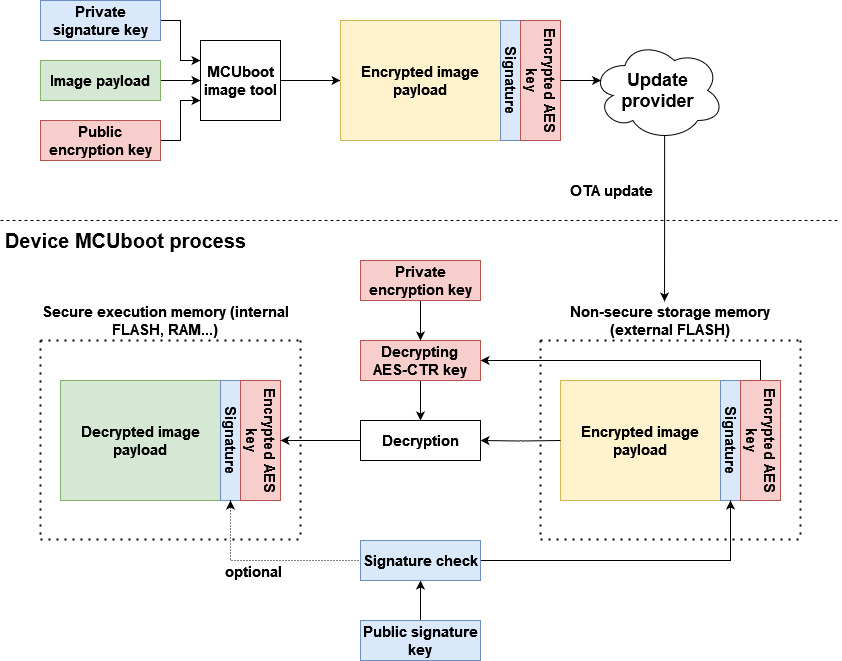
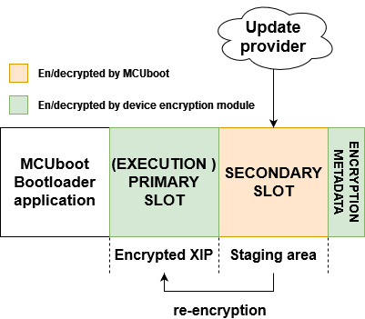

# Encrypted XIP and MCUboot

- [Encrypted XIP and MCUboot](#encrypted-xip-and-mcuboot)
   * [1. Introduction](#1-introduction)
   * [2. MCUboot encrypted image](#2-mcuboot-encrypted-image)
   * [3. Encrypted XIP extension for MCUboot](#3-encrypted-xip-extension-for-mcuboot)
      + [3.1 Configuration structures](#31-configuration-structures)
      + [3.2 Partition layout](#32-partition-layout)
      + [3.3 Flow of modified overwrite only mode](#33-flow-of-modified-overwrite-only-mode)
   * [4. Supported encryption modules](#4-supported-encryption-modules)
      + [4.1 Supported boards](#41-supported-boards)
   * [5. OTA examples instructions](#5-ota-examples-instructions)
      + [5.1 Generate ECIES-P256 key pairs for encrypted image containers (optional)](#51-generate-ecies-p256-key-pairs-for-encrypted-image-containers-optional)
      + [5.2 Enable encrypted XIP support and build projects](#52-enable-encrypted-xip-support-and-build-projects)
      + [5.3 Sign and encrypt image](#53-sign-and-encrypt-image)
      + [5.4 Evaluate encrypted XIP example](#54-evaluate-encrypted-xip-example)
         - [5.4.1 Load encrypted image container to flash memory](#541-load-encrypted-image-container-to-flash-memory)
         - [5.4.2 Run unsigned unencrypted OTA application (debug session)](#542-run-unsigned-unencrypted-ota-application-debug-session)
      + [5.5 Running encrypted image](#55-running-encrypted-image)
   

<!-- TOC -->
## 1. Introduction

To provide confidentiality of image data while in transport to the device or while residing on an non-secure storage such as external flash memory, MCUboot has support for encrypting/decrypting images on-the-fly while upgrading. MCUboot architecture expects that XIP is done from a secure memory so encrypted image is decrypted to a secure location such as internal Flash or RAM, however, size of an internal RAM is limited and there are devices with interfaces to only external flash memory.

Some NXP devices support encrypted XIP on an internal or external Flash device utilizing on-the-fly decryption modules (BEE, OTFAD, IPED, NPX...). It is possible use these decryption engines with a second stage bootloader as the MCUboot.

This document describes an extension of MCUboot functionality to support encrypted XIP on NXP devices and its enablement in OTA examples in MCUXpresso SDK.

<!-- TOC -->
## 2. MCUboot encrypted image

In the extension, the image encrypted by MCUboot is used as a secure capsule for transport and staging in the non-XIP area of a device. This is a feature of MCUboot - for more information please see [MCUboot Encrypted images documentation](https://docs.mcuboot.com/encrypted_images.html).

In summary, an image payload is encrypted using AES-CTR cipher by image tool (see [imgtool](https://docs.mcuboot.com/imgtool.html)). The AES key is randomized per OTA image and padded to image as an encrypted TLV section. The encrypted AES key can be decrypted using private key in selected key encryption scheme (RSA-OAEP, AES-KW, ECIES-P256 or ECIES-X25519).

Following image shows keys management of MCUboot encrypted image.

As shown in the image, a user must securely embed the encryption private key into the device. For simplicity, the OTA examples in SDK use private keys embedded as a C array in MCUboot code (see `middleware\mcuboot_opensource\boot\nxp_mcux_sdk\keys.c`). Users are advised to implement secure provisioning and loading of the private key in the device, for example by encrypting the MCUboot application (including the array) using the encrypted XIP feature of the device, or by staging the private key in trusted sources like OTP or TPM (supported since MCUboot 2.2.0).

<!-- TOC -->
## 3. Encrypted XIP extension for MCUboot

The extension combines usage of platform specific encrypted XIP feature and funcionality of MCUboot encrypted images created by imgtool. 

Following image shows simplified OTA update flow of device fleet using encrypted XIP extension.

The device fleet shares a common MCUboot private key used for decryption of encrypted OTA images residing in staging areas. The MCUboot AES key and hardware encryption module are then used for image re-encryption to the execution area. The hardware key is provisioned by NXP or the user and is typically unique per device instance to prevent image cloning.

<!-- TOC -->
### 3.1 Configuration structures

In summary, every NXP encryption module utilizing the encrypted XIP feature uses a scheme where on-the-fly decryption is configured by ROM. After device reset, the ROM investigates specific configuration structures typically expected at a particular flash offset in the header of the bootable image, which is MCUboot in our case. If configuration structures are valid, then the ROM configures the encryption module for encrypted XIP.

In the case of an OTA update, it is expected that for security reasons the key (or IV/nonce) of the encrypted execution region is also updated, so configuration blocks also have to be re-generated for each OTA update. Unfortunately, this creates a risk during the update of these configuration blocks, as there is a period of time where a power loss could corrupt the update and result in a bricked device.

Note: The risk is related only to use cases using a custom second-stage bootloader. OTA solutions using only a ROM bootloader typically utilize a dual image feature which safely handles this issue, as the ROM can safely revert to the last functional configuration.

The risk is resolved by moving configuration blocks out of the header of the second stage bootloader to a particular flash area and letting the bootloader configure the encryption module manually by inspecting these configuration blocks.

There is always one static configuration for the MCUboot region, investigated by ROM during startup and used for encrypted XIP initialization of the MCUboot region, and one dynamic configuration for the execution slot, which is regenerated during an OTA update. The dynamic configuration block is manually handled by MCUboot to provide more flexibility and robustness to the update process.

The encrypted XIP extension uses a reserved area called encryption metadata, which is used for storage of configuration blocks. The following image shows a generic structure of the encryption metadata.

The metadata sector consists of platform-specific configuration blocks and a common confirmation block. The hash acts as a confirmation of the integrity of configuration blocks and content in the execution slot.

It's recommended to have both blocks in a common flash sector so they are separated by flash page granularity and deleted simultaneously during sector erase. Typically, in the example code, the configuration block is placed at the beginning of the sector and the confirmation block is placed at the end of the sector.

During an OTA update, the extension generates a new configuration block, writes it at a particular flash offset, and reconfigures the encryption unit for the execution area. If the update and verification of the execution area are successful, the configuration block is then hashed and confirmed by writing the confirmation block. This approach is necessary for some encryption modules (like IPED and NPX), as reading or fetching invalid code leads to a device reset and a possible endless reset loop.

<!-- TOC -->
### 3.2 Partition layout

The extension customize OVERWRITE_ONLY upgrade mode and utilizes a partition layout with one execution slot for encrypted XIP, one slot for staging an OTA image and one sector for encryption metadata. The revert funcionality is not possible here.

Following image shows flash memory layout:

Secondary slots act as a staging area for encrypted OTA image by MCUboot. The execution slot is used as an execution area of the encrypted image using platform on-the-fly decryption.

Note: the placement of metadata in the flash memory is up to user. 

<!-- TOC -->
### 3.3 Flow of modified overwrite only mode

Following image shows simplified flow of MCUboot overwrite-only mode extended with encrypted XIP extension.

Before jumping to the booting process, the on-the-fly decryption is initialized so MCUboot is able to read and validate content in the primary slot. The re-encryption process is implemented in customized MCUboot code and in MCUboot hooks (see `flash_api.c` and `bootutil_hooks.c`).

<!-- TOC -->
## 4. Supported encryption modules

| **Encryption module**          | State of support                      | Additional documentation                                 |
|--------------------------------|---------------------------------------|----------------------------------------------------------|
| **BEE**                        | Supported                             | [Additional BEE documentation](encrypted_xip_bee.md)     |
| **OTFAD**                      | Planned                               | [Additional OTFAD documentation](encrypted_xip_otfad.md) |
| **NPX**                        | Partially supported                   | [Additional NPX documentation](encrypted_xip_npx.md)     |
| **IPED**                       | Supported only for RW61x devices      | [Additional IPED documentation](encrypted_xip_iped.md)   |

<!-- TOC -->
### 4.1 Supported boards

BEE:

- [EVK-MIMXRT1020](../../_boards/evkmimxrt1020/ota_examples/mcuboot_opensource/example_board_readme.md)
- [MIMXRT1040-EVK](../../_boards/evkmimxrt1040/ota_examples/mcuboot_opensource/example_board_readme.md)
- [EVKB-IMXRT1050](../../_boards/evkbimxrt1050/ota_examples/mcuboot_opensource/example_board_readme.md)
- [MIMXRT1060-EVKB](../../_boards/evkbmimxrt1060/ota_examples/mcuboot_opensource/example_board_readme.md)
- [MIMXRT1060-EVKC](../../_boards/evkcmimxrt1060/ota_examples/mcuboot_opensource/example_board_readme.md)
- [EVK-MIMXRT1064](../../_boards/evkmimxrt1064/ota_examples/mcuboot_opensource/example_board_readme.md)

IPED:

- [RD-RW612-BGA](../../_boards/rdrw612bga/ota_examples/mcuboot_opensource/example_board_readme.md)
- [FRDM-RW612](../../_boards/frdmrw612/ota_examples/mcuboot_opensource/example_board_readme.md)

NPX:

- [FRDM-MCXN947](../../_boards/frdmmcxn947/ota_examples/mcuboot_opensource/example_board_readme.md)
- [MCX-N5XX-EVK](../../_boards/mcxn5xxevk/ota_examples/mcuboot_opensource/example_board_readme.md)
- [MCX-N9XX-EVK](../../_boards/mcxn9xxevk/ota_examples/mcuboot_opensource/example_board_readme.md)

<!-- TOC -->
## 5. OTA examples instructions

Start preferentially with an empty board, erasing original content if needed.

<!-- TOC -->
### 5.1 Generate ECIES-P256 key pairs for encrypted image containers (optional)

Note: For evaluation purpose this part can be skipped as OTA examples in SDK uses pre-generated key pairs.

1. Generate private key using imgtool: `imgtool keygen -k enc-ec256-priv.pem -t ecdsa-p256`
    * Adjust the content of the `middleware\mcuboot_opensource\boot\nxp_mcux_sdk\keys\enc-ec256-priv.pem` accordingly.

3. Extract private key to a C array: `imgtool getpriv --minimal -k enc-ec256-priv.pem`
    * Adjust the content of the `middleware\mcuboot_opensource\boot\nxp_mcux_sdk\keys\enc-ec256-priv-minimal.c` accordingly.

5. Derive public key key: `imgtool getpub -k enc-ec256-pub.pem -e pem`
Adjust the content of the `middleware\mcuboot_opensource\boot\nxp_mcux_sdk\keys\enc-ec256-pub.pem` accordingly.

<!-- TOC -->
### 5.2 Enable encrypted XIP support and build projects

There are three ways how to enable Encrypted XIP mode:

1. Manually modify content of `sblconfig.h`
    * Enable `CONFIG_BOOT_MODE_ENCRYPTED_XIP` 
    * Disable `CONFIG_BOOT_MODE_FLASH_REMAP` and `CONFIG_BOOT_CUSTOM_DEVICE_SETUP`
2. Manually customize Kconfig configuration and generate the project - see [Kconfig and customization of OTA examples](kconfig_customization.md)
3. Use pre-defined customized builds - see particular chapter in your board readme (see Supported boards)

Then build and load the `mcuboot_opensource` application.

<!-- TOC -->
### 5.3 Sign and encrypt image

To sign and encrypt an application binary, imgtool must be provided with the respective key pairs and a set of parameters as in the following examples.

~~~
 imgtool sign --key sign-ecdsa-p256-priv.pem
	      --align 4
	      --header-size 0x400
	      --pad-header
	      --slot-size 0x200000
	      --max-sectors 800
	      --version "1.1"
	      -E enc-ec256-pub.pem
	      app_binary.bin
	      app_binary_SIGNED_ENCRYPTED_OTA.bin
~~~

The values of parameters can be obtained from a readme file of target board. E.g. `boards\BOARD\ota_examples\mcuboot_opensource\example_board_readme.md`

<!-- TOC -->
### 5.4 Evaluate encrypted XIP example

There are two methods how to run device for first time when an application utilizes encrypted XIP.

<!-- TOC -->
#### 5.4.1 Load encrypted image container to flash memory

See `flash_partitioning.h` for your board. For example:

~~~
/* Encrypted XIP extension: modified overwrite-only mode */

#define BOOT_FLASH_ACT_APP              0x60040000  -- active (execution) slot address
#define BOOT_FLASH_CAND_APP             0x60240000  -- candidate slot address
#define BOOT_FLASH_ENC_META             0x60440000  -- encryption metada address
~~~

An OTA image has to be loaded always to __candidate__ slot address defined as `BOOT_FLASH_CAND_APP`. The MCUboot code recognizes empty primary slot and re-encrypt the encrypted OTA image from the secondary slot to primary slot.

<!-- TOC -->
#### 5.4.2 Run unsigned unencrypted OTA application (debug session)

An unsigned unencrypted application can be loaded and run from execution area using a debug session and then process the OTA update as usual with the encrypted OTA image.

<!-- TOC -->
### 5.5 Running encrypted image

These are expected outputs when an OTA image is detected and then re-encrypted

~~~
hello sbl.
Bootloader Version 2.3.0
Built Mar 31 2026 15:40:59
Toolchain IAR ANSI C/C++ Compiler V9.70.4.588/W64 for ARM
Upgrade mode: ENCRYPTED XIP
context_boot_go
Image index: 0, Swap type: none
boot_validate_slot: slot 0, expected_swap_type 0
boot_validate_slot: slot 1, expected_swap_type 0
boot_enc_load: slot 1
bootutil_tlv_iter_begin: type 50, prot == 0
bootutil_tlv_iter_next: searching for 50 (65535 is any) starting at 42180 ending at 42443
bootutil_tlv_iter_next: TLV 50 found at 42330 (size 113)
boot_decrypt_key
bootutil_img_validate: flash area 30001320
bootutil_img_hash
bootutil_tlv_iter_begin: type 65535, prot == 0
bootutil_img_validate: TLV off 42180, end 42443
bootutil_tlv_iter_next: searching for 65535 (65535 is any) starting at 42180 ending at 42443
bootutil_tlv_iter_next: TLV 16 found at 42184 (size 32)
bootutil_img_validate: EXPECTED_HASH_TLV == 16
bootutil_tlv_iter_next: searching for 65535 (65535 is any) starting at 42216 ending at 42443
bootutil_tlv_iter_next: TLV 1 found at 42220 (size 32)
bootutil_img_validate: EXPECTED_KEY_TLV == 1
bootutil_find_key
bootutil_tlv_iter_next: searching for 65535 (65535 is any) starting at 42252 ending at 42443
bootutil_tlv_iter_next: TLV 34 found at 42256 (size 70)
bootutil_img_validate: EXPECTED_SIG_TLV == 34
bootutil_verify_sig: ECDSA builtin key 0
bootutil_tlv_iter_next: searching for 65535 (65535 is any) starting at 42326 ending at 42443
bootutil_tlv_iter_next: TLV 50 found at 42330 (size 113)
bootutil_tlv_iter_next: searching for 65535 (65535 is any) starting at 42443 ending at 42443
bootutil_tlv_iter_next: TLV 65535 not found
boot_erase_region: flash_area 30001310, offset 45056, size 4096, backwards == 0
boot_erase_region: device with erase
boot_erase_region: flash_area 30001310, offset 49152, size 4096, backwards == 0
boot_erase_region: device with erase
boot_erase_region: flash_area 30001310, offset 53248, size 4096, backwards == 0
boot_erase_region: device with erase
Encrypted XIP initialization successful
Image 0 upgrade secondary slot -> primary slot
Erasing the primary slot
boot_erase_region: flash_area 30001310, offset 0, size 4096, backwards == 0
boot_erase_region: device with erase
boot_erase_region: flash_area 30001310, offset 4096, size 4096, backwards == 0
boot_erase_region: device with erase
boot_erase_region: flash_area 30001310, offset 8192, size 4096, backwards == 0
boot_erase_region: device with erase
boot_erase_region: flash_area 30001310, offset 12288, size 4096, backwards == 0
boot_erase_region: device with erase
boot_erase_region: flash_area 30001310, offset 16384, size 4096, backwards == 0
boot_erase_region: device with erase
boot_erase_region: flash_area 30001310, offset 20480, size 4096, backwards == 0
boot_erase_region: device with erase
boot_erase_region: flash_area 30001310, offset 24576, size 4096, backwards == 0
boot_erase_region: device with erase
boot_erase_region: flash_area 30001310, offset 28672, size 4096, backwards == 0
boot_erase_region: device with erase
boot_erase_region: flash_area 30001310, offset 32768, size 4096, backwards == 0
boot_erase_region: device with erase
boot_erase_region: flash_area 30001310, offset 36864, size 4096, backwards == 0
boot_erase_region: device with erase
boot_erase_region: flash_area 30001310, offset 40960, size 4096, backwards == 0
boot_erase_region: device with erase
boot_erase_region: flash_area 30001310, offset 2093056, size 4096, backwards == 0
boot_erase_region: device with erase
boot_enc_load: slot 1
boot_enc_load: already loaded
Image 0 copying the secondary slot to the primary slot: 0xa5cc bytes
boot_write_magic: fa_id=0 off=0x1ffff0 (0x23fff0)
erasing secondary header
boot_scramble_region: 30001320 0 4096 0
boot_erase_region: flash_area 30001320, offset 0, size 4096, backwards == 0
boot_erase_region: device with erase
erasing secondary trailer
boot_scramble_region: 30001320 2093056 4096 0
boot_erase_region: flash_area 30001320, offset 2093056, size 4096, backwards == 0
boot_erase_region: device with erase
boot_validate_slot: slot 0, expected_swap_type 0
bootutil_img_validate: flash area 30001310
bootutil_img_hash
bootutil_tlv_iter_begin: type 65535, prot == 0
bootutil_img_validate: TLV off 42180, end 42443
bootutil_tlv_iter_next: searching for 65535 (65535 is any) starting at 42180 ending at 42443
bootutil_tlv_iter_next: TLV 16 found at 42184 (size 32)
bootutil_img_validate: EXPECTED_HASH_TLV == 16
bootutil_tlv_iter_next: searching for 65535 (65535 is any) starting at 42216 ending at 42443
bootutil_tlv_iter_next: TLV 1 found at 42220 (size 32)
bootutil_img_validate: EXPECTED_KEY_TLV == 1
bootutil_find_key
bootutil_tlv_iter_next: searching for 65535 (65535 is any) starting at 42252 ending at 42443
bootutil_tlv_iter_next: TLV 34 found at 42256 (size 70)
bootutil_img_validate: EXPECTED_SIG_TLV == 34
bootutil_verify_sig: ECDSA builtin key 0
bootutil_tlv_iter_next: searching for 65535 (65535 is any) starting at 42326 ending at 42443
bootutil_tlv_iter_next: TLV 50 found at 42330 (size 113)
bootutil_tlv_iter_next: searching for 65535 (65535 is any) starting at 42443 ending at 42443
bootutil_tlv_iter_next: TLV 65535 not found
Bootloader chainload address offset: 0x40000
Reset_Handler address offset: 0x40400
Jumping to the image

*************************************
* Basic MCUBoot application example *
*************************************

Built Mar 25 2026 12:45:04
Toolchain IAR ANSI C/C++ Compiler V9.70.4.588/W64 for ARM

$
~~~