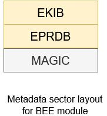

# Encrypted XIP using BEE (Bus Encryption Engine)

This document extends the documentation of [MCUBoot and encrypted XIP in OTA examples](encrypted_xip.md) and provides an additional information related to the BEE module. 

## 1. Introduction

BEE is specific for RT10xx (except RT1010) and supports up to two separate regions using two separate AES keys. In the ota examples, BEE region 1 is used for encrypting the execution slot and BEE region 0 is reserved for a bootloader.

BEE configuration blocks are organized as __EPRDB__ (Encrypted Protection Region Descriptor Block), where the __EPRDB__ is encrypted using AES-CBC mode with AES key and IV located in __KIB__ (Key Info Block). The __KIB__ is encrypted as __EKIB__ (Encrypted KIB) using a key provisioned by the user. Each BEE region has its __PRDB/KIB pair__.

The EKIB is decrypted by a key based on selection in `BEE_KEYn_SEL` fuse:

* __Software key__
	* default value in `BEE_KEYn_SEL`
	* evaluating BEE without fusing the device
* __SW-GP2__
	* fused by user and typically used for offline encryption
	* limited funcionality due hardware bugs, see errata
	* not supported in the examples
* __OTPMK__
	* provisioned by NXP in factory
	* unique per device instance - prevents image cloning
	* __recommended__

Following image shows complete metadata structure used for devices with BEE.

Firmware in execution slot is de/encrypted using AES-CTR combining nonce extracted from PRDB and this device key. The extension automatically detects device key by evaluating `BEE_KEYn_SEL` fuse.

The whole BEE initialization and encryption metadata handling is resolved in module `encrypted_xip_platform_bee.c`.

Additional information can be found in Security Reference Manual of target device and in application notes AN12800, AN12852 and AN12901.