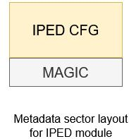
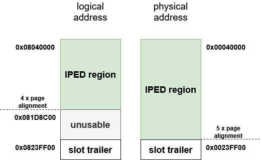
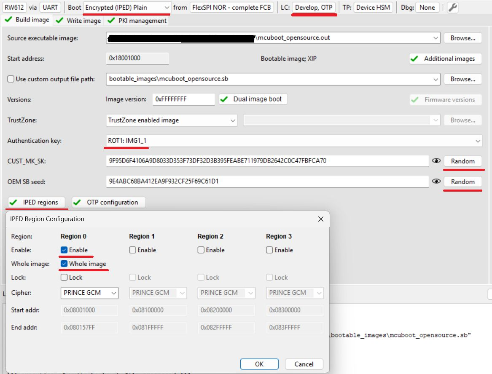

# Encrypted XIP using IPED

This document extends the documentation of [MCUBoot and encrypted XIP in OTA examples](encrypted_xip.md) and provides an additional information related to the IPED module.

## 1. Introduction

IPED (Inline Prince Encryption/Decryption for off-chip flash) is encryption unit for external flash specific for NXP RW61x, RT700 and MCXN MCUs. 

Note: __The extension currently supports only IPED module based on GCM algorithm in RW61x devices.__

Following image shows configuration of metadata structure used for devices with IPED.

The IPED engine generates an 8-byte authentication tag for each 32-byte block of encrypted data. When storing this encrypted data in Flash memory, the FlexSPI controller organizes it in a specific pattern:

* Each block of 32 bytes of ciphertext is followed by 8 bytes of authentication tag data (total: 40 bytes per unit)
* The authentication tags are stored physically in flash but are hidden from the CPU's logical address space (AHB read, fetch) - the CPU only sees the decrypted payload
* Due to this interleaving scheme, the actual physical flash consumption is (5/4)× the logical address space visible to the CPU

Following image shows an example of a valid IPED regions configuration - logical to physical address mapping

There are several points to be aware when utilizing IPED in an OTA process

* Resulting consumption of physical memory
	* range of IPED region is defined in terms of logical address but the physical memory consumption is 1.25× the logical memory consumption
	* OTA process must ensure that installed OTA image doesn't overlap the maximal size of IPED region, for example by adjusting the output binary size in linker file and/or doing checks of the image size before the encryption process
* Flash operations have to	satisfy boundaries of the flash page/sector size and encryption unit size
  * due internal software arbitration only ROM IAP for flash writes can be used
  * size of data chunk must be aligned to 4 * page size, no partial writes are allowed - last data chunk must be padded with dummy bytes

The whole IPED initialization, metadata handling and image re-encryption are resolved in `encrypted_xip_platform_iped.c`, `bootutil_hooks.c` and flash backend porting layer.

Additional information for IPED in RW61x can be found in its reference manual.

## 2. Bootloader encryption (OVERWRITE_ONLY only)

Note: Encrypting the mcuboot partition is required only for case when a private key used for offline encryption is embedded in bootloader code as C array, otherwise, it's optional.

To simplify the workflow, the MCUXpresso Secure Provisioning Tool (SEC tool) is used.

To provision the device and encrypt the bootloader perform the following steps:

1. Erase the device
2. Build `mcuboot_opensource`
3. Get the device into ISP mode 
    * Typically on development boards hold the ISP button and press the reset button
4. Open the SEC tool and create new workspace for RW61x target device
    * Test the ISP connection in SEC tool
5. Switch to PKI management tab
    * Click __Generate keys__ (leave default settings)
6. Build Image
    * Boot: __Encrypted (IPED) Plain__
    * Select or `mcuboot_opensource` output binary or ELF image as __Source executable image__
    * Lifecycle: __Develop, OTP__
    * Select an __authentication key__ and generate __CUST_MK_SK__ and __OEM SB seed__
    * Click __Build image__
7. Configure IPED regions
    * Click __IPED regions__
    * Configure Region 0 for MCUBoot partition as shown in following image (Region 1 is reserved for execution slot)
8. Write image
    * Click __Write image__

Note: This operation provisions the device with __RKTH__ and __CUST_MK_SK__ permanently, but the board will still be usable for development purposes as OTP BOOT_CFG0 (fuseword 15) remains intact. __An user is advised to save SEC tool workspace (or atleast the keys somewhere) for future use.__

## 3. Initial SB3 image, OTA SB3 image (FLASH_REMAP only)

__Note: Encrypted XIP with FLASH_REMAP support is currently in an experimental state. The mode can be evaluated only with ota_mcuboot_basic_iped_remap example__

Due of customized placement of configuration structures out of FCB, an initial SB3 is required for safe deployment during end-product manufacturing. SB3 container can be also used as secure capsule for signed image providing an encryption during the OTA image transport. Additional information can be found ib [SB3 documentation](sb3_common_readme.md)

Note: The device must be provisioned with __RKTH__ and __CUST_MK_SK__. For provisioning, you can follow the previous chapter.

To simplify the workflow, the MCUXpresso Secure Provisioning Tool (SEC tool) is used.

1. Build `ota_mcuboot_basic` and sign image by `imgtool` as usual.
2. Look into [ota_examples/\_common/sb3_templates](../_common/sb3_templates) and [ota_examples/\_common/binaries](../_common/binaries) directories and copy the template and additional binaries to your `$sec_tool_workspace`
    * `rw61x_IPED_initial_image.yaml` for the initial image
    * `rw61x_IPED_ota_slot0_image.yaml` or `rw61x_IPED_ota_slot1_image.yaml` for OTA image
    * `iped_conf_magic_page.bin` magic (confirmation) for configuration structure
    * `slot_trailer_page.bin` MCUboot slot trailer with confirmation flag (required for DIRECT-XIP mode)
3. Extract the FCB from `mcuboot_opensource` binary and place it in `source_images` folder
    * `nxpimage utils binary-image extract -b mcuboot_opensource.bin -a 0x400 -s 512 -o parsed_fcb.bin`
3. In SEC tool open __Tools/SB Editor__ and click __Import__ to import the template
    * Check and eventually fix paths to keys and image binary
    * click __Generate__
    * alternatively use SPSDK directly:  `nxpimage sb31 export -c template.yaml`

For initial image:

1. Get the device into ISP mode
    * Typically on development boards hold the ISP button and press the reset button
    * Test the ISP connection in SEC tool
2. The initial imag can be loaded using `blhost`
    * `blhost -p COM3,115200 receive-sb-file initial_image_slot_0.sb`

For OTA update using SB3 follow instructions [MCUBoot and encrypted XIP in OTA examples](encrypted_xip.md).
