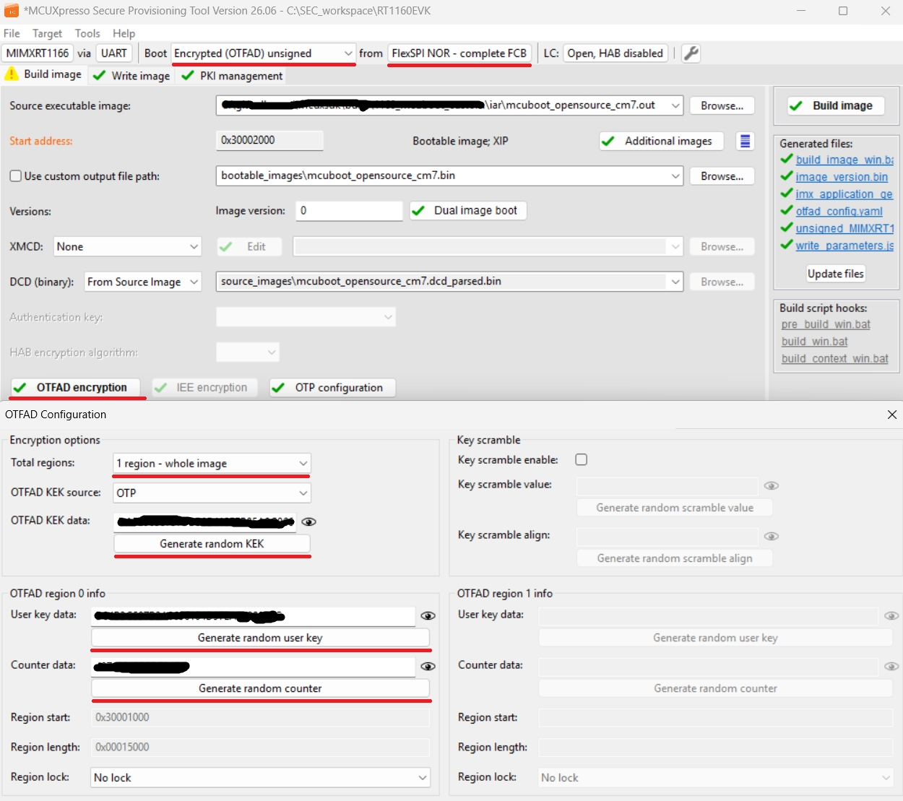

# Encrypted XIP using OTFAD (On-The-Fly AES Decryption)

This document extends the documentation of [MCUBoot and encrypted XIP in OTA examples](encrypted_xip.md) and provides additional information related to the OTFAD module.

## 1. Introduction

OTFAD is available on RT1160 and RT1170 devices and supports up to four independent encrypted regions, each with a separate AES-128 key and counter. In the OTA examples, OTFAD context 1 is used for encrypting the execution slot. Context 0 is reserved for the bootloader region configured by ROM.

OTFAD uses AES-128 in a custom CTR-like mode. The 128-bit input block fed to the AES engine is constructed per the device Security Reference Manual as follows:

```
[127:96] = BSWAP32(CTR_W0)
[ 95:64] = BSWAP32(CTR_W1)
[ 63:32] = BSWAP32(CTR_W0 ^ CTR_W1)
[ 31: 0] = systemAddress[31:4] | 0000b
```

Unlike standard AES-CTR (which increments the full 128-bit counter by 1 between blocks), OTFAD only increments the address field (bits[31:0]) between consecutive 16-byte blocks. The upper 96 bits — derived from CTR_W0 and CTR_W1 register values — remain constant across the entire protected region.

### 1.1 Key protection

The OTFAD AES-128 key and CTR words are protected using a CAAM red blob. The blob mechanism uses the device-unique OTPMK (One-Time Programmable Master Key), which is provisioned by NXP at manufacturing and is never readable by software. CAAM uses the OTPMK internally to derive a blob encryption key as:

```
blob_key = KDF(OTPMK, key_modifier)
```

where `key_modifier` is a 16-byte random nonce generated alongside the secret and stored in plaintext in the metadata area. It acts as a domain separator, ensuring that each OTA update produces a cryptographically independent blob even on the same device.

The key selection is implicit — CAAM always uses the OTPMK for red blob operations. There is no fuse selection required.

Key protection options summary:

* __OTPMK__
    * provisioned by NXP in factory
    * unique per device instance — prevents image cloning
    * never readable by software — CAAM uses it internally via SNVS
    * only supported option for OTFAD in the examples

> **Note:** Engineering samples and some development boards may have a zero OTPMK. On such devices, CAAM blob operations will succeed but provide no security. Production devices with a properly burned OTPMK are required for a secure deployment.

### 1.2 Metadata structure

```
Metadata Flash Sector
━━━━━━━━━━━━━━━━━━━━━━━━━━━━━━━━━━━━━━━━━━━━━━━━━━━━━━━━━━━━━━━━━━━━━━━━━━━━━━

 0                    ┌─────────────────────────────────────────────────────┐
                      │  tag           [4 bytes]                            │
 +4                   ├─────────────────────────────────────────────────────┤
                      │  key_modifier  [16 bytes]                           │
 +20                  ├─────────────────────────────────────────────────────┤
                      │  blob          [72 bytes]                           │
 +92                  ├─────────────────────────────────────────────────────┤
                      │  start_addr    [4 bytes]                            │
 +96                  ├─────────────────────────────────────────────────────┤
                      │  end_addr      [4 bytes]                            │
 +100                 ├─────────────────────────────────────────────────────┤
                      │  reserved      [12 bytes]                           │
 +112                 ├╌╌╌╌╌╌╌╌╌╌╌╌╌╌╌╌╌╌╌╌╌╌╌╌╌╌╌╌╌╌╌╌╌╌╌╌╌╌╌╌╌╌╌╌╌╌╌╌╌╌╌╌╌┤
                      │                                                     │
                      │              (erased 0xFF)                          │
                      │                                                     │
 SECTOR_SIZE/2        ╠═════════════════════════════════════════════════════╣
                      │                                                     │
                      │              (erased 0xFF)                          │
                      │                                                     │
 SECTOR_SIZE-32       ├─────────────────────────────────────────────────────┤
                      │  enc_confirm_t [32 bytes]                           │
 SECTOR_SIZE          └─────────────────────────────────────────────────────┘
━━━━━━━━━━━━━━━━━━━━━━━━━━━━━━━━━━━━━━━━━━━━━━━━━━━━━━━━━━━━━━━━━━━━━━━━━━━━━━
```

The OTFAD metadata stored in the encryption metadata flash area consists of:

* __key_modifier__: 16-byte random nonce (plaintext) — used as domain separator for CAAM blob
* __blob__: 72-byte CAAM red blob — contains AES-128 key + CTR_W0 + CTR_W1 encrypted with OTPMK
* __start_addr__ / __end_addr__: system addresses of the OTFAD-protected XIP region
* __tag__: 4-byte validity marker (`"OTFA"`)

```
otfad_cfg_ctx_t (112 bytes, 16-byte aligned):
  [  0..  3]  tag           (4 bytes)   "OTFA" validity marker
  [  4.. 19]  key_modifier  (16 bytes)  random nonce, plaintext
  [ 20.. 91]  blob          (72 bytes)  CAAM red blob (OTPMK-protected)
  [ 92.. 95]  start_addr    (4 bytes)   OTFAD region start (system address)
  [ 96.. 99]  end_addr      (4 bytes)   OTFAD region end   (system address)
  [100..111]  reserved      (12 bytes)  padding to 16-byte boundary

enc_confirm_t (32 bytes):
  [  0.. 31]  magic         (32 bytes)   written last in a separate flash page — confirms config block
                                         was fully persisted; absence signals incomplete OTA update
```

The blob itself has the following internal structure:

```
blob (72 bytes):
  [ 0..31]  header          (32 bytes)  CAAM key blob header
  [32..55]  encrypted secret (24 bytes) AES-encrypted {key[16] + ctr_w0[4] + ctr_w1[4]}
  [56..71]  MAC             (16 bytes)  authentication tag
```

### 1.3 OTA update flow

On every OTA update, the extension:

1. Generates a fresh AES-128 key, CTR_W0, CTR_W1, and key_modifier via CAAM RNG
2. Encapsulates the secret into a CAAM red blob using OTPMK
3. Configures OTFAD context 1 for the primary slot region
4. Re-encrypts the incoming image page by page using the new key and counter
5. Persists the metadata (blob + key_modifier + addresses) to the encryption metadata flash area

On every boot, MCUboot:

1. Reads the metadata from the encryption metadata flash area
2. Decapsulates the CAAM blob to recover the AES key and CTR words (OTPMK never leaves CAAM hardware)
3. Loads the recovered key and counter into OTFAD context 1
4. Jumps to the application — OTFAD decrypts transparently on every flash read

### 1.4 Implementation

The complete OTFAD initialization, encryption metadata handling, and image re-encryption are implemented in `encrypted_xip_platform_otfad.c`.

The implementation uses the following SDK drivers:

* `fsl_otfad` — OTFAD context configuration
* `fsl_caam` — AES-ECB encryption, RNG, red blob encapsulation/decapsulation
* `mflash_drv` — IAP flash programming support 

Additional information can be found in the Security Reference Manual of the target device (chapter OTFAD) and in the CAAM reference manual (chapter Blob Protocol).

## 2. Encryption of MCUboot partition (OVERWRITE_ONLY only)

Encrypting the mcuboot partition is required only for case when a private key used for offline encryption is exposed in bootloader code as C array, otherwise, it's optional. It's not necessary during development phase.

To simplify the workflow, the MCUXpresso Secure Provisioning Tool (SEC tool) is used.

To provision the device and encrypt the bootloader perform the following steps:

Note: This setup applies to region 0 only. Region 1 is reserved for the execution slot and will be handled dynamically by the application code (out of ROM scope).

1. Erase the device
2. Build `mcuboot_opensource`
3. Get the device into ISP mode 
    * Typically on development boards hold the ISP button and press the reset button
4. Open the SEC tool and create new workspace for RW61x target device
    * Test the ISP connection in SEC tool
5. Build Image
    * Boot: __Encrypted (OTFAD) unsigned__
    * Select or `mcuboot_opensource` output binary or ELF/OUT image as __Source executable image__
    * Lifecycle: __Open, HAB disabled__
7. Configure OTFAD regions
    * Click __OTFAD encryption__
    * Total regions: __1 region - whole image__
    * OTFAD KEK source: __OTP__
    * Generate random KEK, user key and counter for region 0 (see following image)
    * Configure Region 0 for MCUBoot partition as shown in following image 
8. Build image
9. Write image
    * Click __Write image__

Note: This operation provisions the device with __KEK__ permanently. No other fuses are burned, so the board will still be usable for development purposes. A user still has to enable encrypted XIP boot (by ROM) by switching bit BOOT_CFG[1] on the DIP switch on the board. __Also, it's advised to save the SEC tool workspace (or at least the keys somewhere) for future use.__

