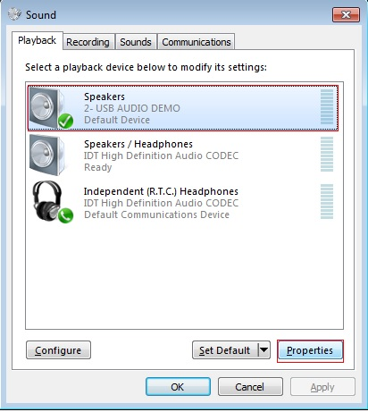
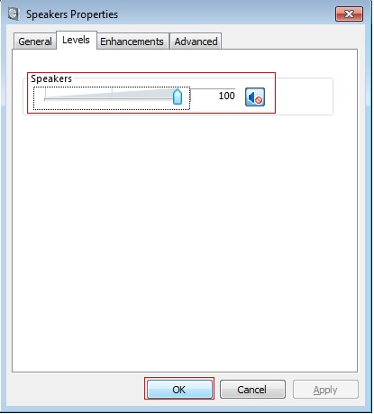
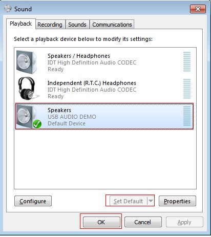

# dev_audio_speaker_lpc_lite_bm

## Overview

The USB Audio Speaker application is a simple demonstration program based on the MCUXpresso SDK. 
It is enumerated as a playback device and users can play music using the device.

## System Requirement

### Hardware requirements

- Mini/micro USB cable
- USB A to micro AB cable
- Hardware (Tower System base/module) with a SGTL board (except MAPS-KS22)
- Personal Computer(PC)

### Software requirements

- The path for the project files for lite version example is: 
  <MCUXpresso_SDK_Install>/boards/<board>/usb_examples/usb_device_audio_speaker_lite/<rtos>/<toolchain>.
   For non-lite version example, the path is: 
  <MCUXpresso_SDK_Install>/boards/<board>/usb_examples/usb_device_audio_speaker/<rtos>/<toolchain>.
> The <rtos> is Bare Metal or FreeRTOS OS.

## Getting Started

### Hardware Settings

> Set the hardware jumpers (Tower system/base module) to default settings.

### Prepare the example

1.  Download the program to the target board.
2.  Connect the target board to the external power source (the example is self-powered).
3.  Either press the reset button on the board or launch the debugger in the IDE to start running
    the demo.
4.  Connect a USB cable between the PC host and the USB device port on the board.

For detailed instructions, see the appropriate board User's Guide.

## Run the example in Windows (USB AUDIO CLASS 1.0)

1.  Plug-in the audio speaker device which is running the Audio Speaker example into the PC. 
2.  A USB AUDIO DEMO device shows up as enumerated in the Device Manager.
3.  Right click on the sound control icon of the Start bar (close to the clock) and select "Playback devices".
 
4.  In the pop-up window, select the "Playback" device with the description "USB Audio Device" and click on the "Properties" button.
 
5.  In the new window, go to "Levels" tab and move the slide until 100%. Click "OK".
 
6.  In the previous window, ensure that the "USB Audio Device" is still selected and click on the "Set Default" button. Click on the "OK" button. 
 
7.  Open the Window Media Player application, select, and play your favorite song. 

## Run the example on a Mac&reg; (USB AUDIO CLASS 2.0)
1.  Plug-in the audio speaker device which is running the Audio Speaker example into the Mac.
2.  A USB audio device shows up as enumerated in the sound catalogue under the System Preferences.
3.  Select the USB audio speaker device as the default audio device in the sound catalogue under System Preferences.
4.  Open the QuickTime application. Select and play your favorite song.

note 
1. If the device audio speaker example uses an ISO IN feedback endpoint, please attach the device to a host like
PC which supports feedback function. Otherwise, there might be attachment issue or other problems.
2. USB audio class 2.0 is enabled by default. 
3. Based on the USB spec, the feedback endpoint data length should be 3 bytes if the device is full speed. In this case, device can work on Mac OS. However, device can not work on Win 10 and feedback data length must be set 4. There is a workaround to fix this issue, please open the macro
USB_DEVICE_WORKAROUND_AUDIO_20_WINDOWS when meets the following conditions:
  - USB device is full speed and USB audio class 2.0 is enabled.
  - USB device uses feedback endpoint.
  - USB host is Windows 10.

## Supported Boards
- LPCXpresso54S018M
- LPCXpresso54628
- LPCXpresso54S018
