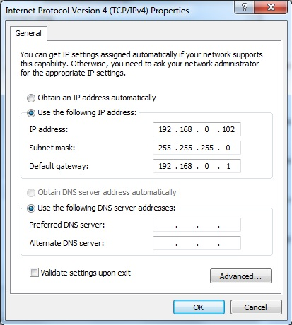
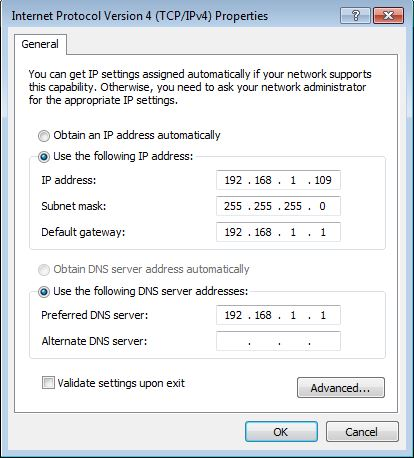
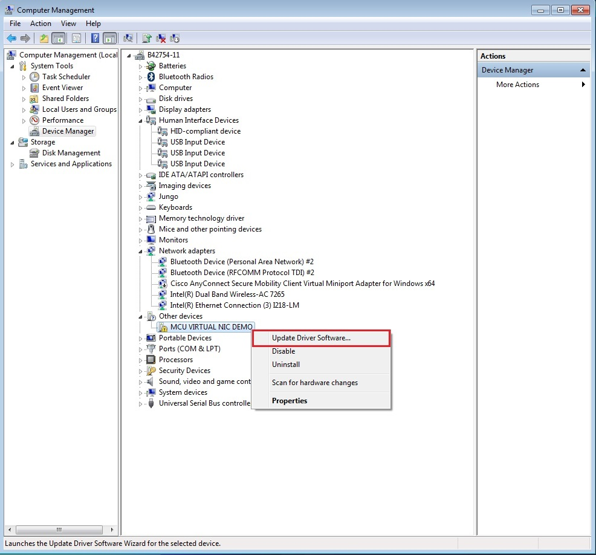
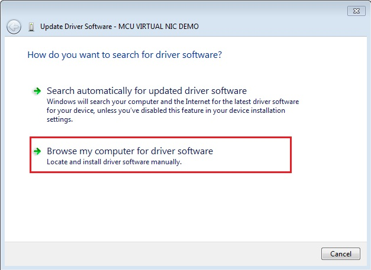
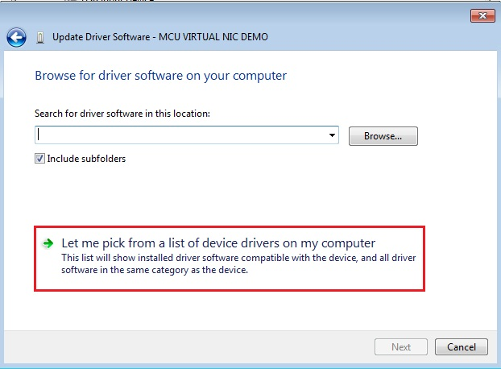
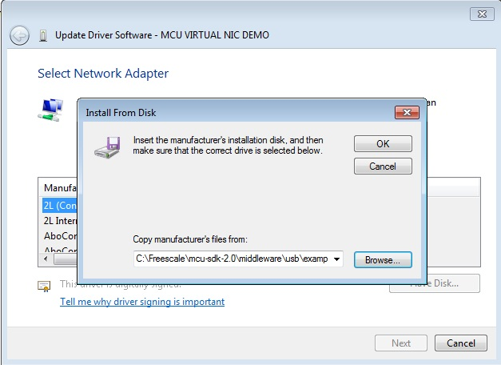
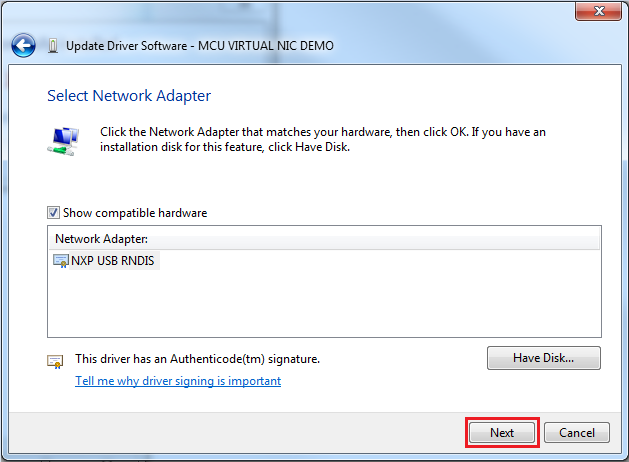
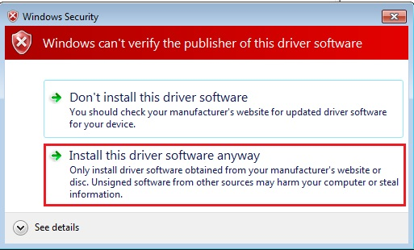
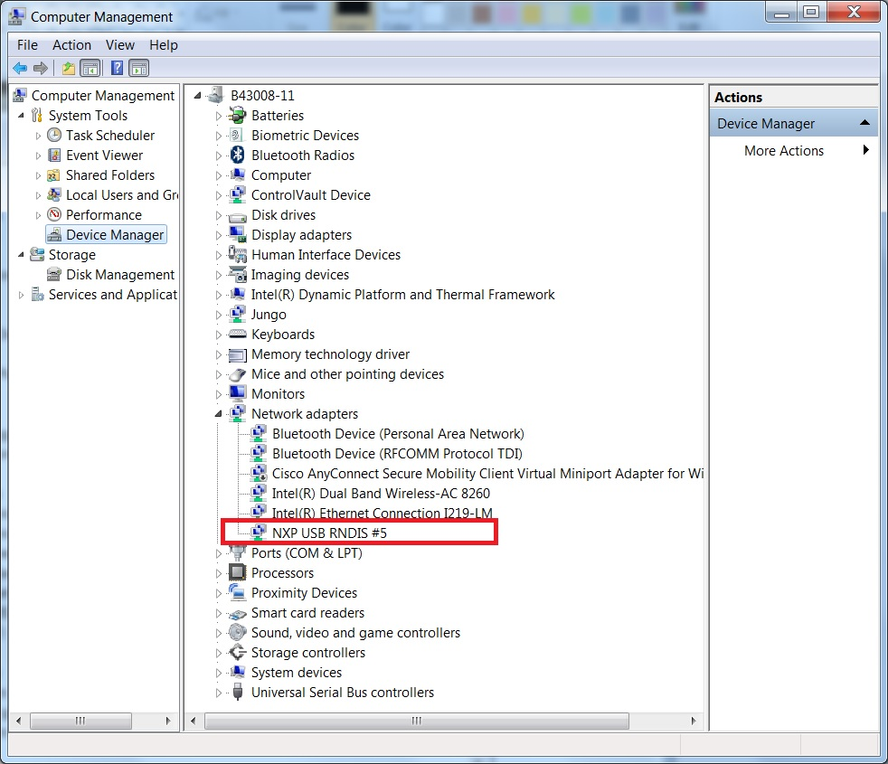

# dev_cdc_vnic_lite_bm

## Overview

The Virtual NIC project is a simple demonstration program based on the MCUXpresso SDK.  It is enumerated as a network adapter. Users can access the network by properly configuring this network adapter. The purpose of this demo is to show how to build a device of USB CDC class to implement RNDIS protocol and to provide a simple project for further development.

## System Requirement

### Hardware requirements

- Mini/micro USB cable
- USB A to micro AB cable
- Hardware (Tower module/base board, and so on) for a specific device
- Personal Computer

### Software requirements

- The project files are in:
  <MCUXpresso_SDK_Install>/boards/<board>/usb_examples/usb_device_cdc_vnic/<rtos>/<toolchain>.
  For lite version, the project files are in:
  <MCUXpresso_SDK_Install>/boards/<board>/usb_examples/usb_device_cdc_vnic_lite/<rtos>/<toolchain>.
> The <rtos> is Bare Metal or FreeRTOS OS.

## Getting Started

### Hardware Settings

> Set the hardware jumpers (Tower system/base module) to default settings.

### Prepare the example 

1.  Download the program to the target board.
2.  Either press the reset button on your board or launch the debugger in your IDE to begin running
    the demo.
3.  Plug in the network cable before running this example. (Or you may have to disable and then enable the RNDIS network adapter after you plug in the network cable.)
4.  Connect the USB device port on the board to the host PC and the using a USB cable.

> For detailed instructions, see the appropriate board User's Guide.
     Duo to the speed missmatch between usb and enet, some enet frame will be discard when lots of data are received in short time, this issue is obvious, especially on Full speed usb. 
     The upper layer protocol will handle this issue, such as TCP/IP protocol. 
     Based on the test on TWR-K65,add the buffer number to receive enet frame data could reduce the discard frame, user may add the buffer number if ram is enough.

## Run the example in Windows&reg;

1.  A network adapter is enumerated in Device Manager.
 
> On Windows 10, the device would be identified as an virtual com for the first time.
 
2.  In *Control Panel\\Network and Internet\\Network Connections*, the RNDIS network adapter is listed as below.
 
3.  Connect the ethernet port to another test PC using a network cable. The IP address of this test PC can be configured as 192.168.1.102. 
 
4.  Then configure the RNDIS adapter in Windows for your host PC. For this testing example, please make sure your PC host and the test PC are in the same network segment. E.g
 

5.  Then you are supposed to access the test PC through this USB RNDIS network adapter from your host PC
 

## Note
1.  The VNIC CIC CLASS code can be changed to be miscellaneous device to implement that there is no need to install inf file by changing the codes for descriptor. Provide the following codes macros for descriptor
to change its related codes:
     #define USB_CDC_IFACE_DESCRIPTOR_VNIC_CIC_CLASS (0xEF)
     #define USB_CDC_IFACE_DESCRIPTOR_VNIC_CIC_SUBCLASS (0x04)
     #define USB_CDC_IFACE_DESCRIPTOR_VNIC_CIC_PROTOCOL (0x01)
 	Note that the above change is only applied for descriptor, please do not change the codes of class driver. This is not verified under all conditions, so please be cautious to change.

## Installing the RNDIS driver for virtual_nic example
Below are the steps to install the RNDIS driver on Windows 7. Similar steps apply for Windows XP.

Step 1. Click "Update Driver Software..."

 

Step 2. Choose "Browse..."

 

Step 3. Select "Let me pick..."

 

Step 4. Navigate to your RNDIS driver location.

<install_dir>\\boards\\<board>\\usb_examples\\usb_device_cdc_vnic\\inf

or

<install_dir>\\boards\\<board>\\usb_examples\\usb_device_cdc_vnic_lite\\inf

 

Step 5. Press "Next".

 

Step 6. Ignore the warning and press "Yes".

 

Step 7. Now the RNDIS driver should be installed successfully.

 

- If a driver signature issue occurs on Windows 8 OS,  see the link,\n
[Disabling Driver Signature on Windows 8](https://learn.sparkfun.com/tutorials/disabling-driver-signature-on-windows-8/disabling-signed-driver-enforcement-on-windows-8)
- To enable driver signing on Windows OS, see the link,
  + <a href="msdn.microsoft.com/en-us/library/windows/hardware/ff544865(v=vs.85.aspx)">Driver Signing</a>
  + [Practical Windows Code and Driver Signing](http://www.davidegrayson.com/signing/#howto)

*/

## Supported Boards
- EVKB-IMXRT1050
- MIMXRT1060-EVKB
- MIMXRT1170-EVKB
- MIMXRT1060-EVKC
- EVK-MIMXRT1020
- MIMXRT1024-EVK
- MIMXRT1040-EVK
- EVK-MIMXRT1064
- MIMXRT1160-EVK
- MIMXRT1180-EVK
- FRDM-MCXN947
- FRDM-RW612
- LPCXpresso54628
- LPCXpresso54S018
- LPCXpresso54S018M
- MCX-N5XX-EVK
- MCX-N9XX-EVK
- RD-RW612-BGA
