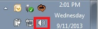

# dev_composite_hid_audio_lite_bm

## Overview

The USB Composite device application is a simple demonstration program based on the MCUXpresso SDK. 
It is enumerated as a recording device. Users can record the sound from this device via the "Sound Recorder" in the Windows Accessories with an HID mouse device.

## System Requirement

### Hardware requirements

- Mini/micro USB cable
- USB A to micro AB cable
- Hardware (Tower module/base board, and so on) for a specific device
- Personal Computer

### Software requirements

- The project files for the lite version example are in: 
  <MCUXpresso_SDK_Install>/boards/<board>/usb_examples/usb_device_composite_hid_audio_lite/<rtos>/<toolchain>.
   The project files for a non-lite version example are in: 
  <MCUXpresso_SDK_Install>/boards/<board>/usb_examples/usb_device_composite_hid_audio/<rtos>/<toolchain>.
> The <rtos> is Bare Metal or FreeRTOS OS.

## Getting Started

### Hardware Settings

> Set the hardware jumpers (Tower system/base module) to default settings.

### Prepare the example

1.  Download the program to the target board.
2.  Connect the target board to the external power source (the example is self-powered).
3.  Either press the reset button on your board or launch the debugger in your IDE to begin running
    the demo.
4.  Connect a USB cable between the PC host and the USB device port on the board.

For detailed instructions, see the appropriate board User's Guide.

## Run the example in Windows

1.  Plug in the device which is running composite example into PC. 
2.  For the HID mouse, the mouse arrow is moving on the PC screen.
3.  For the Audio generator, a USB AUDIO DEMO device is enumerated in the Device Manager.
4.  Right click on the sound control icon in the Start bar (near the clock) and select "Recording devices".
 
5.  In the opened window, select the "Microphone" device with the description "USB Audio Device" and click on the "Properties" button.
 
6.  In the new window, go to "Levels" tab, move the slide until 100%, and click on "OK".
 
7.  Ensure that "USB Audio Device" is still selected in the previous window and click on the "Set Default" button. Finally, click on the "OK" button. 
 
8.  Open the "Sound Recorder" application and record audio for 5-10 seconds.
9.  After recording, open the recorder file with any media player. The recorded media is identical to the instance located in the memory.

note 
1.  On Aruba which has DMIC module, please speaker to the DMIC when recording, the recorder file is the sound which is recorded by DMIC.
2.  When connected to Mac OS, change the PCM format from (0x02,0x00,) to (0x01,0x00, ) in g_config_descriptor[CONFIG_DESC_SIZE] in the usb_descriptor.c. Otherwise, it can't be enumerated and has noise when recording with the QuickTime&reg; player because the sampling frequency and bit resolution are not matched.
3.  USB audio class 2.0 is enabled by default.
4.  When device functionality is changed, such as USB auido class 2.0 or UAC 5.1, please uninstall the previous PC driver to make sure the device with changed functionality can run normally.
5.  If you're having audio problems on Windows 10, please disable signal enhancement if it is enabled and have a try again.
 

## Supported Boards
- FRDM-K22F
- FRDM-K32L2A4S
- FRDM-K32L2B
- FRDM-K32L3A6
- FRDM-MCXC242
- FRDM-MCXC444
