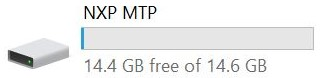

# dev_mtp_lite_bm

## Overview

The USB MTP application is a simple demonstration program based on the MCUXpresso SDK.
It is enumerated as a portable device. Users can read and write the storage in the portable device.

## System Requirement

### Hardware requirements

- Mini/micro USB cable
- USB A to micro AB cable
- Hardware (Tower module/base board, and so on) for a specific device
- Personal Computer (PC)

### Software requirements

- The project files for lite version example are in: 
  <MCUXpresso_SDK_Install>/boards/<board>/usb_examples/usb_device_mtp_lite/<rtos>/<toolchain>.
   For non-lite version example, the path is: 
  <MCUXpresso_SDK_Install>/boards/<board>/usb_examples/usb_device_mtp/<rtos>/<toolchain>.
> The <rtos> is Bare Metal or FreeRTOS OS.

## Getting Started

### Hardware Settings

> Set the hardware jumpers (Tower system/base module) to default settings.

### Prepare the example

1.  Download the program to the target board.
2.  Connect the target board to the external power source (the example is self-powered).
3.  Power off the target board. And then power on again.
4.  Connect a USB cable between the PC and the USB device port of the board.

> For detailed instructions, see the appropriate board User's Guide.

## Run the example

1.  Plug in the device, which is running the usb_device_mtp example, into the PC. A Portable Device is enumerated in the Device Manager.
2.  The computer will display the portable device.
 
3.  Double click the portable device icon, and the computer will display the storage capacity in the portable device.
 

note 
- The USB_DEVICE_MTP_TRANSFER_BUFF_SIZE macro limits the device identification and data transfer speed.
   The larger the buffer size is, the faster the data transfer speed is. The buffer size should be a multiple of 512 with the smallest value being 1024. 
- The USB_DEVICE_MTP_DIR_INSTANCE macro limits the maximum directory depth that can be created. 
   The larger the value, the deeper the directory can be created. 

*/

## Supported Boards
- EVKB-IMXRT1050
- MIMXRT1060-EVKB
- MIMXRT1170-EVKB
- MIMXRT1060-EVKC
- EVK-MIMXRT1020
- MIMXRT1024-EVK
- MIMXRT1040-EVK
- EVK-MIMXRT1064
- MIMXRT1160-EVK
- MIMXRT1180-EVK
- EVK-MIMXRT595
- EVK-MIMXRT685
- FRDM-MCXN947
- LPCXpresso54S018
- LPCXpresso54S018M
- LPCXpresso55S28
- LPCXpresso55S69
- MCX-N5XX-EVK
- MCX-N9XX-EVK
- MIMXRT685-AUD-EVK
- MIMXRT700-EVK
