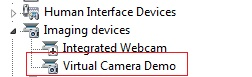
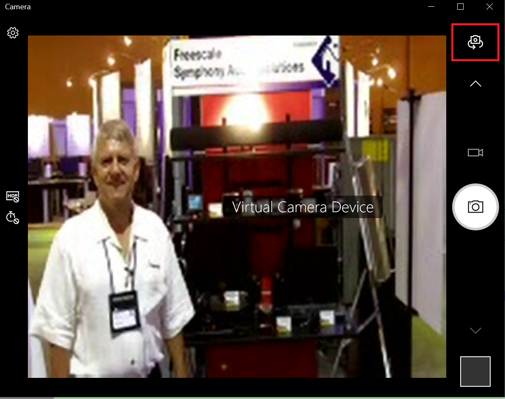
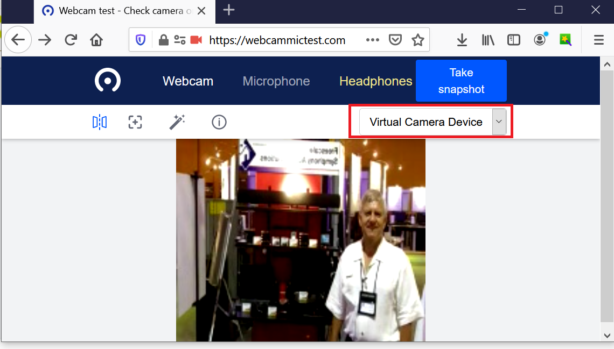

# dev_video_virtual_camera

## Overview

The USB video virtual camera application is a simple demonstration program based on the MCUXpresso SDK.
It is enumerated as a camera and users can see the video of the device by using a PC test tool.

## System Requirement

### Hardware requirements

- Mini/micro USB cable
- USB A to micro AB cable
- Hardware (Tower module/base board, and so on) for a specific device
- Personal Computer (PC)

### Software requirements

- The project files for lite version example are in:
  <MCUXpresso_SDK_Install>/boards/<board>/usb_examples/usb_device_video_virtual_camera_lite/<rtos>/<toolchain>.
   For non-lite version example, the path is:
  <MCUXpresso_SDK_Install>/boards/<board>/usb_examples/usb_device_video_virtual_camera/<rtos>/<toolchain>.
note 
  - The <rtos> is Bare Metal or FreeRTOS OS. 
  - The video virtual camera example is tested in Microsoft Windows 10.

## Getting Started

### Hardware Settings

> Set the hardware jumpers (Tower system/base module) to default settings.

### Prepare the example

1.  Download the program to the target board.
2.  Connect the target board to the external power source (the example is self-powered).
3.  Power off the target board. And then power on again.
4.  Connect a USB cable between the PC and the USB device port of the board.

> For detailed instructions, see the appropriate board User's Guide.

## Run the example

1.  Plug in the device, which is running video virtual camera application, into the PC. An imaging device "Virtual Camera Demo" is enumerated in the Device Manager.\n
 
2.  Open the camera tool Windows provides, switch to use the target camera by clicking the button in the red circle.
 
    Or use online tool https://webcammictest.com/, select "Virtual Camera Device".
 

> The resolution is 176 * 144 and the video image format is MJPEG. The frame interval includes 30, 25, 20, 15, 10, and 5 and the default frame interval is 15.

*/

## Supported Boards
- EVKB-IMXRT1050
- MIMXRT1060-EVKB
- MIMXRT1170-EVKB
- MIMXRT1060-EVKC
- EVK-MIMXRT1010
- EVK-MIMXRT1015
- EVK-MIMXRT1020
- MIMXRT1024-EVK
- MIMXRT1040-EVK
- EVK-MIMXRT1064
- MIMXRT1160-EVK
- MIMXRT1180-EVK
- EVK-MIMXRT595
- EVK-MIMXRT685
- FRDM-K22F
- [FRDM-K32L2A4S](../../_boards/frdmk32l2a4s/usb_examples/usb_device_video_virtual_camera/example_board_readme.md)
- FRDM-K32L2B
- FRDM-K32L3A6
- FRDM-MCXA153
- FRDM-MCXA156
- FRDM-MCXA276
- FRDM-MCXC444
- FRDM-MCXN236
- FRDM-MCXN947
- FRDM-RW612
- LPCXpresso51U68
- LPCXpresso54628
- LPCXpresso54S018
- LPCXpresso54S018M
- [LPCXpresso55S16](../../_boards/lpcxpresso55s16/usb_examples/usb_device_video_virtual_camera/example_board_readme.md)
- LPCXpresso55S28
- LPCXpresso55S36
- LPCXpresso55S69
- MCX-N5XX-EVK
- MCX-N9XX-EVK
- MIMXRT685-AUD-EVK
- MIMXRT700-EVK
- RD-RW612-BGA
