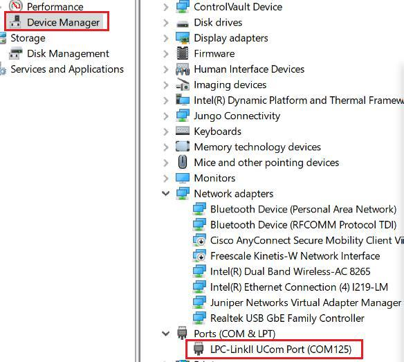
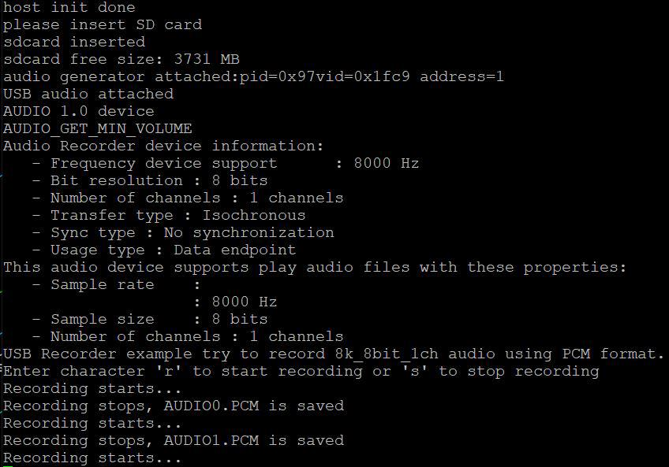
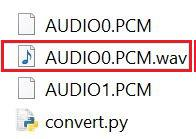

# host_audio_recorder_freertos


## Overview

The Host Audio example supports the audio microphone device.
<br> The application prints the audio microphone information when the USB microphone device is attached.

## System Requirement

### Hardware requirements

- Mini/micro USB cable
- USB A to micro AB cable
- Hardware (Tower module/base board, and so on) for a specific device
- Personal Computer


### Software requirements

- The project files are in: 
<br> <MCUXpresso_SDK_Install>/boards/<board>/usb_examples/usb_host_audio_recorder/<rtos>/<toolchain>.
> The <rtos> is FreeRTOS OS, do not support Bare Metal because writing sdcard is in blocking mode. Even though in freertos, the host can't totally guarantee getting all of stream data of audio device (some transfers may be lost) on some platforms because some SOCs' performance may not meet this case's requirement.


## Getting Started

### Hardware Settings

For detailed instructions, see the appropriate board User's Guide.
> Set the hardware jumpers (Tower system/base module) to default settings.


### Prepare the example 

1.  Download the program to the target board.
2.  Power off the target board and power on again.
3.  Prepare a sdcard and format it with FAT32 file system.

> For detailed instructions, see the appropriate board User's Guide.

## Run the example

1.  Connect the board UART to the PC, you can see the Serial port number from "Device Manager", then open the
COM port in a terminal tool such as PuTTy as the following picture, the baud rate is 115200.
<br>
<br>
2.  Insert the SD card into the slot. "sdcard inserted" and free memory size is printed out in the terminal as the following
image.
<br>
3.  Plug in the USB audio microphone(generator) device to the board and the related information is printed in the
terminal.
4.  Enter 'r' to start recording. The USB application will transfers the audio data from the USB audio microphone
device and the sound is written in sd card. Enter 's' to stop recording, then one PCM file is saved. The following
image shows how to attach a USB audio microphone device.
<br>
<br>
5.  Every time step 4 is executed, a file will be saved. For the convenience of audio testing, the following python script is
provided to convert PCM to be WAV. Please set right parameters for setparams functon, which nchannels is channel
count, sampwidth is byte width, framerate is sample rate. In the current test case, we should use setparams((1, 1,
8000, 0, 'NONE', 'NONE')). Open the WAV file with any media player and verify it by listening on the speaker of Laptop/PC.
```
                import sys
                import wave

                for arg in sys.argv[1:]:
                    with open(arg, 'rb') as pcmfile:
                        pcmdata = pcmfile.read()
                    with wave.open(arg+'.wav', 'wb') as wavfile:
                        wavfile.setparams((nchannels, sampwidth, framerate, 0, 'NONE', 'NONE'))
                        wavfile.writeframes(pcmdata)
```
<br>

> 1. USB host only supports PCM format. If device has no PCM format, usb host will print necessary log.


## Supported Boards
- MIMXRT1170-EVKB
- LPCXpresso55S69
- EVK-MIMXRT1064
- MIMXRT685-AUD-EVK
- LPCXpresso54S018
- LPCXpresso54S018M
- MIMXRT1060-EVKB
- [MIMXRT1040-EVK](../../_boards/evkmimxrt1040/usb_examples/usb_host_audio_recorder/example_board_readme.md)
- FRDM-MCXN947
- MIMXRT1024-EVK
- LPCXpresso55S28
- LPCXpresso54628
- MCX-N5XX-EVK
- MIMXRT1060-EVKC
- MIMXRT1180-EVK
- EVK-MIMXRT1020
- MIMXRT700-EVK
- [EVK-MIMXRT595](../../_boards/evkmimxrt595/usb_examples/usb_host_audio_recorder/example_board_readme.md)
- EVK-MIMXRT685
- MCX-N9XX-EVK
- EVKB-IMXRT1050
