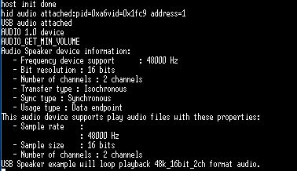
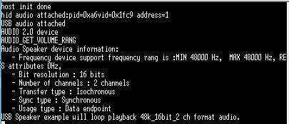

# host_audio_speaker

## Overview

The Host Audio example supports the audio speaker device. 
  The application prints the audio speaker information when the USB speaker device is attached.

## System Requirement

### Hardware requirements

- Mini/micro USB cable
- USB A to micro AB cable
- Hardware (Tower module/base board, and so on) for a specific device
- Personal Computer

### Software requirements

- The project files are in: 
  <MCUXpresso_SDK_Install>/boards/<board>/usb_examples/usb_host_audio_speaker/<rtos>/<toolchain>.
> The <rtos> is Bare Metal or FreeRTOS OS.

## Getting Started

### Hardware Settings

For detailed instructions, see the appropriate board User's Guide.
> Set the hardware jumpers (Tower system/base module) to default settings.

### Prepare the example 

1.  Download the program to the target board.
2.  Power off the target board, and then power on again or press the reset button on your board.
3.  Connect the  USB audio speaker devices to the board.

> For detailed instructions, see the appropriate board User's Guide.

## Run the example

1.  Connect the board UART to the PC and open the COM port in a terminal tool.
2.  Plug in the USB audio speaker device to the board and attach the information print out in the terminal.
3.  The USB audio speaker information prints in the terminal when USB speaker device is attached. 
4.  After the USB speaker device is plugged into the host, the USB application automatically transfers the audio 
    data to the USB audio speaker device and the sound can be heard from the audio speaker device.

The following image shows how to attach a USB audio speaker device.

 
 
 
## Known issue for FreeRTOS Host Audio Speaker Example
-   The FreeRTOS OS version example attach/detached printed debug message displays jumbled instructions to perform the hot plug test many times. Because the example
    handles different interfaces in different tasks, one task printing the debug message may be broken by another task and cause the debug
	message to be jumbled.
	
-	A noise occurs when a song is playing on some boards with The FreeRTOS version example. Because there is no software timer to
    ensure that one ISO transfer is sent per one SOF timer without the hardware PIT timer enablement, the issue also is effected by the KHCI
	hardware SOF Threshold feature. The host sends less audio data to the device after a while. As a result, the buffer on the device side experiences an underrun 
	error. If the device doesn't have an appropriate method to deal with it, some noise will occur.

## Supported Boards
- EVKB-IMXRT1050
- MIMXRT1060-EVKB
- MIMXRT1170-EVKB
- MIMXRT1060-EVKC
- EVK-MIMXRT1010
- EVK-MIMXRT1015
- EVK-MIMXRT1020
- MIMXRT1024-EVK
- MIMXRT1040-EVK
- EVK-MIMXRT1064
- MIMXRT1160-EVK
- MIMXRT1180-EVK
- EVK-MIMXRT595
- EVK-MIMXRT685
- [FRDM-K22F](../../_boards/frdmk22f/usb_examples/usb_host_audio_speaker/example_board_readme.md)
- [FRDM-K32L2A4S](../../_boards/frdmk32l2a4s/usb_examples/usb_host_audio_speaker/example_board_readme.md)
- FRDM-MCXN236
- FRDM-RW612
- [LPCXpresso54628](../../_boards/lpcxpresso54628/usb_examples/usb_host_audio_speaker/example_board_readme.md)
- [LPCXpresso54S018](../../_boards/lpcxpresso54s018/usb_examples/usb_host_audio_speaker/example_board_readme.md)
- [LPCXpresso54S018M](../../_boards/lpcxpresso54s018m/usb_examples/usb_host_audio_speaker/example_board_readme.md)
- [LPCXpresso55S16](../../_boards/lpcxpresso55s16/usb_examples/usb_host_audio_speaker/example_board_readme.md)
- [LPCXpresso55S28](../../_boards/lpcxpresso55s28/usb_examples/usb_host_audio_speaker/example_board_readme.md)
- LPCXpresso55S36
- [LPCXpresso55S69](../../_boards/lpcxpresso55s69/usb_examples/usb_host_audio_speaker/example_board_readme.md)
- [MCX-N5XX-EVK](../../_boards/mcxn5xxevk/usb_examples/usb_host_audio_speaker/example_board_readme.md)
- [MCX-N9XX-EVK](../../_boards/mcxn9xxevk/usb_examples/usb_host_audio_speaker/example_board_readme.md)
- MIMXRT685-AUD-EVK
- MIMXRT700-EVK
- RD-RW612-BGA
