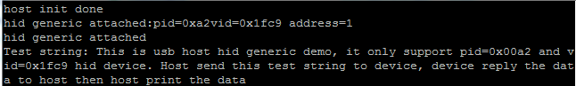

# host_hid_generic

## Overview

This Host HID example only supports the HID generic device that runs the device HID generic example. 
  This application implements a simple HID interrupt in-and-out endpoint bi-directional communication.
The application sends one test string to the device. The device receives and sends back the string. The application receives the string and prints it.

## System Requirement

### Hardware requirements

- Mini/micro USB cable
- USB A to micro AB cable
- Hardware (Tower module/base board, and so on) for a specific device
- Personal Computer (PC)

### Software requirements

- The project path is: 
  <MCUXpresso_SDK_Install>/boards/<board>/usb_examples/usb_host_hid_generic/<rtos>/<toolchain>.
> The <rtos> is Bare Metal or FreeRTOS OS.

## Getting Started

### Hardware Settings

> Set the hardware jumpers (Tower system/base module) to default settings.

### Prepare the example 

1.  Download the program to the target board.
2.  Power off the target board and power on again.
3.  Connect devices to the board.

> For detailed instructions, see the appropriate board User's Guide.
> this example could be tested with the "usb_device_hid_generic" example in pairs.

## Run the example

1.  Connect the board UART to the PC and open the COM port in a terminal tool.
2.  Plug in the HUB or HID generic device to the board. The attached information prints out in the terminal.
3.  The following string prints in the terminal.
   Test string: This is a USB host HID generic demo. It only supports pid=0x00a2 and vid=0x1fc9 HID device. 
The host sends this test string to the device. The device echoes the data to the host and the host prints the data.

The following figure is an example for attaching one HID generic device.

 

## Supported Boards
- EVKB-IMXRT1050
- MIMXRT1060-EVKB
- MIMXRT1170-EVKB
- MIMXRT1060-EVKC
- EVK-MIMXRT1010
- EVK-MIMXRT1015
- EVK-MIMXRT1020
- MIMXRT1024-EVK
- MIMXRT1040-EVK
- EVK-MIMXRT1064
- MIMXRT1160-EVK
- MIMXRT1180-EVK
- EVK-MIMXRT595
- EVK-MIMXRT685
- [FRDM-K22F](../../_boards/frdmk22f/usb_examples/usb_host_hid_generic/example_board_readme.md)
- [FRDM-K32L2A4S](../../_boards/frdmk32l2a4s/usb_examples/usb_host_hid_generic/example_board_readme.md)
- FRDM-MCXN236
- FRDM-MCXN947
- FRDM-RW612
- [LPCXpresso54628](../../_boards/lpcxpresso54628/usb_examples/usb_host_hid_generic/example_board_readme.md)
- [LPCXpresso54S018](../../_boards/lpcxpresso54s018/usb_examples/usb_host_hid_generic/example_board_readme.md)
- [LPCXpresso54S018M](../../_boards/lpcxpresso54s018m/usb_examples/usb_host_hid_generic/example_board_readme.md)
- [LPCXpresso55S16](../../_boards/lpcxpresso55s16/usb_examples/usb_host_hid_generic/example_board_readme.md)
- [LPCXpresso55S28](../../_boards/lpcxpresso55s28/usb_examples/usb_host_hid_generic/example_board_readme.md)
- LPCXpresso55S36
- [LPCXpresso55S69](../../_boards/lpcxpresso55s69/usb_examples/usb_host_hid_generic/example_board_readme.md)
- [MCX-N5XX-EVK](../../_boards/mcxn5xxevk/usb_examples/usb_host_hid_generic/example_board_readme.md)
- [MCX-N9XX-EVK](../../_boards/mcxn9xxevk/usb_examples/usb_host_hid_generic/example_board_readme.md)
- MIMXRT685-AUD-EVK
- MIMXRT700-EVK
- RD-RW612-BGA
