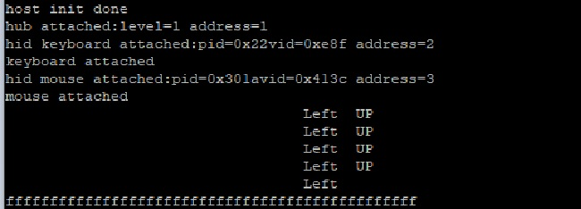

# host_hid_mouse_keyboard


## Overview

This Host HID example supports the mouse device and the keyboard device. 
<br> The application prints the mouse operation when the mouse device is attached.
The application prints the pressed keyboard key when the keyboard is attached. 
Because this is a simple demo, special function keys and long press function are not supported.

<br> The application supports three types of devices:
    - The single mouse device or the single keyboard device.
    - The composite device that contains one mouse and one keyboard.
    - HUBs connected with one mouse device and one keyboard device.

## System Requirement

### Hardware requirements

- Mini/micro USB cable
- USB A to micro AB cable
- Hardware (Tower module/base board, and so on) for a specific device
- Personal Computer(PC)


### Software requirements

- The project path is: 
<br> <MCUXpresso_SDK_Install>/boards/<board>/usb_examples/usb_host_hid_mouse_keyboard/<rtos>/<toolchain>.
> The <rtos> is Bare Metal or FreeRTOS OS.


## Getting Started

### Hardware Settings

> Set the hardware jumpers (Tower system/base module) to default settings.
> Host hid example doesn't support HID report descriptor analysis, this example assume that the device data are sent by specific order. 
      <br> For more detail, please refer to the code. For the device list we tested,
      <br> please refer to chapter Peripheral devices tested with the USB Host stack in "SDK Release Notes xxxx(board name)".


### Prepare the example 

1.  Download the program to the target board.
2.  Power off the target board and power on again.
3.  Connect devices to the board.

> For detailed instructions, see the appropriate board User's Guide.

## Run the example

1.  Connect the board UART to the PC and open the COM port in a terminal tool.
2.  Plug in the HUB, mouse or keyboard device to the board. The attached information prints out in the terminal.
3.  If one mouse is plugged in, the mouse operation information prints in the terminal when moving the mouse.
    <br> The application prints the mouse operation information in one line. Each line contains the following sequential string: 
    "Left Click", "Middle Click", "Right Click", "Right"/"Left" movement, "UP"/"Down" movement and "Wheel Down"/"Wheel Up" movement.
    White space replaces the above string if the mouse doesn't have the corresponding operation.
    <br> For example when the mouse moves right and up, 
    <br> ``` "                                  Right UP             "```
    <br> prints in the terminal.
4.  If one keyboard is plugged in, the keyboard pressed key information prints in the terminal when operating the keyboard.
    <br> for example: when F key is pressed, the
    <br> ``` 'F'```
    <br> prints in the terminal.

The following picture is an example for attaching a HUB, a mouse, and a keyboard.

<br>

> The Host keyboard doesn't support the long pressed key. To implement the long press function, follow these steps:
1. Implement one timer and the interval is 10 ms, for example PIT.
2. Define one 6-byte array to count time.
3. Update the time array:
    -# When the timer times out: For every key in the lastPressData, add the time. 
	For example, if the second key is valid in the lastPressData, the second value of the time array adds 1.
    -# When the lastPressData is updated: Update the time array to map the time with the lastPressData. 
	For example, the second value of the time array is the time for the seconds of lastPressData.
4. When one time is greater than 5, the key is long pressed. Print the key and reset the time value for the next long press.


## Supported Boards
- MIMXRT1170-EVKB
- [FRDM-K22F](../../_boards/frdmk22f/usb_examples/usb_host_hid_mouse_keyboard/example_board_readme.md)
- [LPCXpresso55S69](../../_boards/lpcxpresso55s69/usb_examples/usb_host_hid_mouse_keyboard/example_board_readme.md)
- EVK-MIMXRT1064
- MIMXRT685-AUD-EVK
- [LPCXpresso54S018](../../_boards/lpcxpresso54s018/usb_examples/usb_host_hid_mouse_keyboard/example_board_readme.md)
- [LPCXpresso55S16](../../_boards/lpcxpresso55s16/usb_examples/usb_host_hid_mouse_keyboard/example_board_readme.md)
- [LPCXpresso54S018M](../../_boards/lpcxpresso54s018m/usb_examples/usb_host_hid_mouse_keyboard/example_board_readme.md)
- MIMXRT1060-EVKB
- EVK-MIMXRT1010
- MIMXRT1040-EVK
- FRDM-MCXN947
- MIMXRT1024-EVK
- [LPCXpresso55S28](../../_boards/lpcxpresso55s28/usb_examples/usb_host_hid_mouse_keyboard/example_board_readme.md)
- [LPCXpresso54628](../../_boards/lpcxpresso54628/usb_examples/usb_host_hid_mouse_keyboard/example_board_readme.md)
- LPCXpresso55S36
- [MCX-N5XX-EVK](../../_boards/mcxn5xxevk/usb_examples/usb_host_hid_mouse_keyboard/example_board_readme.md)
- MIMXRT1060-EVKC
- MIMXRT1160-EVK
- MIMXRT1180-EVK
- [FRDM-K32L2A4S](../../_boards/frdmk32l2a4s/usb_examples/usb_host_hid_mouse_keyboard/example_board_readme.md)
- EVK-MIMXRT1020
- MIMXRT700-EVK
- EVK-MIMXRT595
- EVK-MIMXRT685
- [MCX-N9XX-EVK](../../_boards/mcxn9xxevk/usb_examples/usb_host_hid_mouse_keyboard/example_board_readme.md)
- EVKB-IMXRT1050
- RD-RW612-BGA
- EVK-MIMXRT1015
- FRDM-MCXN236
- FRDM-RW612
