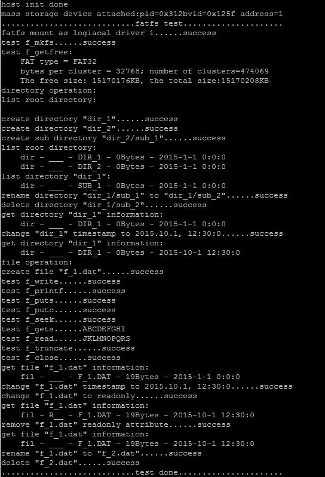
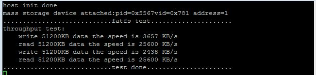

# host_msd_fatfs

## Overview

This Host FatFs example supports UFI and SCSI U-disk device. 
  The application prints the attached device information when U-disk device is attached.
The application executes some FatFs APIs to test the attached device.

## System Requirement

### Hardware requirements

- Mini/micro USB cable
- USB A to micro AB cable
- Hardware (Tower module/base board, and so on) for a specific device
- Personal Computer (PC)

### Software requirements

- The project path is: 
  <MCUXpresso_SDK_Install>/boards/<board>/usb_examples/usb_host_msd_fatfs/<rtos>/<toolchain>.
> The <rtos> is Bare Metal or FreeRTOS OS.

## Getting Started

### Hardware Settings

> Set the hardware jumpers (Tower system/base module) to default settings.

### Prepare the example 

1.  Download the program to the target board.
2.  Power off the target board and power on again.
3.  Connect devices to the board.

> For detailed instructions, see the appropriate board User's Guide.

## Run the example

1.  Connect the board UART to the PC and open the COM port in a terminal tool.
2.  Plug in a HUB or a U-disk device to the board. The attached information prints out in the terminal.
3.  The test information prints in the terminal. The "success" message prints when a FatFs API succeeds. The "fail" message prints when a FatFs API fails.
    The test completes when either the FatFs API fails or all the tests are done.
  The following figure is an example for attaching one U-disk device.
 
4.  To test the throughput, set the MSD_FATFS_THROUGHPUT_TEST_ENABLE to (1) in the file host_msd_fatfs.h. 
    An additional 64 K RAM is required to test the throughput. The macro is only supported on TWR-K65F180M Tower System module and IAR IDE.
      The throughput test process is as follows:
    - Enable MSD_FATFS_THROUGHPUT_TEST_ENABLE.
    - Format the U-disk in the PC. Select the "Allocation unit size" 32 K.
    - Insert the U-disk. The throughput test starts.
  The following image shows an example.
 

> 1. The throughput test only supports the TWR-K65F180M Tower System module.
> 2. LFN (long file name) can be enabled by changing the macro FF_USE_LFN as 1.

## Supported Boards
- EVKB-IMXRT1050
- MIMXRT1060-EVKB
- MIMXRT1170-EVKB
- MIMXRT1060-EVKC
- EVK-MIMXRT1010
- EVK-MIMXRT1015
- EVK-MIMXRT1020
- MIMXRT1024-EVK
- MIMXRT1040-EVK
- EVK-MIMXRT1064
- MIMXRT1160-EVK
- MIMXRT1180-EVK
- EVK-MIMXRT595
- EVK-MIMXRT685
- [FRDM-K22F](../../_boards/frdmk22f/usb_examples/usb_host_msd_fatfs/example_board_readme.md)
- [FRDM-K32L2A4S](../../_boards/frdmk32l2a4s/usb_examples/usb_host_msd_fatfs/example_board_readme.md)
- FRDM-MCXN236
- FRDM-MCXN947
- FRDM-RW612
- [LPCXpresso54628](../../_boards/lpcxpresso54628/usb_examples/usb_host_msd_fatfs/example_board_readme.md)
- [LPCXpresso54S018](../../_boards/lpcxpresso54s018/usb_examples/usb_host_msd_fatfs/example_board_readme.md)
- [LPCXpresso54S018M](../../_boards/lpcxpresso54s018m/usb_examples/usb_host_msd_fatfs/example_board_readme.md)
- [LPCXpresso55S16](../../_boards/lpcxpresso55s16/usb_examples/usb_host_msd_fatfs/example_board_readme.md)
- [LPCXpresso55S28](../../_boards/lpcxpresso55s28/usb_examples/usb_host_msd_fatfs/example_board_readme.md)
- LPCXpresso55S36
- [LPCXpresso55S69](../../_boards/lpcxpresso55s69/usb_examples/usb_host_msd_fatfs/example_board_readme.md)
- [MCX-N5XX-EVK](../../_boards/mcxn5xxevk/usb_examples/usb_host_msd_fatfs/example_board_readme.md)
- [MCX-N9XX-EVK](../../_boards/mcxn9xxevk/usb_examples/usb_host_msd_fatfs/example_board_readme.md)
- MIMXRT685-AUD-EVK
- MIMXRT700-EVK
- RD-RW612-BGA
