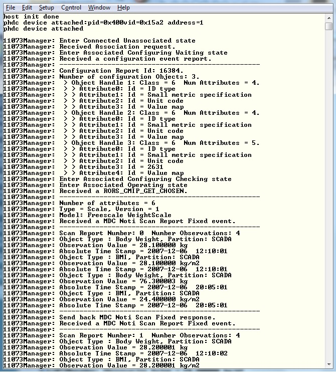

# host_phdc_manager

## Overview

The Host PHDC Manager Example is a simple demonstration program based on the MCUXpresso SDK.
  The application supports the USB weight scale device. It prints out the body mass and body mass index information when the USB weight scale device is attached.

## System Requirement

### Hardware requirements

- Mini/micro USB cable
- USB A to micro AB cable
- Hardware (Tower module/base board, and so on) for a specific device
- Personal Computer

### Software requirements

- The project files are in: 
  <MCUXpresso_SDK_Install>/boards/<board>/usb_examples/usb_host_phdc_manager/<rtos>/<toolchain>.
> The <rtos> is Bare Metal or FreeRTOS OS.
- Terminal tool.

## Getting Started

### Hardware Settings

For detailed instructions, see the appropriate board User's Guide.
> Set the hardware jumpers (Tower system/base module) to default settings.

### Prepare the example

1.  Download the program to the target board.
2.  Power off the target board and power on again.
3.  Connect a USB weight scale device to the board.
> this example could be tested with the "usb_device_phdc_manager" example in pairs.
## Run the example

1.  Connect the board UART to the PC and open the COM port in a terminal tool.
2.  Plug in a hub or the USB weight scale device to the board that is running the PHDC manager example.
    The attached information prints out in the terminal.
3.  The weight scale data (body mass and body mass index) is automatically sent to the host. The scan
    report number, time, value, and unit of each field is shown in terminal tool.

The following figure is an example for attaching one USB weight scale device.

 

## Supported Boards
- EVKB-IMXRT1050
- MIMXRT1060-EVKB
- MIMXRT1170-EVKB
- MIMXRT1060-EVKC
- EVK-MIMXRT1010
- EVK-MIMXRT1015
- EVK-MIMXRT1020
- MIMXRT1024-EVK
- MIMXRT1040-EVK
- EVK-MIMXRT1064
- MIMXRT1160-EVK
- MIMXRT1180-EVK
- EVK-MIMXRT595
- EVK-MIMXRT685
- [FRDM-K22F](../../_boards/frdmk22f/usb_examples/usb_host_phdc_manager/example_board_readme.md)
- [FRDM-K32L2A4S](../../_boards/frdmk32l2a4s/usb_examples/usb_host_phdc_manager/example_board_readme.md)
- FRDM-MCXN236
- FRDM-MCXN947
- FRDM-RW612
- [LPCXpresso54628](../../_boards/lpcxpresso54628/usb_examples/usb_host_phdc_manager/example_board_readme.md)
- [LPCXpresso54S018](../../_boards/lpcxpresso54s018/usb_examples/usb_host_phdc_manager/example_board_readme.md)
- [LPCXpresso54S018M](../../_boards/lpcxpresso54s018m/usb_examples/usb_host_phdc_manager/example_board_readme.md)
- [LPCXpresso55S16](../../_boards/lpcxpresso55s16/usb_examples/usb_host_phdc_manager/example_board_readme.md)
- [LPCXpresso55S28](../../_boards/lpcxpresso55s28/usb_examples/usb_host_phdc_manager/example_board_readme.md)
- LPCXpresso55S36
- [LPCXpresso55S69](../../_boards/lpcxpresso55s69/usb_examples/usb_host_phdc_manager/example_board_readme.md)
- [MCX-N5XX-EVK](../../_boards/mcxn5xxevk/usb_examples/usb_host_phdc_manager/example_board_readme.md)
- [MCX-N9XX-EVK](../../_boards/mcxn9xxevk/usb_examples/usb_host_phdc_manager/example_board_readme.md)
- MIMXRT685-AUD-EVK
- MIMXRT700-EVK
- RD-RW612-BGA
