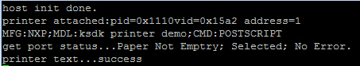

# host_printer_plain_text


## Overview

The host printer example demonstrates how to get the status of the printer device
and how to print a certain test string. Currently, it supports the virtual printer
(see device_printer_virtual_plain_text applicatioin) and the real printer, which supports the PJL and postscript (for example, HP LaserJet P2055dn).
PJL is one printer control protocol (PCP) from HP, postscript is one page description language (PDL) from Adobe.
For the virtual printer, the test string is shown on the virtual printer side so that
it is easy for the customer to verify the basic function of the printer. For the real printer,
it has to be installed correctly to make sure that the content can be printed from the printer.
Installing the printer is beyond the scope of this document.
For more information, see the appropriate manuals.

## System Requirement

### Hardware requirements

- Mini/micro USB cable
- USB A to micro AB cable
- Hardware (Tower module/base board, and so on) for a specific device
- Personal Computer(PC)


### Software requirements

- The project path is:
<br> <MCUXpresso_SDK_Install>/boards/<board>/usb_examples/usb_host_printer_plain_text/<rtos>/<toolchain>.
> The <rtos> is Bare Metal or FreeRTOS OS.


## Getting Started


### Hardware Settings

> Set the hardware jumpers (Tower system/base module) to default settings.


### Prepare the example

1.  Download the program to the target board.
2.  Power off the target board and power on again.
3.  Connect devices to the board.

> For detailed instructions, see the appropriate board User's Guide.

## Run the example

1.  Connect the board UART to the PC and open the COM port in a terminal tool.
2.  Plug in the HUB or the printer device to the board. The attached information prints out in the terminal.
> Two types of printer devices are supported: device_printer_virtual_plain_text demo device and
the real printer that support PJL and postscript.
3.  The terminal log is as follows:
<br>
4.  If the device is a real printer which supports both PJL and postscript,
The "NXP host printer test" string is printed.
<br>
If the device is a real printer which does not support PJL and postscript,
the "unsupported printer language" is output in the terminal log.
If the device is device_printer_virtual_plain_text virtual printer, the following is output in the device's debug console
terminal.
<br> ```
                file name
        NXP host printer test```
```

## Supported Boards
- EVKB-IMXRT1050
- MIMXRT1060-EVKB
- MIMXRT1170-EVKB
- MIMXRT1060-EVKC
- EVK-MIMXRT1010
- EVK-MIMXRT1015
- EVK-MIMXRT1020
- MIMXRT1024-EVK
- MIMXRT1040-EVK
- EVK-MIMXRT1064
- MIMXRT1160-EVK
- MIMXRT1180-EVK
- EVK-MIMXRT595
- EVK-MIMXRT685
- [FRDM-K22F](../../_boards/frdmk22f/usb_examples/usb_host_printer_plain_text/example_board_readme.md)
- FRDM-K32L2A4S
- FRDM-MCXN236
- FRDM-MCXN947
- FRDM-RW612
- LPCXpresso54628
- LPCXpresso54S018
- LPCXpresso54S018M
- [LPCXpresso55S16](../../_boards/lpcxpresso55s16/usb_examples/usb_host_printer_plain_text/example_board_readme.md)
- [LPCXpresso55S28](../../_boards/lpcxpresso55s28/usb_examples/usb_host_printer_plain_text/example_board_readme.md)
- LPCXpresso55S36
- [LPCXpresso55S69](../../_boards/lpcxpresso55s69/usb_examples/usb_host_printer_plain_text/example_board_readme.md)
- [MCX-N5XX-EVK](../../_boards/mcxn5xxevk/usb_examples/usb_host_printer_plain_text/example_board_readme.md)
- [MCX-N9XX-EVK](../../_boards/mcxn9xxevk/usb_examples/usb_host_printer_plain_text/example_board_readme.md)
- MIMXRT685-AUD-EVK
- MIMXRT700-EVK
- RD-RW612-BGA
